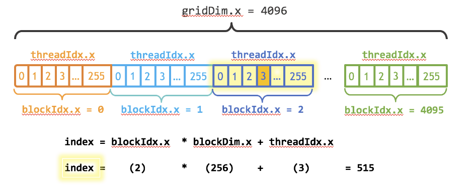

# Material

Introduction  
https://www.youtube.com/watch?v=mKo0cxBlGwM

Course  
Coursera - Introduction to Parallel Programming with CUDA  

# Introduction

https://developer.nvidia.com/blog/even-easier-introduction-cuda/  

Easier introduction  
Source Dir: easy 

# Module 1 - Overview

Examples

| Directory  | Description                  |
| ---------- | ---------------------------- |
| hello      | Hello World running on host  |
| add        | Adding to numbers on GPU     |
| simple     | Simple vector multiplication |
| mandelbrot | Mandelbrot calculation       |

# Module 2 - Threads, Blocks and Grids

## Converting CPU Divide and Conquer to Parallel Kernel Execution

Search vector 
Coursera submission

| Directory  | Description                  |
| ---------- | ---------------------------- |
| search     | Searching vector             |

[Understanding search method](./module2_search.md)

## Defining Kernel Thread and Data Layout via Blocks