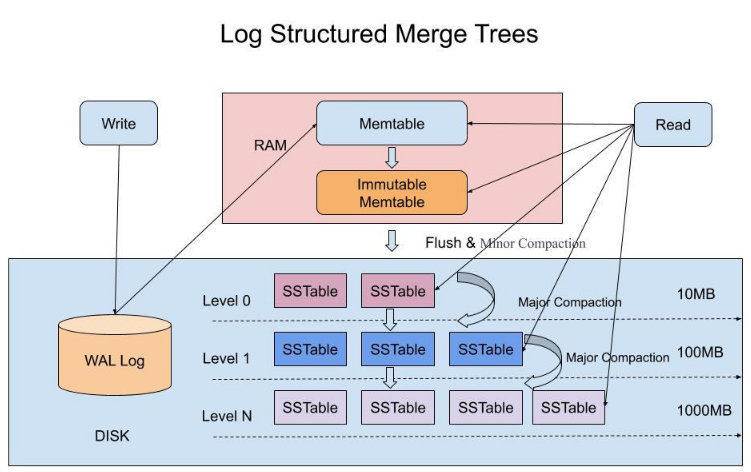

# Book

Link: https://build-your-own.org/database/

# Chapter 1

1.1 Updating files in-lace

- Why not use excell as a database?
- Why databases generally are client-server?
- What happens if I am writing to a file and someone else is reading it ? (zig example)
- What is concurrency ?

1.2 Atomic renaming

Renaming a file to an existing one replaces it atomically; deleting the old file is not needed
(and not correct).

- Why it is not correct? Why is not needed?

1.3 Append-only logs

- Is just adding line to a file solve the problem ?
- How to index data? Read the entire file?
- What happens during a crash?

1.4 fsync gotchas

- What is fsync ?

# Chapter 2

Why log-structured merge tree?

It is not a simple log and it is not a B+Tree , it is log data in layers (tree, it is not related to binary tree or B+Tree)!  
What happens if the base file gets larger?

Updates go to small file first and then at certain point it will be merged into the larger file  
Why do you need multiple levels ? Reduce write amplification  
What is write amplification ? Every time the large file is rewritten when the smaller reaches a threshold  
Write amplification X number of levels (query performance)  

What is in each level? Indexing data structure, could be a sorted array

# Chapter 3