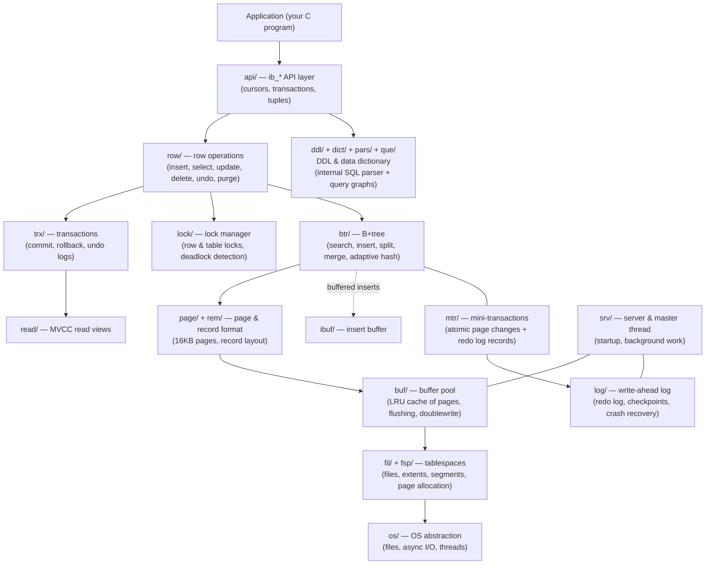

# Chapter 0 — Overview: How InnoDB Is Architected

> **Series:** InnoDB Architecture Deep-Dive — a step-by-step study guide to the internals of
> Embedded InnoDB 1.0.6 (Innobase Oy era, before deep MySQL integration).
> Every claim in this series is grounded in *this repository's* source code, with file references
> you can open and read alongside each chapter.

## Why study this codebase?

This is InnoDB as a **pure storage engine**: no MySQL parser, no replication, no query optimizer.
What remains is exactly the part that made InnoDB famous — a crash-safe, transactional,
multi-versioned B+tree storage engine — in roughly 250k lines of readable C. Almost every idea
here still exists in today's MySQL 8.x InnoDB, just with more layers on top. If you understand
this codebase, you understand the core of modern InnoDB.

## The big picture

An application links `libinnodb` and talks to the `ib_*` API. Underneath, the engine is a stack
of cooperating subsystems:



Three cross-cutting mechanisms tie everything together:

1. **Mini-transactions (`mtr/`)** — every physical page change is wrapped in a mini-transaction
   that (a) holds page latches so the change is atomic, and (b) emits redo log records so the
   change is durable. This is the write-ahead-logging backbone.
2. **The buffer pool (`buf/`)** — nobody reads or writes disk pages directly; every page access
   goes through the buffer pool, which caches 16KB pages in memory with an LRU policy.
3. **MVCC (`trx/` + `read/` + undo logs)** — writers never block readers: updates keep the old
   row version reachable through undo logs, and each reader reconstructs the version it is
   allowed to see.

## The layered mental model

A good way to hold the engine in your head is as five layers, from bytes on disk up to ACID
transactions:

```
┌───────────────────────────────────────────────────────────────────┐
│ 5. TRANSACTIONS   ACID, MVCC, locking            trx/ lock/ read/ │
├───────────────────────────────────────────────────────────────────┤
│ 4. ACCESS PATHS   B+trees, cursors, row ops      btr/ row/ ibuf/  │
├───────────────────────────────────────────────────────────────────┤
│ 3. DURABILITY     mini-transactions, redo log,   mtr/ log/        │
│                   checkpoints, crash recovery                     │
├───────────────────────────────────────────────────────────────────┤
│ 2. CACHING        buffer pool, LRU, flushing,    buf/             │
│                   doublewrite, read-ahead                         │
├───────────────────────────────────────────────────────────────────┤
│ 1. STORAGE        tablespaces, extents,          fil/ fsp/        │
│                   segments, 16KB pages,          page/ rem/       │
│                   record format                  os/              │
└───────────────────────────────────────────────────────────────────┘
```

The chapters follow this bottom-up order, because each layer only makes sense in terms of the
one below it: you can't understand the redo log until you know what a page is, and you can't
understand MVCC until you know how undo records are stored in pages.

## Chapter roadmap

| # | Chapter | Question it answers | Main directories |
|---|---------|--------------------|------------------|
| [01](./01-file-storage.md) | Files, Tablespaces & Space Management | Where do bytes live on disk? How are pages allocated? | `fil/`, `fsp/`, `os/` |
| [02](./02-page-format.md) | The 16KB Page & Record Format | What exactly is inside a page? How is a row encoded? | `page/`, `rem/` |
| [03](./03-buffer-pool.md) | The Buffer Pool | How does InnoDB cache pages and decide what to evict/flush? | `buf/` |
| [04](./04-mini-transactions.md) | Mini-Transactions & Latching | How is a single page change made atomic and logged? | `mtr/`, `sync/` |
| [05](./05-redo-log-recovery.md) | Redo Log & Crash Recovery | How does InnoDB survive a crash without losing commits? | `log/` |
| [06](./06-btree.md) | The B+Tree | How are rows indexed, found, inserted, and pages split? | `btr/`, `page/` |
| [07](./07-transactions-mvcc.md) | Transactions, Undo & MVCC | How do commit, rollback, and consistent reads work? | `trx/`, `read/` |
| [08](./08-locking.md) | The Lock Manager | How are conflicts and phantoms prevented? How are deadlocks found? | `lock/` |
| [09](./09-row-operations.md) | Row Operations | What happens end-to-end on INSERT/SELECT/UPDATE/DELETE? | `row/` |
| [10](./10-data-dictionary.md) | The Data Dictionary | Where does InnoDB keep its own schema? | `dict/`, `pars/`, `que/` |
| [11](./11-startup-api.md) | Startup, Shutdown & the Embedded API | What happens between `ib_init()` and a usable database? | `api/`, `srv/` |
| [12](./12-background-threads.md) | Background Threads & the Master Thread | Who does the work your transaction didn't wait for? | `srv/`, `ibuf/`, `trx/` |

## How to study with this series

1. **Read a chapter, then read the code it cites.** Each chapter references functions as
   `file.c` (in the module directory) — e.g. `buf/buf0buf.c` — and structs in `include/*.h`.
   Remember: many functions are defined in `include/*.ic` inline files, not the `.c` file.
2. **Run the tests and trace them.** The `tests/` directory has small programs (`ib_test1.c`,
   `ib_cursor.c`) that exercise everything. Trace API calls with
   `ltrace -e 'ib_*' .libs/ib_test1` or use `tests/debug_gdb.sh` to break inside the engine.
3. **Look at real bytes.** After running a test, hex-dump `ibdata1`
   (`xxd tests/ibdata1 | less`) and find the structures from chapters 1–2 at their documented
   offsets.
4. **Follow one operation all the way down.** A good capstone: pick `ib_cursor_insert_row()` and
   walk it through api → row → btr → page → mtr → log using chapters 9, 6, 4, 5.

## Conventions used in this series

- **File references** are relative to the repository root: `btr/btr0cur.c`, `include/trx0trx.h`.
- **Naming**: files are `module0submodule.c`; functions are `module_submodule_action()`.
  So `buf_LRU_get_free_block()` lives in `buf/buf0lru.c`.
- **Page size** is fixed: `UNIV_PAGE_SIZE` = 16384 bytes (`include/univ.i`).
- Diagrams are Mermaid (rendered by GitHub/VS Code) or ASCII byte-layout tables.

---

**Next:** [Chapter 1 — Files, Tablespaces & Space Management](./01-file-storage.md)
