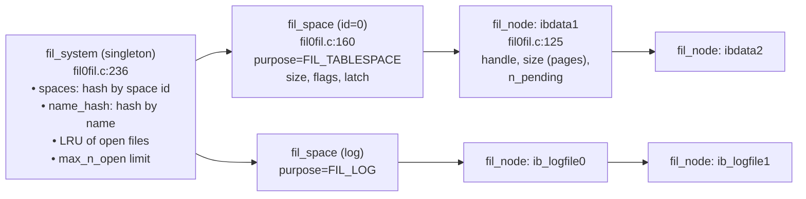
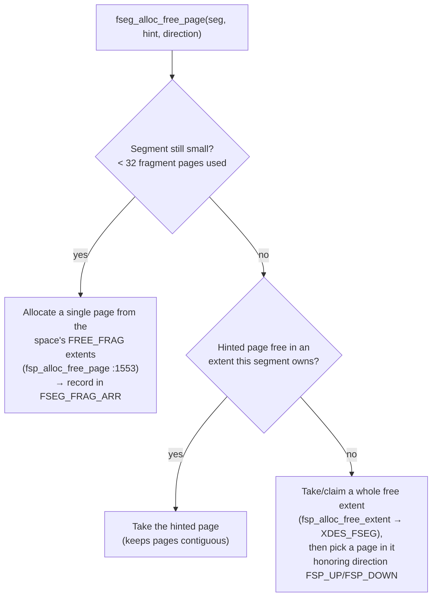

# Chapter 1 — Files, Tablespaces & Space Management

> **Layer 1 of 5 — Storage.** Where bytes live on disk, and how InnoDB carves files into
> pages, extents, and segments.
> Source: `fil/fil0fil.c`, `fsp/fsp0fsp.c`, `include/fil0fil.h`, `include/fsp0types.h`, `os/`

## 1.1 The unit of everything: the page

InnoDB never reads or writes individual bytes from disk. The atomic unit of I/O and storage is
the **page**: `UNIV_PAGE_SIZE` = 2¹⁴ = **16384 bytes** (`include/univ.i:242-244`).

Every page in the system has a global address:

```
(space id, page number)  →  byte offset = page_number × 16384 within the space's file(s)
```

- **space id** — which tablespace (0 = the system tablespace, `ibdata1`)
- **page number** — 4-byte page index within that space; `FIL_NULL` (0xFFFFFFFF) means "no page"
  (`include/fil0fil.h:47`)

Some on-disk structures point not just to a page but *into* one. That is a **file address**
(`fil_addr_t`, `include/fil0fil.h:65-68`): a page number plus a 2-byte byte-offset within the
page — 6 bytes on disk. File addresses are what on-disk linked lists (`fut/fut0lst.c`) are made of.

## 1.2 The FIL layer: mapping spaces to real files

The `fil/` module ("file space abstraction") maintains the mapping from logical
`(space, page_no)` addresses to actual OS files. Three structs, all in `fil/fil0fil.c`:



- **`fil_system_struct`** (`fil/fil0fil.c:236-283`) — the singleton cache of all tablespaces. It
  hashes spaces by id and by name, and keeps an LRU of open file handles so InnoDB can run with
  more tablespaces than the OS allows open file descriptors (`max_n_open`).
- **`fil_space_struct`** (`fil/fil0fil.c:160-224`) — one tablespace *or* one log space
  (`purpose` = `FIL_TABLESPACE` or `FIL_LOG`). Holds total `size` in pages and a chain of files.
- **`fil_node_struct`** (`fil/fil0fil.c:125-154`) — one physical file. A space with several data
  files (e.g. `ibdata1;ibdata2`) has several nodes chained in order; page numbers run
  consecutively across the chain.

New tablespaces register through `fil_space_create(name, id, flags, purpose)`
(`fil/fil0fil.c:1157`).

### How an I/O actually happens: `fil_io()`

All page I/O funnels through one function, `fil_io()` (`fil/fil0fil.c:4326`):

```
caller (buffer pool, log)
  └─ fil_io(type, sync, space_id, zip_size, block_offset, byte_offset, len, buf, msg)
       1. space = fil_space_get_by_id(space_id)            ← hash lookup   (:4414)
       2. walk space->chain, subtracting node->size,
          until the node containing block_offset is found  (:4433)
       3. file offset = block_offset * 16384 + byte_offset (:4480)
       4. os_aio(...)  → async I/O, or immediate if sync   (:4521)
```

The `os/` layer (`os/os0file.c`) hides platform differences and implements **simulated
asynchronous I/O**: dedicated I/O handler threads sit in `fil_aio_wait()` waiting for
completions, so the rest of the engine can issue reads/writes without blocking. This is the
1990s-era answer to portable async I/O, and it still shapes InnoDB's thread architecture
(see Chapter 12).

## 1.3 The FSP layer: allocating pages inside a space

The `fil/` layer knows how to *reach* a page; the `fsp/` layer ("file space management") decides
which pages are *used for what*. It manages three granularities:

```
tablespace
 └── extent   = 64 consecutive pages = 1 MB      (FSP_EXTENT_SIZE, include/fsp0types.h:45)
      └── page = 16 KB
segment (fseg) = a logical file inside the space, owning fragment pages + whole extents
```

### The space header (page 0)

Page 0 of every tablespace is type `FIL_PAGE_TYPE_FSP_HDR`. After the standard 38-byte FIL
header (Chapter 2) comes the **FSP header** at offset 38 (`fsp/fsp0fsp.c:70-110`):

| offset (in header) | field | meaning |
|-----|-------|---------|
| 0 | `FSP_SPACE_ID` | this space's id |
| 8 | `FSP_SIZE` | current size in pages |
| 12 | `FSP_FREE_LIMIT` | first page never yet initialized |
| 16 | `FSP_SPACE_FLAGS` | format/compression flags |
| 20 | `FSP_FRAG_N_USED` | used pages in FREE_FRAG extents |
| 24 | `FSP_FREE` | list base: completely free extents |
| 40 | `FSP_FREE_FRAG` | list base: extents with some pages used individually |
| 56 | `FSP_FULL_FRAG` | list base: fragment extents fully used |
| 72 | `FSP_SEG_ID` | next segment id to assign (8 bytes) |
| 80 | `FSP_SEG_INODES_FULL` | list base: full segment-inode pages |
| 96 | `FSP_SEG_INODES_FREE` | list base: inode pages with free slots |

The "list base" entries are on-disk doubly-linked lists (`fut/fut0lst.c`): a 16-byte base node
(`FLST_BASE_NODE_SIZE`, count + first + last `fil_addr_t`) whose 12-byte list nodes
(`FLST_NODE_SIZE`, prev + next) live inside the linked structures themselves. **This is a key
pattern: InnoDB builds linked lists *across disk pages* out of file addresses.**

### Extent descriptors (XDES)

Right after the FSP header, at byte offset 150 of page 0, sits an array of **extent
descriptors** (`fsp/fsp0fsp.c:201-234`), 40 bytes each — one per extent:

```
XDES entry (40 bytes)
┌────────────┬────────────┬────────┬──────────────────────────────┐
│ XDES_ID    │ list node  │ state  │ bitmap: 2 bits × 64 pages    │
│ owning seg │ (12 bytes) │        │ (FREE bit + unused CLEAN bit)│
│ (8 bytes)  │            │        │ (16 bytes)                   │
└────────────┴────────────┴────────┴──────────────────────────────┘
states: XDES_FREE(1) XDES_FREE_FRAG(2) XDES_FULL_FRAG(3) XDES_FSEG(4)
```

One page of descriptors covers 16384 extents = 256MB, so the descriptor page repeats: every
16384th page (page 0, 16384, 32768, …) is an XDES page (type `FIL_PAGE_TYPE_XDES`), and the
page after it is an insert-buffer bitmap page (`FSP_IBUF_BITMAP_OFFSET` = 1, Chapter 12).
That's why those page numbers are "stolen" in every tablespace.

### Fixed low pages of the system tablespace

The system tablespace reserves its first pages for engine metadata
(`include/fsp0types.h:88-103`):

| page | constant | contents | chapter |
|------|----------|----------|---------|
| 0 | — | FSP header + XDES array | this one |
| 1 | `FSP_IBUF_BITMAP_OFFSET` | insert buffer bitmap | 12 |
| 2 | `FSP_FIRST_INODE_PAGE_NO` | first segment-inode page | this one |
| 3 | `FSP_IBUF_HEADER_PAGE_NO` | insert buffer header | 12 |
| 4 | `FSP_IBUF_TREE_ROOT_PAGE_NO` | insert buffer B+tree root | 12 |
| 5 | `FSP_TRX_SYS_PAGE_NO` | transaction system header (+ doublewrite info) | 7 |
| 6 | `FSP_FIRST_RSEG_PAGE_NO` | first rollback segment header | 7 |
| 7 | `FSP_DICT_HDR_PAGE_NO` | data dictionary header | 10 |

You can see these with `xxd tests/ibdata1 | less` after running a test — e.g. page 5 starts at
byte offset 5 × 16384 = 0x14000.

### Segments (fseg): logical files inside the space

A **segment** is what higher layers actually allocate from. Every B+tree index uses *two*
segments — one for leaf pages, one for internal pages (Chapter 6); undo logs use segments too
(Chapter 7). A segment is described by a 192-byte **inode** stored on an inode page
(`fsp/fsp0fsp.c:116-192`, 85 inodes fit per page):

| field | meaning |
|-------|---------|
| `FSEG_ID` | segment id (0 = free slot) |
| `FSEG_FREE` | list base: extents owned, fully free |
| `FSEG_NOT_FULL` | list base: extents owned, partially used |
| `FSEG_FULL` | list base: extents owned, full |
| `FSEG_NOT_FULL_N_USED` | used-page count in NOT_FULL extents |
| `FSEG_FRAG_ARR` | array of 32 individual "fragment" page numbers |

Users of a segment hold a 10-byte **segment header** (`FSEG_HEADER_SIZE`,
`include/fsp0types.h:57-62`) = (space, inode page, inode offset) — e.g. stored in a B+tree root
page — which is simply a pointer to the inode.

### The allocation strategy: fragments first, then whole extents

`fseg_alloc_free_page()` (`fsp/fsp0fsp.c:2898` → `fseg_alloc_free_page_low()` `:2579`)
embodies a deliberate small-to-large growth policy:



The idea: a tiny table shouldn't consume 1MB extents, so its first 32 pages come one at a time
from shared fragment extents. Once a segment proves it is growing (fill factor check against
`FSEG_FILLFACTOR` = 8, `FSEG_FRAG_LIMIT` = 32), it graduates to owning whole 1MB extents —
which is what makes large scans sequential on disk. The `hint` and `direction` parameters let
the B+tree keep sibling pages physically close.

To avoid deadlocking on a full disk, multi-page operations first call
`fsp_reserve_free_extents()` (`fsp/fsp0fsp.c`, alloc types `FSP_NORMAL`/`FSP_UNDO`/
`FSP_CLEANING`) so that cleanup operations always have room to proceed.

## 1.4 What to remember

1. Everything is a **16KB page** addressed by `(space id, page number)`; `fil_io()` is the
   single funnel from page addresses to file offsets to (simulated) async I/O.
2. Space management is **bitmap-based**: XDES entries with 1 free-bit per page, grouped into
   64-page/1MB extents.
3. **Segments** give each index/undo-log its own logical file, growing from shared fragment
   pages to private extents — the mechanism behind InnoDB's good locality.
4. On-disk **linked lists of file addresses** (`fut0lst`) stitch all of this together; you will
   meet them again in undo logs and the insert buffer.

**Try it:** run `tests/.libs/ib_test1`, then
`xxd tests/ibdata1 | awk 'NR<=16'` — bytes 24–25 of page 0 are `0x0008` (`FIL_PAGE_TYPE_FSP_HDR`),
and at offset 38+8 you'll find `FSP_SIZE`.

---
**Previous:** [Chapter 0 — Overview](./00-overview.md) · **Next:** [Chapter 2 — The 16KB Page & Record Format](./02-page-format.md)
