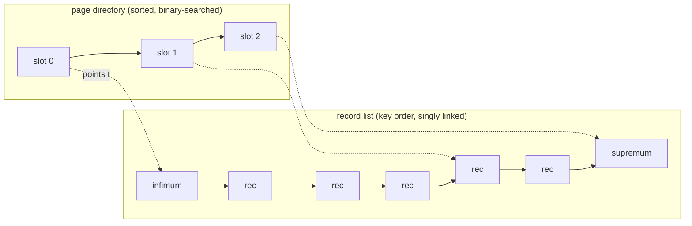

# Chapter 2 — Inside the 16KB Page & the Record Format

> **Layer 1 of 5 — Storage.** The anatomy of an index page and the byte-level encoding of
> a row.
> Source: `include/fil0fil.h`, `include/page0page.h`, `page/page0page.c`, `rem/rem0rec.c`,
> `include/rem0rec.h`

## 2.1 Every page starts and ends the same way

Regardless of type, every 16384-byte page carries a **38-byte FIL header** and an **8-byte FIL
trailer** (`include/fil0fil.h:74-127`):

```
byte offset
0        4        8        12       16               24     26              34       38
┌────────┬────────┬────────┬────────┬────────────────┬──────┬───────────────┬────────┬─────
│checksum│ page   │ prev   │ next   │ FIL_PAGE_LSN   │ page │ flush LSN     │ space  │ data
│        │ number │ page   │ page   │ (8 bytes)      │ type │ (page 0 only) │ id     │ ...
└────────┴────────┴────────┴────────┴────────────────┴──────┴───────────────┴────────┴─────
                                                                          16376        16384
                                                             ─────────────┬────────────┤
                                                                      ... │ old cksum +│
                                                                          │ LSN low 32 │
                                                                          └────────────┘
```

Three fields matter enormously for later chapters:

- **`FIL_PAGE_LSN` (offset 16)** — the log sequence number of the *newest change* to this page.
  Crash recovery compares this against redo records to know what is already applied (Chapter 5).
- **`FIL_PAGE_PREV` / `FIL_PAGE_NEXT` (offsets 8/12)** — sibling pointers. On B+tree leaf pages
  these form the doubly-linked list that makes range scans possible (Chapter 6).
- **`FIL_PAGE_TYPE` (offset 24)** — e.g. `FIL_PAGE_INDEX` (17855) for B+tree pages,
  `FIL_PAGE_UNDO_LOG` (2), `FIL_PAGE_TYPE_FSP_HDR` (8) (`include/fil0fil.h:130-144`).

The trailer repeats the low 32 bits of the LSN. If a write is torn mid-page, header LSN ≠
trailer LSN — that's how `buf_page_is_corrupted()` (`buf/buf0buf.c:369`) detects partial
writes. The checksum (`buf_calc_page_new_checksum`, `buf/buf0buf.c:317`) covers everything
except itself and the trailer, and is stamped at flush time
(`buf_flush_init_for_writing`, `buf/buf0flu.c:704-725`).

## 2.2 The index page: a heap of records plus a sorted directory

A B+tree page (`FIL_PAGE_INDEX`) has this internal structure:

```
┌───────────────────────────────┐ 0
│ FIL header (38 bytes)         │
├───────────────────────────────┤ 38   PAGE_HEADER
│ index page header (36 bytes)  │      n_dir_slots, heap_top, n_heap, free list,
│ + 2 fseg headers (root only)  │      garbage, last_insert, direction, n_recs,
├───────────────────────────────┤ 94   PAGE_DATA        max_trx_id, level, index id
│ infimum record  ("-infinity") │
│ supremum record ("+infinity") │
├───────────────────────────────┤ 120 (compact)
│ user records, in INSERTION    │
│ order (the "heap"), each      │  ← grows downward
│ pointing to its successor     │
│ in KEY order                  │
├╌╌╌╌╌╌╌╌╌╌╌╌╌╌╌╌╌╌╌╌╌╌╌╌╌╌╌╌╌╌╌┤ PAGE_HEAP_TOP
│                               │
│         free space            │
│                               │
├╌╌╌╌╌╌╌╌╌╌╌╌╌╌╌╌╌╌╌╌╌╌╌╌╌╌╌╌╌╌╌┤
│ page directory: 2-byte slots, │  ← grows upward
│ sparse index into the record  │
│ list (1 slot per 4-8 records) │
├───────────────────────────────┤ 16376
│ FIL trailer (8 bytes)         │
└───────────────────────────────┘ 16384
```

Key fields of the 36-byte page header (offsets relative to `PAGE_HEADER` = 38,
`include/page0page.h:55-98`):

| offset | field | meaning |
|--------|-------|---------|
| 0 | `PAGE_N_DIR_SLOTS` | number of directory slots |
| 2 | `PAGE_HEAP_TOP` | first byte after the record heap |
| 4 | `PAGE_N_HEAP` | records in heap; **bit 15 set = compact format** |
| 6 | `PAGE_FREE` | head of the free (deleted) record list |
| 8 | `PAGE_GARBAGE` | bytes in deleted records (for reorganize decision) |
| 10 | `PAGE_LAST_INSERT` | position of last insert (split heuristic, Ch. 6) |
| 12 | `PAGE_DIRECTION` | recent insert direction (`PAGE_LEFT`/`PAGE_RIGHT`…) |
| 16 | `PAGE_N_RECS` | user record count |
| 18 | `PAGE_MAX_TRX_ID` | max trx that modified this page (secondary indexes; Ch. 7) |
| 26 | `PAGE_LEVEL` | tree level: 0 = leaf |
| 28 | `PAGE_INDEX_ID` | which index this page belongs to |
| 36 | `PAGE_BTR_SEG_LEAF/TOP` | fseg headers (root page only; Ch. 1, Ch. 6) |

### The three clever ideas in this layout

1. **Records live where they were inserted; order lives in pointers.** Records are appended to
   a heap (growing down from `PAGE_DATA`), and each record's header contains a *next-record
   pointer* forming a **singly-linked list in key order**:
   `infimum → smallest … largest → supremum`. Inserting never shifts other records — it just
   splices the list. Deleted record space goes on the `PAGE_FREE` list for reuse.

2. **Infimum and supremum are real records.** Two system records, fixed at bytes 99/112
   (compact; `include/page0page.h:112-118`), act as −∞ and +∞ sentinels. Every algorithm can
   assume the list has a first and last element, eliminating edge cases; supremum also serves
   as the lock target for "the gap after the last record" (Chapter 8).

3. **The page directory makes search O(log n).** A linked list alone would force linear scans.
   The directory — 2-byte slots growing up from the trailer — points at every 4th-to-8th record
   (`PAGE_DIR_SLOT_MIN/MAX_N_OWNED` = 4/8, `include/page0page.h:142-161`). Searching a page
   (`page_cur_search_with_match`, `page/page0cur.c`) binary-searches the directory, then walks
   at most ~8 list nodes. Each record's `n_owned` field says how many records its directory
   slot covers.



## 2.3 The record format: how a row is encoded

InnoDB has two record formats, and this codebase contains the transition between them:

- **Redundant (old-style)** — original format, 6 extra header bytes
  (`REC_N_OLD_EXTRA_BYTES`, `include/rem0rec.h:46`), stores an offset for *every* field.
- **Compact (new-style)** — 5 extra header bytes (`REC_N_NEW_EXTRA_BYTES`,
  `include/rem0rec.h:49`), stores lengths only for variable-length fields and a NULL bitmap.
  A page is compact if bit 15 of `PAGE_N_HEAP` is set.

A compact record looks like:

```
             ┌ record pointer ("origin") points HERE
             ▼
┌──────────────┬──────────────┬──────────────────────────────────┐
│ var-len      │ NULL │ 5-byte header                │ field 1 │ field 2 │ ...
│ lengths      │ bits │ (read at negative offsets)   │  data   │  data   │
│ (reversed)   │      │                              │         │         │
└──────────────┴──────┴──────────────────────────────┴─────────┴─────────┘
                        5-byte header contains:
                        • info bits: REC_INFO_DELETED_FLAG (0x20 = delete-marked)
                        •            REC_INFO_MIN_REC_FLAG (0x10 = min rec on level)
                        • n_owned   (records owned by my directory slot)
                        • heap_no   (position in page heap; 13 bits)
                        • status    (3 bits: ORDINARY / NODE_PTR / INFIMUM / SUPREMUM)
                        • next-record pointer (2 bytes, relative offset)
```

(Bit layout: `include/rem0rec.h:39-64`; accessors like `rec_get_heap_no_new`,
`rec_get_next_offs` at `include/rem0rec.h:96-306` — note they read *before* the origin.)

Points worth internalizing:

- **The delete flag, not deletion.** `REC_INFO_DELETED_FLAG` marks a record deleted without
  removing it. MVCC readers may still need it, and its key must remain to prevent phantoms.
  Actual removal happens later, by purge (Chapter 7).
- **The record pointer points at the data, header behind it.** All header accessors use
  negative offsets. This lets field access proceed without knowing header size.
- **`status` distinguishes leaf records from node pointers.** Internal (non-leaf) B+tree pages
  hold `REC_STATUS_NODE_PTR` records: a key prefix + 4-byte child page number
  (`REC_NODE_PTR_SIZE`, `include/rem0rec.h:52-55`). Same page machinery, different payload —
  that's how one page format serves every level of the tree.

### Hidden system columns

Every clustered-index (primary key) leaf record carries columns your schema never declared:

| column | size | purpose |
|--------|------|---------|
| `DB_ROW_ID` | 6 bytes | synthetic PK, only when the table has no user PK |
| `DB_TRX_ID` | 6 bytes | id of the transaction that last modified this row |
| `DB_ROLL_PTR` | 7 bytes | pointer to the undo record holding the *previous version* |

`DB_TRX_ID` + `DB_ROLL_PTR` are the anchors of MVCC: they turn each row into the head of a
version chain threaded through the undo log (Chapter 7).

## 2.4 What to remember

1. Pages are self-describing (type, LSN, checksums) and self-verifying (torn-write detection
   via header/trailer LSN match).
2. Within an index page: **heap for placement, linked list for order, directory for speed** —
   an insert costs a splice, a search costs a binary search.
3. Records carry their bookkeeping (delete flag, heap number, next pointer) in a header
   *behind* the record origin; clustered rows additionally carry `DB_TRX_ID`/`DB_ROLL_PTR`,
   the hooks for the entire MVCC machinery.
4. This codebase shows both the redundant and compact formats, plus their parallel redo record
   types (`MLOG_REC_INSERT` vs `MLOG_COMP_REC_INSERT`, Chapter 4) — a lesson in how a storage
   engine evolves a format without breaking old data.

**Try it:** run a test, then dump a data page: `xxd -s $((N*16384)) -l 512 tests/ibdata1` for
increasing N until byte 24-25 reads `0x45bf` (17855 = `FIL_PAGE_INDEX`). Bytes 38+16..17 are
`PAGE_N_RECS`.

---
**Previous:** [Chapter 1 — Files & Tablespaces](./01-file-storage.md) · **Next:** [Chapter 3 — The Buffer Pool](./03-buffer-pool.md)
