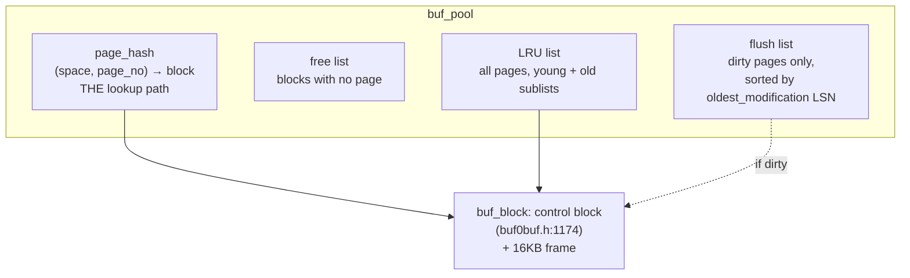
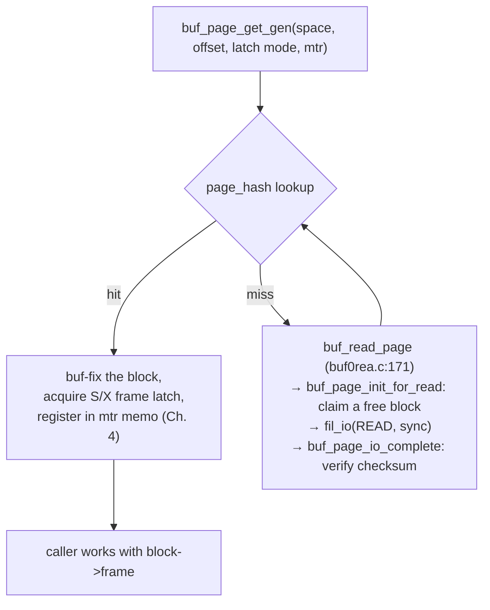

# Chapter 3 — The Buffer Pool

> **Layer 2 of 5 — Caching.** How InnoDB keeps hot pages in memory, decides what to evict,
> and writes dirty pages back safely.
> Source: `buf/buf0buf.c`, `buf/buf0lru.c`, `buf/buf0flu.c`, `buf/buf0rea.c`,
> `include/buf0buf.h`

## 3.1 Why a buffer pool

Every page access in InnoDB — B+tree descent, undo lookup, dictionary read — goes through the
buffer pool. Nothing above the `buf/` layer ever calls `fil_io()` directly. This single
choke-point gives InnoDB three things at once: caching, **write-ahead-logging enforcement**
(a dirty page cannot reach disk before its redo log does — Chapter 5), and **torn-write
protection** (the doublewrite buffer, below).

## 3.2 The data structures

The singleton `buf_pool` (`include/buf0buf.h:1337-1446`) owns a set of memory chunks divided
into 16KB frames, each with a control block, and four bookkeeping structures:



Each page's control block (`buf_page_struct`, `include/buf0buf.h:1040-1169`) carries the fields
that drive everything else:

| field | meaning |
|-------|---------|
| `space`, `offset` | page identity — the hash key |
| `state` | `BUF_BLOCK_NOT_USED` (free), `BUF_BLOCK_FILE_PAGE` (caching a page), … |
| `io_fix`, `buf_fix_count` | page pinned for I/O / by users — cannot be evicted |
| `oldest_modification` | LSN of the *first* redo record since the page was last clean — position in flush list; 0 = clean |
| `newest_modification` | LSN of the latest change — the WAL barrier for flushing |
| `old`, `access_time` | LRU old-sublist membership and first-access time |

The full `buf_block_struct` adds the frame pointer, a per-block mutex, the **frame rw-lock**
(this is the "page latch" every other chapter talks about), and `modify_clock` — a counter
bumped on every reorganization, which lets cursors optimistically revalidate a remembered
position without a fresh tree descent (Chapter 6).

## 3.3 Fetching a page: `buf_page_get_gen()`

The workhorse (`buf/buf0buf.c:2134`) — the function behind every `buf_page_get()` you'll see in
btr/row/trx code:



If the free list is empty, `buf_LRU_get_free_block()` (`buf/buf0lru.c`) evicts from the LRU
tail — writing the victim out first if dirty (an "LRU flush").

### The midpoint LRU

A naive LRU has a famous failure mode: one large table scan evicts the entire working set.
InnoDB's answer is a **two-part LRU** (`buf/buf0lru.c`):

```
 head (young/new)                          midpoint                      tail (old)
 ┌────────────────────────────────────────────┬───────────────────────────────┐
 │  hot working set                           │  recently read, on probation  │
 └────────────────────────────────────────────┴───────────────────────────────┘
   promoted here on re-access                    newly read pages enter HERE
                                                 eviction happens from tail
```

- Newly read pages enter at the **midpoint** (head of the old sublist), not the head.
- Only a *subsequent* access promotes a page to the young half — and only if it has survived
  `buf_LRU_old_threshold_ms` (`buf/buf0lru.c:124`), so a scan that touches each page once (or
  twice within milliseconds) never pollutes the young half.
- The old sublist's share is `buf_LRU_old_ratio`/1024 of the list (`buf/buf0lru.c:121`,
  bounds ≈5%–100%, `include/buf0lru.h:245-255`); the split only exists once the LRU exceeds
  `BUF_LRU_OLD_MIN_LEN` = 512 pages (`include/buf0lru.h:72`).

The API exposes these as `lru_old_blocks_pct` and `lru_block_access_recency`
(`api/api0cfg.c:880-890`) — this very engine is where MySQL's
`innodb_old_blocks_pct`/`innodb_old_blocks_time` come from.

### Read-ahead

`buf_read_ahead_linear()` (`buf/buf0rea.c:235`): when the accessed page is the border page of
a 64-page area and *every* page of that area has been accessed, InnoDB predicts a sequential
scan and prefetches the next area asynchronously. (This version has only linear read-ahead;
the random read-ahead of later versions is absent — a nice example of a feature that was
removed and re-added over InnoDB's history.)

## 3.4 Writing pages back: the flush list

A page becomes dirty inside a mini-transaction commit (Chapter 4), which sets
`oldest/newest_modification` and inserts the block into the **flush list, ordered by
`oldest_modification`**. That ordering is the whole point: the minimum
`oldest_modification` across the flush list tells the checkpoint algorithm (Chapter 5) exactly
how much redo log is still "needed", so flushing from the flush-list tail *advances the
checkpoint*.

Flushing comes in flavors (`enum buf_flush`, `include/buf0types.h:44-49`):

- **`BUF_FLUSH_LIST`** — flush pages with the oldest modification LSNs; driven by the master
  thread and by checkpoint pressure (Chapters 5, 12).
- **`BUF_FLUSH_LRU`** — flush/evict from the LRU tail to keep free blocks available.
- **`BUF_FLUSH_SINGLE_PAGE`** — emergency single-page flush.

Each write goes through `buf_flush_write_block_low()` (`buf/buf0flu.c:733`), which enforces two
invariants in order:

1. **WAL first:** `log_write_up_to(bpage->newest_modification, ..., TRUE)`
   (`buf/buf0flu.c:771`) — the redo log describing the page's latest change is flushed and
   fsynced *before* the page itself. This one line is the write-ahead-logging rule.
2. **Stamp and checksum:** `buf_flush_init_for_writing()` (`buf/buf0flu.c:650`) writes
   `FIL_PAGE_LSN`, the trailer LSN, and both checksums into the frame.

### The doublewrite buffer

A 16KB page write is not atomic on most storage: a crash mid-write leaves a "torn" page that
checksums cannot repair (redo records describe *changes*, not full pages, so a half-written
page is unrecoverable). InnoDB's fix — invented in this era and still in use today — is the
**doublewrite buffer**: 2×64 pages reserved in the system tablespace, described from the
TRX_SYS page (`trx_doublewrite`, `trx/trx0sys.c:161`, layout `include/trx0sys.h:445-523`).

```
flush a batch of dirty pages:
  1. memcpy pages into the doublewrite staging buffer
  2. write staging buffer sequentially to the doublewrite area  + fsync
  3. write each page to its real location                       + fsync
recovery: for each page in the doublewrite area,
  if the real page is torn (bad checksum) → restore it from the copy
```

Either copy of the page survives any single crash intact, at the cost of writing everything
twice (cheap, because step 2 is one sequential write).

## 3.5 What to remember

1. The buffer pool is the single gateway between memory and disk; its per-page metadata
   (`oldest/newest_modification`, frame rw-lock, `modify_clock`) is infrastructure that
   *other* subsystems — logging, checkpointing, B+tree cursors — depend on.
2. The **midpoint LRU** protects the working set from scans; you are looking at the original
   implementation of a design MySQL DBAs still tune today.
3. The **flush list is LSN-ordered**, which couples page writeback directly to checkpoint
   advancement — the buffer pool and the redo log are two halves of one mechanism.
4. The **doublewrite buffer** solves torn pages; the WAL call in
   `buf_flush_write_block_low()` solves lost changes. Together they make "crash anywhere" safe.

**Try it:** `grep -n "log_write_up_to" buf/buf0flu.c` — one call, and it's the entire WAL
guarantee.

---
**Previous:** [Chapter 2 — Page & Record Format](./02-page-format.md) · **Next:** [Chapter 4 — Mini-Transactions & Latching](./04-mini-transactions.md)
