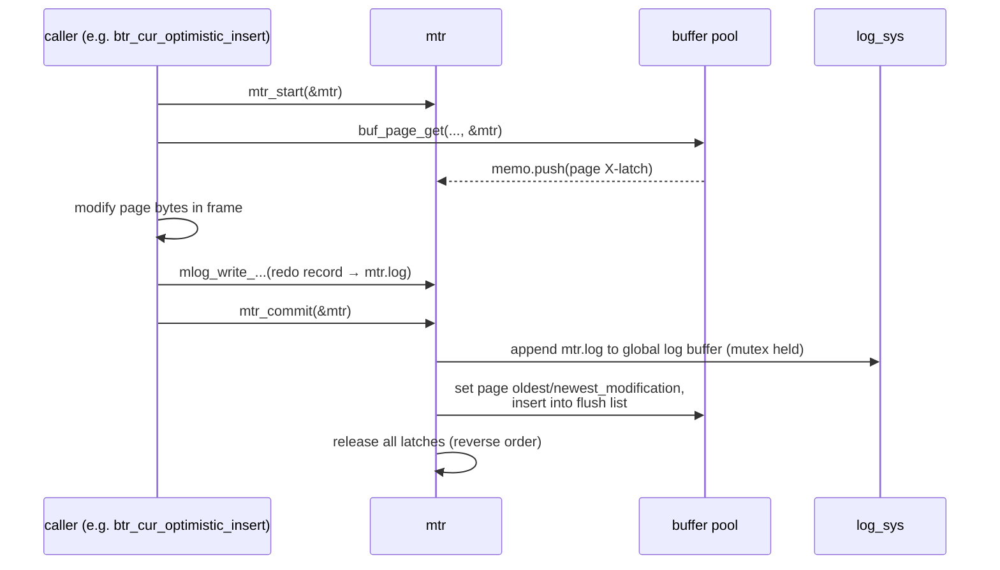

# Chapter 4 — Mini-Transactions & Latching

> **Layer 3 of 5 — Durability.** The mechanism that makes every physical page change atomic
> *and* logged — the hinge between the buffer pool and the redo log.
> Source: `mtr/mtr0mtr.c`, `mtr/mtr0log.c`, `include/mtr0mtr.h`, `include/sync0sync.h`,
> `sync/sync0rw.c`

## 4.1 The problem mini-transactions solve

A logical operation like "insert a row" may touch several pages: the leaf page, maybe a split
sibling, a node pointer page, the space bitmap. Two dangers:

1. **Concurrency** — another thread must never see a page *between* two related changes
   (e.g. a leaf split half-done).
2. **Durability** — if we crash mid-change, recovery must either redo the whole group of page
   changes or none of it.

The **mini-transaction** (`mtr_t`) solves both with one object. Despite the name it has nothing
to do with user transactions (no rollback, no locks); it is a short-lived *critical section +
redo-log batch*. Every function in btr/, fsp/, trx/, ibuf/ that touches a page takes an
`mtr_t*` parameter — now you know why.

## 4.2 Anatomy and lifecycle

`mtr_t` (`include/mtr0mtr.h:376-397`) is two growable arrays and a bit of state:

- **`memo`** — a stack of every latch acquired (page S/X-latches, index tree locks) and every
  page modified.
- **`log`** — the redo records describing the changes, buffered locally.
- `n_log_recs`, `modifications`, `start_lsn`/`end_lsn`.



The three rules a caller must obey:

1. Latch every page you touch through the mtr (`buf_page_get` registers it in the memo).
2. Never modify page bytes directly — use the `mlog_*` writers, which change the page *and*
   append the matching redo record.
3. Keep mtrs short. Latches are held until `mtr_commit()`; a long mtr is a concurrency
   bottleneck.

### What commit does — and why the order matters

`mtr_commit()` (`mtr/mtr0mtr.c:176-218`):

1. If more than one log record was written, append `MLOG_MULTI_REC_END`; if exactly one, OR
   `MLOG_SINGLE_REC_FLAG` into its type byte (`mtr/mtr0mtr.c:129-131`). **This is the atomicity
   marker**: recovery only applies a group of records if it sees the complete group ending in
   `MLOG_MULTI_REC_END` (Chapter 5). Crash mid-mtr → incomplete group → recovery ignores it →
   the multi-page change never happened. That's how a page split is all-or-nothing.
2. Acquire the log mutex, copy `mtr.log` into the global log buffer; this assigns the mtr its
   `start_lsn`/`end_lsn` (`mtr_log_reserve_and_write`, `mtr/mtr0mtr.c:110-171`).
3. **Still under the log mutex**, mark all modified pages dirty (setting their modification
   LSNs, inserting into the flush list) and release the page latches
   (`mtr/mtr0mtr.c:200-206`). Doing this before releasing the log mutex guarantees that
   whenever the log mutex is free, every buffer page's modification info is current — the
   checkpoint calculation (Chapter 5) depends on exactly this invariant.

## 4.3 Redo records: physiological logging

The records in `mtr.log` are typed by one byte (`MLOG_*`, `include/mtr0mtr.h:57-183`). A
record's shape is:

```
type (1) | space id (1-5, compressed) | page number (1-5, compressed) | body...
```

The types span a spectrum from physical to logical:

| type | value | meaning | body |
|------|-------|---------|------|
| `MLOG_1BYTE/2BYTES/4BYTES/8BYTES` | 1,2,4,8 | write N bytes at offset | offset + value |
| `MLOG_WRITE_STRING` | 30 | write byte string | offset + len + bytes |
| `MLOG_REC_INSERT` / `MLOG_COMP_REC_INSERT` | 9 / 38 | insert record into page | record image |
| `MLOG_REC_DELETE`, `MLOG_REC_UPDATE_IN_PLACE`… | 14, 13 | record ops | |
| `MLOG_PAGE_CREATE` / `MLOG_COMP_PAGE_CREATE` | 19 / 37 | (re)initialize an index page | — |
| `MLOG_UNDO_INSERT`, `MLOG_UNDO_HDR_CREATE`… | 20, 25 | undo-log page ops | |
| `MLOG_INIT_FILE_PAGE` | 29 | page allocated: prior contents void | — |
| `MLOG_FILE_CREATE/RENAME/DELETE` | 33-35 | file operations | name |
| `MLOG_MULTI_REC_END` | 31 | end of an atomic group | — |

This is called **physiological logging**: physical *to a page* (space+page_no), logical
*within the page* ("insert this record"), rather than logging full page images (too big) or
purely logical SQL (not idempotent, needs a consistent structure to apply to). A
`MLOG_REC_INSERT` replayed against the page re-runs the actual insert code
(`page_cur_insert_rec_low`) during recovery — the same routine used at runtime, just fed from
the log. Look at any `page0cur.c` or `btr0cur.c` operation and you'll find the pattern:
`foo()` does the work and writes the record; `foo_parse_log()`/`recv_parse_or_apply_log_rec_body`
replays it.

Note the parallel `MLOG_COMP_*` series (36-46): when the compact record format was added
(Chapter 2), every record-level redo type needed a sibling. Log formats are forever.

## 4.4 Latching: rw-locks and the ordering discipline

The latches in the mtr memo are **rw-locks** (`sync/sync0rw.c`, `include/sync0rw.h`) — this
version supports S (shared) and X (exclusive, recursive for the same thread) modes, implemented
over one atomic `lock_word` (readers decrement by 1; a writer subtracts `X_LOCK_DECR` =
0x00100000, `include/sync0rw.h:54`). Contended acquisitions spin
(`SYNC_SPIN_ROUNDS`) and then park in the global **sync array** (`sync/sync0arr.c`), which also
powers the "long semaphore wait" diagnostics that InnoDB still prints today.

With hundreds of threads latching thousands of pages, deadlock between latches is prevented not
by detection but by **discipline**: a global partial order of latch levels
(`SYNC_*` constants, `include/sync0sync.h:421-495`). A thread may only acquire a latch at a
*lower* level than every latch it already holds. Excerpts, high to low:

```
SYNC_DICT (1000)            dictionary
SYNC_INDEX_TREE (900)       index->lock (the tree latch)
SYNC_TREE_NODE (890)        B+tree page latch
SYNC_TRX_UNDO (700) … SYNC_RSEG (600)     undo/rollback segments
SYNC_FSP (400)              space management
SYNC_KERNEL (300)           the big kernel mutex (trx/lock state, Ch. 7-8)
SYNC_LOG (170)              log mutex
SYNC_BUF_POOL (150)         buffer pool mutex
```

Debug builds verify every acquisition against the thread's held-latch list
(`sync_thread_add_level`, `include/sync0sync.h:214`). This table *is* the concurrency design
document of InnoDB: reading it top-to-bottom tells you which subsystem is allowed to call into
which. Note that the index tree latch (900) sits above page latches (890) — the B+tree descent
in Chapter 6 follows exactly that order.

## 4.5 What to remember

1. An mtr = **latches + redo records, released/published atomically at commit**. It is the
   quantum of physical change in InnoDB; user transactions (Chapter 7) are built from many
   mtrs plus undo logging.
2. `MLOG_MULTI_REC_END` / `MLOG_SINGLE_REC_FLAG` give multi-page atomicity through the log —
   no shadow paging, no page images.
3. Physiological logging replays runtime code paths during recovery; every page-modifying
   function has a log-writer and a log-parser twin.
4. Latch deadlocks are prevented by a static latch order (`sync0sync.h`); that ordering table
   explains the shape of many algorithms in the chapters ahead (e.g. why B+tree code
   "releases and re-searches" instead of latching upward).

**Try it:** `grep -c "mtr_t\*" include/*.h` — count how many APIs thread an mtr through; then
read `mtr_commit` (`mtr/mtr0mtr.c:176`) side-by-side with section 4.2.

---
**Previous:** [Chapter 3 — The Buffer Pool](./03-buffer-pool.md) · **Next:** [Chapter 5 — Redo Log & Crash Recovery](./05-redo-log-recovery.md)
