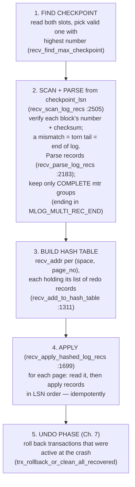

# Chapter 5 — The Redo Log & Crash Recovery

> **Layer 3 of 5 — Durability.** How committed work survives any crash: the write-ahead log,
> checkpoints, and the redo-apply recovery algorithm.
> Source: `log/log0log.c`, `log/log0recv.c`, `include/log0log.h`, `include/log0recv.h`
> *(note: `log/log0log.c` and `log/log0recv.c` are deleted in this working tree — read them
> with `git show HEAD:log/log0log.c`)*

## 5.1 The LSN: one number to rule them all

The **log sequence number** is a 64-bit byte offset into the conceptually infinite stream of
redo records ever written (starting at `LOG_START_LSN` = 8192, `include/log0log.h:601`). It is
InnoDB's global clock. The same unit measures:

- how much log exists (`log_sys->lsn`),
- how much is durably on disk (`flushed_to_disk_lsn`),
- how new a page is (`FIL_PAGE_LSN` on every page, Chapter 2),
- how dirty the buffer pool is (each page's `oldest_modification`, Chapter 3),
- where recovery must start (the checkpoint LSN).

Because everything is measured on one axis, correctness conditions become simple inequalities —
e.g. WAL is literally `flushed_to_disk_lsn ≥ page.newest_modification` before a page write.

## 5.2 The log on disk: blocks, files, checkpoint slots

Redo is written in **512-byte blocks** (`OS_FILE_LOG_BLOCK_SIZE`, `include/os0file.h:109`) —
sized to the disk sector, so a block write is assumed atomic (the log's own answer to torn
writes; data pages needed the doublewrite buffer instead):

```
one 512-byte log block
┌──────────────┬───────────────────────────────────────────────┬──────────┐
│ header (12B) │ log record data (496 B)                       │ trailer  │
│ block no     │                                               │ checksum │
│ data length  │                                               │ (4B)     │
│ 1st rec grp  │                                               │          │
│ checkpoint no│                                               │          │
└──────────────┴───────────────────────────────────────────────┴──────────┘
```

(`LOG_BLOCK_*`, `include/log0log.h:606-643`.) `LOG_BLOCK_FIRST_REC_GROUP` marks where the first
mtr record-group *starts* in this block — recovery needs it because an mtr's records can
straddle blocks.

The log files (`ib_logfile0`, `ib_logfile1`, …) form one **circular** log group: blocks are
written round-robin across files, wrapping to the first file when the last is full
(`log_group_write_buf`, `log0log.c:1228`, wraps at `:1277`). Each file starts with a 2048-byte
header; the *first* file additionally holds two **checkpoint slots** at offsets 512
(`LOG_CHECKPOINT_1`) and 1536 (`LOG_CHECKPOINT_2`) (`include/log0log.h:679-717`).

Why two slots? Checkpoints alternate between them (`next_checkpoint_no & 1`,
`log0log.c:1849-1853`). If the machine dies while writing one, the other still holds a valid
older checkpoint — recovery picks whichever slot has a valid checksum and the higher
checkpoint number (`recv_find_max_checkpoint`, `log0recv.c:625`).

## 5.3 Runtime: buffer, group commit, and the WAL rule

In memory, `log_sys` (`include/log0log.h:777-976`) holds a circular **log buffer** and a family
of LSN watermarks (`buf_next_to_write`, `write_lsn`, `flushed_to_disk_lsn`,
`last_checkpoint_lsn`). Mini-transactions append to the buffer at `mtr_commit` (Chapter 4);
`log_write_up_to(lsn, wait, flush_to_disk)` (`log0log.c:1349`) pushes the buffer to disk when
someone needs durability up to `lsn`.

`log_write_up_to` contains one of the great old tricks: **group commit**
(`log0log.c:1408-1424`). If a write is already in flight and will cover your LSN, you just wait
for it; if not, you wait for the current write to finish, then issue one write covering
*everyone* who queued up meanwhile. N transactions committing concurrently cost ~1 fsync, not N.

Who calls it, and when:

- **Transaction commit** (`trx_commit_off_kernel`, `trx/trx0trx.c:901-922`) — behavior depends
  on `srv_flush_log_at_trx_commit`: `1` = write + fsync (real durability), `2` = write to OS
  only, `0` = do nothing now (the master thread flushes ~once per second). Yes — this is the
  original `innodb_flush_log_at_trx_commit`.
- **Page flush** (`buf_flush_write_block_low`, `buf/buf0flu.c:771`) — the WAL rule from
  Chapter 3.
- **Log-space pressure** — see next section.

## 5.4 Checkpoints: bounding recovery and reclaiming log space

The log is circular, so old log must eventually be overwritten. A record at LSN X may be
overwritten only when it is no longer needed — i.e. when every page change it describes has
been flushed to disk. The **checkpoint LSN** is exactly that point:

```
checkpoint_lsn  =  min(oldest_modification) over all dirty pages in the flush list
```

`log_checkpoint()` (`log0log.c:1982`) computes this, first forces
`log_write_up_to(oldest_lsn)` (WAL again — `log0log.c:2024-2033`), then writes the checkpoint
record into the alternating slot. After that, all log before `checkpoint_lsn` is dead, and
recovery may start from `checkpoint_lsn` instead of from the beginning of time.

This creates the engine's most important feedback loop. The distance
`log_sys->lsn − last_checkpoint_lsn` (the "checkpoint age") must stay below the log capacity.
Thresholds computed at startup (`log_calc_max_ages`, `log0log.c:671`) drive escalating
responses, checked by every operation via `log_free_check()` (`include/log0log.ic:442`):

```
checkpoint age →   [ ok ]  → [async: background-flush dirty pages, checkpoint ]
                           → [sync: STALL writers until pages flushed         ]
```

**This is why "too-small redo logs" make InnoDB slow**: small logs → small max age → constant
forced flushing and, at worst, synchronous stalls. A tuning fact DBAs learned for decades,
visible here as ~30 lines of margin arithmetic.

## 5.5 Crash recovery

Startup always runs recovery (`recv_recovery_from_checkpoint_start`, `log0recv.c:2927`, called
from `srv/srv0start.c:1645`); on a clean shutdown it simply finds nothing to do. Three phases:



Two details carry most of the intellectual weight:

**Idempotent apply.** For each record on a page, recovery applies it only if
`recv->start_lsn >= page_lsn` — the LSN stored *in the page itself* (`recv_recover_page`,
`log0recv.c:1558`). If the page already contains that change (it was flushed before the
crash), the record is skipped; after applying, the page LSN is advanced
(`:1583-1592`). Crash during recovery? Run recovery again; same rule, same result. The page
LSN written at flush time (Chapter 3) and the record LSNs meet here — this comparison is the
reason both exist.

**The hash table makes redo I/O-efficient.** Records are grouped per page, so each page is
read once and receives all its changes together (`recv_read_in_area` batches the reads);
without this, replaying a large log would re-read hot pages thousands of times. If the hash
table outgrows memory, recovery applies-and-clears in batches (`log0recv.c:2505`'s call to
`recv_apply_hashed_log_recs(FALSE)`).

After redo, the database is exactly as it was at the instant of the crash — *including*
uncommitted changes. Redo is deliberately ignorant of transactions; it restores pages, not
semantics. The undo phase (Chapter 7) then rolls back the transactions that never committed,
using the undo logs that redo just faithfully reconstructed. Notice the layering: **undo data
is itself redo-protected** — that is what makes the whole scheme composable.

## 5.6 What to remember

1. One LSN axis ties pages, buffer pool, log, and checkpoints together; every correctness rule
   is an inequality on it.
2. Group commit amortizes fsync across concurrent committers;
   `flush_log_at_trx_commit` trades durability for speed at that exact point.
3. A checkpoint = "all page changes before LSN X are on disk"; log capacity minus checkpoint
   age is the engine's breathing room, and running out of it stalls writers.
4. Recovery = redo everything from the checkpoint (idempotently, page-LSN-guarded), then undo
   the losers. Torn log tails are cut off by block checksums; torn pages were already solved
   by the doublewrite buffer; incomplete mtrs by `MLOG_MULTI_REC_END`.

**Try it:** run `tests/.libs/ib_test1`, kill it mid-run (`kill -9`), rerun — and watch the
recovery messages InnoDB prints as it scans from the last checkpoint.

---
**Previous:** [Chapter 4 — Mini-Transactions](./04-mini-transactions.md) · **Next:** [Chapter 6 — The B+Tree](./06-btree.md)
