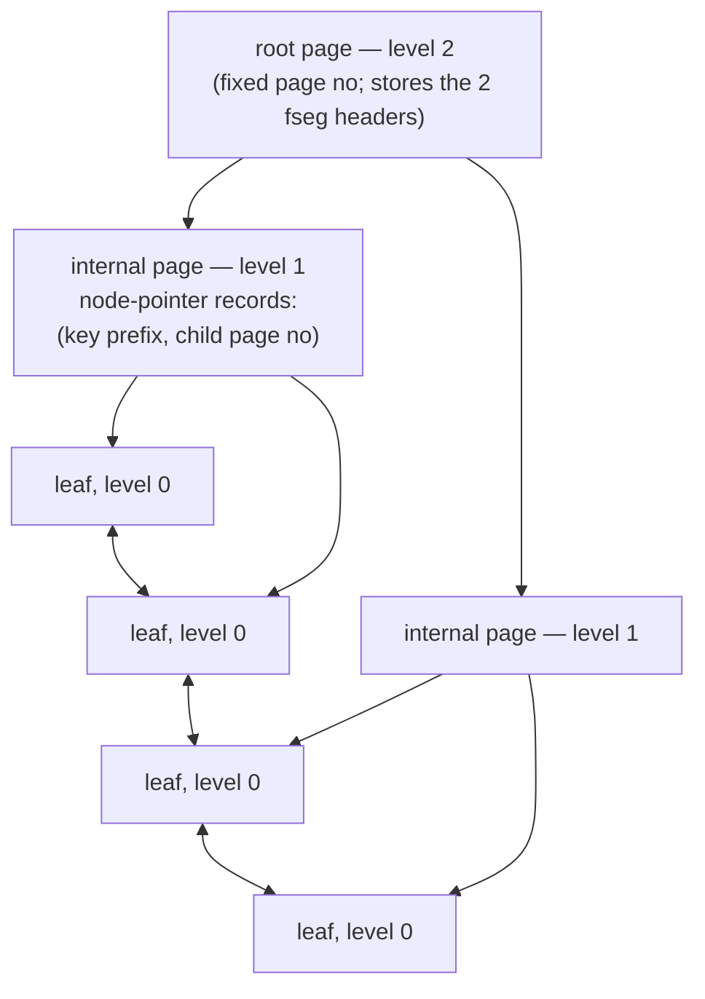

# Chapter 6 — The B+Tree

> **Layer 4 of 5 — Access paths.** How rows are indexed, found, inserted, split, merged —
> and the adaptive hash shortcut on top.
> Source: `btr/btr0btr.c`, `btr/btr0cur.c`, `btr/btr0pcur.c`, `btr/btr0sea.c`,
> `page/page0cur.c`

## 6.1 Everything is a B+tree

InnoDB has no separate "table storage": **the table *is* its clustered index** — a B+tree keyed
on the primary key whose leaf records are the full rows (with the hidden `DB_TRX_ID` /
`DB_ROLL_PTR` columns, Chapter 2). Secondary indexes are further B+trees whose leaf records
hold the indexed columns + the primary key, so a secondary lookup ends with a second descent
into the clustered tree. Even the data dictionary (Chapter 10) and the insert buffer
(Chapter 12) are B+trees. Master this chapter and you've mastered most of the engine's disk
structure.



Structural facts (`btr/btr0btr.c:46-99` — read this header comment, it's the design doc):

- Internal pages hold **node-pointer records**: a unique key prefix + the 4-byte child page
  number, exactly one per child. They use the same page/record machinery as leaves
  (`REC_STATUS_NODE_PTR`, Chapter 2); `PAGE_LEVEL` distinguishes levels, leaf = 0.
- Leaves are **doubly linked** through `FIL_PAGE_PREV`/`FIL_PAGE_NEXT` — that's what makes
  range scans a linked-list walk instead of repeated descents.
- The **root page number never changes** (it's stored in the dictionary — `dict_index_t.page`);
  when the root fills, its contents move *down* into a new child and the root becomes internal
  (`btr_root_raise_and_insert`, `btr/btr0btr.c:1204`). The tree grows at the top, in place.
- Each index owns **two file segments** (Chapter 1), anchored in the root page: one for
  non-leaf pages (`PAGE_BTR_SEG_TOP`), one for leaves (`PAGE_BTR_SEG_LEAF`)
  (`btr_create`, `btr/btr0btr.c:740`) — so leaves cluster together on disk for scan locality.

## 6.2 Searching: latch crabbing with a tree latch

`btr_cur_search_to_nth_level()` (`btr/btr0cur.c:345`) positions a cursor. The latching scheme
(per the `btr0btr.c` header and the `SYNC_*` order from Chapter 4):

```
S-latch index->lock (the tree latch)
descend: root → ... → leaf, each internal page only buffer-fixed (no latch)
latch the leaf (S for read, X for modify)
release the tree latch
```

Readers and point-writers hold the tree latch only during descent. A **restructuring**
operation (split/merge) instead takes the tree latch in X mode (`BTR_MODIFY_TREE`), which
freezes the tree's *shape* — this is a classic 1990s-style tree-level scheme, simpler but less
concurrent than the lock-free/B-link approaches modern InnoDB later adopted. Within a page,
positioning is the directory binary search of Chapter 2 (`page_cur_search_with_match`,
`page/page0cur.c:254`).

Latch modes tell the story (`include/btr0btr.h:55-82`): `BTR_SEARCH_LEAF` (S),
`BTR_MODIFY_LEAF` (X on leaf), `BTR_MODIFY_TREE` (X on tree), plus OR-flags like `BTR_INSERT`
("if the leaf isn't cached, buffer this insert instead" — the insert buffer hook, Chapter 12).

### Persistent cursors: surviving latch release

A raw cursor dies when its page latch is released. But row operations must span
mini-transactions (e.g. fetch a row, return to the user, continue the scan). The **persistent
cursor** (`btr_pcur_t`, `btr/btr0pcur.c`) bridges this:

- `btr_pcur_store_position()` (`:89`) copies the record's key prefix and remembers the block +
  its `modify_clock` (Chapter 3).
- `btr_pcur_restore_position()` (`:208`) first tries the **optimistic** path: if the same block
  is still in the pool with an unchanged `modify_clock`, jump straight back — no descent. Else
  re-search from the root using the stored key.

This optimistic-revalidation pattern (version counter + retry) appears all over InnoDB; here is
its most important use.

## 6.3 Inserting: optimistic first, pessimistic if needed

Every insert tries the cheap path before the expensive one (`row_ins_index_entry`,
`row/row0ins.c:2160` — flow detailed in Chapter 9):

1. **Optimistic** (`btr_cur_optimistic_insert`, `btr/btr0cur.c:1059`): descend with
   `BTR_MODIFY_LEAF`, X-latch just the leaf; if the record fits, splice it in
   (`page_cur_insert_rec_low`, `page/page0cur.c:966` — reuse a slot from the page free list or
   extend the heap, then link into the key-order list). The overwhelmingly common case: one
   page latch, no tree latch.
2. **Pessimistic** (`btr_cur_pessimistic_insert`, `btr/btr0cur.c:1341`): the page was full.
   X-latch the tree, then split.

### Page splits — and the sequential-insert optimization

`btr_page_split_and_insert()` (`btr/btr0btr.c:1885`) picks the split point
(`:1941-1991`):

- Default: split at the **middle record** — classic 50/50 B-tree behavior, good for random
  inserts.
- But if `PAGE_LAST_INSERT` shows the new record continues an ascending run
  (`btr_page_get_split_rec_to_right`, `:1427`), split at the *insertion point*, keeping the
  full page intact and starting a nearly-empty new right page.

That heuristic is why monotonically increasing primary keys (auto-increment) fill pages ~100%
instead of 50% — and why every MySQL performance guide since has told you to prefer
auto-increment PKs over random UUIDs. The page header's `PAGE_DIRECTION`/`PAGE_N_DIRECTION`
fields (Chapter 2) exist to feed exactly this decision. The mirrored descending case is
`btr_page_get_split_rec_to_left` (`:1382`).

After moving records, the split inserts a new node pointer into the parent
(`btr_insert_on_non_leaf_level`, `:1707`) — which may recursively split the parent, up to the
root raise. All of it happens inside one mini-transaction: crash anywhere, and Chapter 4's
`MLOG_MULTI_REC_END` rule makes the whole split vanish or persist atomically.

### Deletes, merges, and BLOBs

- Deletion is two-phase: transactions only **delete-mark** records
  (`btr_cur_del_mark_set_clust_rec`, `btr/btr0cur.c:2581` — sets the info bit, logs to undo);
  physical removal is purge's job (Chapters 7, 9).
- When a page's fill drops low, `btr_compress` (`btr/btr0btr.c:2569`) merges it into a
  sibling; an emptied page is unlinked by `btr_discard_page` (`:2932`). Both need the tree
  X-latch.
- A record too large for a page (> ~½ page, `BTR_PAGE_MAX_REC_SIZE`,
  `include/btr0btr.h:40`) has its longest columns moved to a chain of BLOB pages
  (`btr_store_big_rec_extern_fields`, `btr/btr0cur.c:3872`), leaving a 768-byte prefix + a
  20-byte external reference in the record — the origin of the famous "768-byte prefix" of
  MySQL's Antelope row format.

## 6.4 The adaptive hash index

Descending 3 levels for every point lookup is wasteful when the same keys are probed
repeatedly. `btr/btr0sea.c` watches search patterns per page and, when a page has served
enough (~100, `BTR_SEARCH_BUILD_LIMIT`, `btr0sea.c:92`) hash-friendly lookups, builds an
in-memory **hash index** over its records: hash(key prefix) → record pointer, bypassing the
descent entirely (`btr_search_guess_on_hash`, `btr0sea.c:835`).

It's a pure cache — built lazily, dropped when the page is evicted, protected by one global
`btr_search_latch` (a scalability pain point then and for the next fifteen years of InnoDB
history; the tuning knob `adaptive_hash_index` exists in this codebase's API,
`api/api0cfg.c:649`). Every page-modifying operation in `btr0cur.c` dutifully updates or
invalidates it — grep `btr_search_update_hash` to see the maintenance burden a "simple cache"
imposes.

## 6.5 What to remember

1. Table = clustered B+tree; secondary index = B+tree pointing at primary keys. One structure,
   used everywhere (dictionary, ibuf, undo… everything but the log).
2. Concurrency = tree latch for shape + page latches for content, ordered per Chapter 4;
   positions survive latch release via persistent cursors and `modify_clock`.
3. Writes are **optimistic-then-pessimistic**; splits are logged as atomic mtrs; the
   split-point heuristic rewards sequential keys — a design decision you can still feel in
   every MySQL schema review.
4. Delete = mark now, purge later (the B+tree meets MVCC in the next chapter).
5. The adaptive hash index shows the cost/benefit of transparent caching: free speed on skewed
   point reads, a global latch and invalidation logic everywhere else.

**Try it:** `tests/.libs/ib_index` exercises index creation; trace a split by breaking on
`btr_page_split_and_insert` in `tests/debug_gdb.sh` while `ib_bulk_insert` runs.

---
**Previous:** [Chapter 5 — Redo Log & Recovery](./05-redo-log-recovery.md) · **Next:** [Chapter 7 — Transactions, Undo & MVCC](./07-transactions-mvcc.md)
