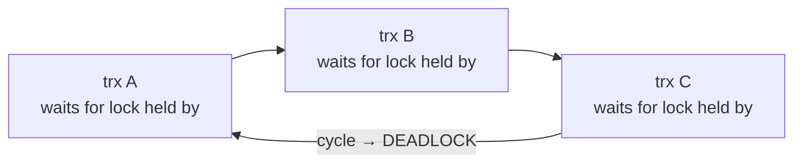

# Chapter 8 — The Lock Manager

> **Layer 5 of 5 — Transactions.** How writers coordinate: row and table locks, gap locks
> against phantoms, and deadlock detection.
> Source: `lock/lock0lock.c`, `include/lock0lock.h`, `include/lock0priv.h`

## 8.1 Locks vs latches — don't confuse them

| | latch (Ch. 4) | lock (this chapter) |
|---|---|---|
| protects | in-memory page/structure | logical data (rows, tables) |
| held for | microseconds (one mtr) | until transaction commit |
| deadlocks | prevented by static order | detected and resolved |
| module | `sync/` | `lock/` |

MVCC (Chapter 7) removed *read-write* conflicts. The lock manager handles what remains:
**write-write conflicts** and **locking reads** (SELECT … FOR UPDATE, foreign-key checks,
SERIALIZABLE).

## 8.2 Modes and intention locking

Lock modes (`enum lock_mode`, `include/lock0types.h:34`): `LOCK_S`, `LOCK_X`, plus table-level
`LOCK_IS`, `LOCK_IX` and `LOCK_AUTO_INC`. Compatibility
(`lock/lock0lock.c:290-321`):

```
        IS   IX   S    X    AI
   IS   ✓    ✓    ✓    ✗    ✓
   IX   ✓    ✓    ✗    ✗    ✗
   S    ✓    ✗    ✓    ✗    ✗
   X    ✗    ✗    ✗    ✗    ✗
   AI   ✓    ✗    ✗    ✗    ✗
```

**Intention locks** solve a hierarchy problem: to lock the whole table (e.g. for DROP), you
must know no one holds row locks inside it — without scanning every row lock. So every row
lock is preceded by an IS/IX lock *on the table*; a table S/X request then conflicts with
IS/IX directly, in O(1). `LOCK_AUTO_INC` is the special table lock serializing auto-increment
allocation.

## 8.3 Record locks: bitmaps and gap semantics

### Storage: one lock object covers a page

A naive row lock = one heap object per (trx, row) — millions of objects for a big update.
InnoDB's representation (`lock_rec_create_low`, `lock/lock0lock.c:1684`):

```
lock_t  { trx, type_mode, index, {space, page_no, n_bits} }
        followed immediately in memory by a BITMAP, one bit per heap_no on that page
```

One `lock_t` per (transaction, page, mode) covers *any number of rows on that page* — a bit
per record heap number (Chapter 2's `heap_no`). All record locks live in one global hash table
keyed by (space, page_no) (`lock_sys->rec_hash`, `include/lock0lock.h:814`). Locking a row =
find/create the lock object, set a bit. This is why InnoDB row locks are so cheap (~1 bit
amortized) — and why lock objects must be reorganized when records move between pages
(`lock_update_*` calls sprinkled through `btr0btr.c`).

### Gap locks: the phantom problem

Between committed rows there are **gaps**, and a plain row lock says nothing about them:
transaction A locks "all rows WHERE k BETWEEN 10 AND 20", transaction B *inserts* k=15, A
re-reads and sees a phantom. InnoDB's REPEATABLE READ kills phantoms with three record-lock
flavors (`include/lock0lock.h:752-803`):

```
index:      ... [k=10] ──gap── [k=20] ...

LOCK_REC_NOT_GAP   locks the record only        (unique-key point lookups)
LOCK_GAP           locks the gap before it only (nothing may be INSERTed there)
LOCK_ORDINARY      "next-key" = record + gap    (range scans; the default)
```

A scan under locking-read acquires next-key locks on every record it passes: rows can't
change, gaps can't be filled — the range is sealed. The supremum record (Chapter 2) receives
the lock for "the gap after the last row". Inserts negotiate via
**`LOCK_INSERT_INTENTION`** (`:789`): an insert into a locked gap enqueues this special
waiting gap-lock; it conflicts with gap/next-key locks (so range scanners block phantom
inserts) but two inserts into the same gap at different positions don't block each other.

READ COMMITTED, by contrast, skips gap locks (`row/row0sel.c:3167`) — phantoms allowed,
concurrency higher: the exact trade-off MySQL users pick with `transaction_isolation` today.

There is also a hidden economy: a freshly inserted, uncommitted row is protected not by any
lock object but **implicitly** — its `DB_TRX_ID` names an active transaction. Only when a
second transaction actually conflicts does the lock manager materialize an explicit lock on
the first one's behalf (`row_vers_impl_x_locked_off_kernel`, `row/row0vers.c:56`). Most locks
are never created at all.

## 8.4 Waiting, timeouts, deadlocks

All lock-manager state is guarded by the kernel mutex (Chapter 7's big lock). A conflicting
request enqueues a lock with `LOCK_WAIT` set (`lock_rec_enqueue_waiting`,
`lock/lock0lock.c:~1795`), the transaction goes to `TRX_QUE_LOCK_WAIT`, and its thread sleeps.
Grants happen when the blocker releases: `lock_rec_dequeue_from_page` (`:2268`) scans the
queue and grants whatever is now compatible — FIFO-ish, preventing starvation. A background
thread times out waits (`srv_lock_timeout_thread`, Chapter 12; tunable `lock_wait_timeout`).

### Deadlock detection: DFS on the wait-for graph

Because locks are held to commit and acquired incrementally, deadlocks are inevitable. At each
new *wait*, InnoDB runs `lock_deadlock_occurs()` → `lock_deadlock_recursive()`
(`lock/lock0lock.c:3292`, `:3373`) — a depth-first search along "who is waiting for whom":



- Search cost is bounded: depth ≤ 200, steps ≤ 1,000,000
  (`LOCK_MAX_DEPTH_IN_DEADLOCK_CHECK`, `LOCK_MAX_N_STEPS_IN_DEADLOCK_CHECK`,
  `lock/lock0lock.c:44-48`); beyond that, assume the worst and abort the requester — a
  pragmatic answer to graph-search blowup.
- On a cycle, the **victim** is the transaction with less weight (`trx_weight_cmp` — roughly:
  fewer undo records + fewer locks = cheaper to roll back); it gets
  `DB_DEADLOCK` and is rolled back (Chapter 7's machinery).

Commit releases everything: `lock_release_off_kernel()` (`lock/lock0lock.c:3992`) walks the
trx's lock list, granting queued waiters lock by lock, then discards the whole lock heap in
one free.

## 8.5 What to remember

1. Latches protect memory for microseconds; locks protect data until commit. MVCC removed
   reader-writer conflicts; the lock manager arbitrates writers.
2. Row locks are **bitmaps hanging off (page, trx, mode) objects** in a page-keyed hash — the
   representation is the scalability trick. Implicit locks avoid even that until a conflict
   materializes.
3. **Next-key = record + preceding gap**; gap locks + insert-intention locks are how
   REPEATABLE READ prevents phantoms without predicate locks. Supremum owns the last gap.
4. Deadlock handling = bounded DFS at wait time + cheapest-victim rollback; lock waits and
   timeouts are the visible symptoms (`ib_deadlock.c` in tests/ demonstrates one).

**Try it:** `tests/ib_deadlock.c` constructs a deadlock; run it and watch one transaction get
`DB_DEADLOCK`. Break in `lock_deadlock_recursive` to watch the DFS walk the wait-for graph.

---
**Previous:** [Chapter 7 — Transactions & MVCC](./07-transactions-mvcc.md) · **Next:** [Chapter 9 — Row Operations](./09-row-operations.md)
