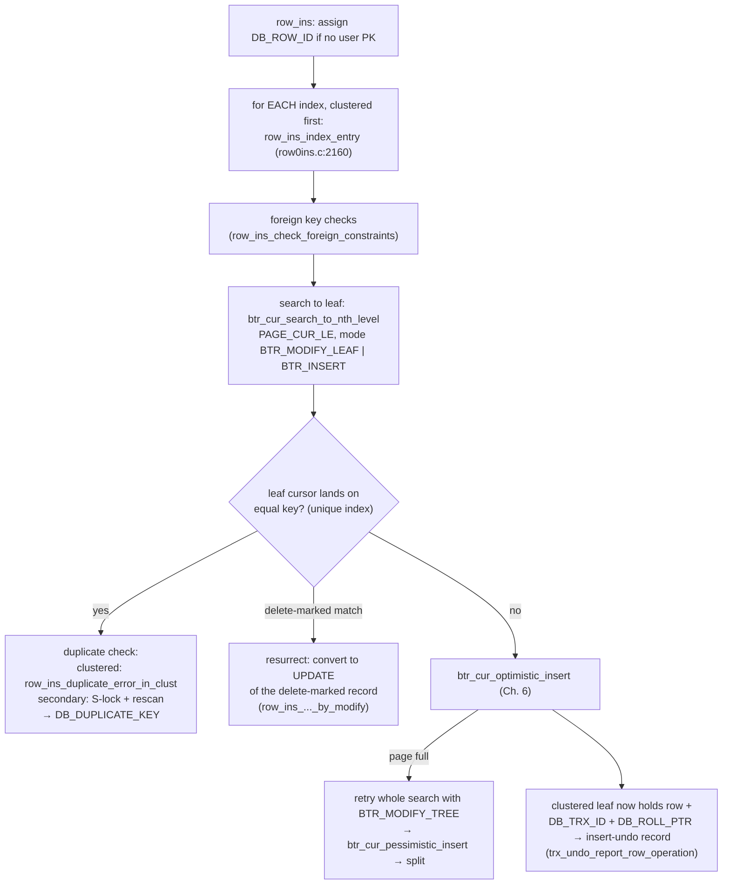

# Chapter 9 — Row Operations: INSERT, SELECT, UPDATE, DELETE End-to-End

> **Layer 4-5 glue.** The `row/` module composes everything from Chapters 1-8 into the four
> verbs of a database. This chapter follows each verb all the way down.
> Source: `row/row0ins.c`, `row/row0sel.c`, `row/row0upd.c`, `row/row0undo.c`,
> `row/row0purge.c`, `row/row0row.c`, `row/row0merge.c`

## 9.1 The cast of characters

- **`row_prebuilt_t`** (`row/row0prebuilt.c`) — a per-cursor cache of everything needed to
  run row operations on one table (index handles, a persistent cursor, heaps, the search
  tuple). The embedded API's `ib_crsr_t` wraps one (`api/api0api.c:2866`).
- **Query graphs** — row operations run as nodes (`ins_node_t`, `upd_node_t`, `sel_node_t`)
  stepped by InnoDB's internal executor (`que/que0que.c`, Chapter 10). The API builds a tiny
  graph and pumps it (`row_ins_step`, `row_upd_step`); only SELECT has a direct entry point.
- **`row_build*` helpers** (`row/row0row.c`) — convert between physical records and in-memory
  tuples: `row_build` (record → row), `row_build_index_entry` (row → entry for index N),
  `row_build_row_ref` (secondary record → primary key).

## 9.2 INSERT

Full descent from the API (`api/api0api.c:3353` → `row_ins_step` → `row_ins`,
`row/row0ins.c:2375`):



Things worth noticing:

- **Optimistic-then-pessimistic appears again** (`row0ins.c:2183-2193`) — the same
  two-attempt pattern as the B+tree layer, one level up.
- **Insert doesn't lock the new row.** It relies on the implicit lock (Chapter 8): the row's
  own `DB_TRX_ID` protects it. It *does* wait on insert-intention vs gap locks if someone has
  the gap sealed.
- **A delete-marked duplicate is an update in disguise** (`row_ins_must_modify`): if the same
  key was deleted (but not yet purged, Chapter 7), the "insert" reuses the tombstone record.
  MVCC's deferred deletion leaks into insert logic — a recurring price you'll now recognize.
- If the leaf page isn't in the buffer pool and this is a non-unique secondary index, the
  `BTR_INSERT` flag routes the entry into the **insert buffer** instead (Chapter 12) — the
  insert completes without a single random read.

## 9.3 SELECT

The embedded API's row reader is **`row_search_for_client()`** (`row/row0sel.c:2832`) — a
~700-line function that is the direct ancestor of MySQL's `row_search_for_mysql` /
`row_search_mvcc`. Skeleton:

1. Restore the persistent cursor (or search from the tuple) at `BTR_SEARCH_LEAF`.
2. For each candidate record:
   - **Consistent read** (default): check `read_view_sees_trx_id(DB_TRX_ID)`; if not visible,
     rebuild the old version via the undo chain
     (`row_vers_build_for_consistent_read`, Chapter 7) — a secondary-index record has no
     `DB_TRX_ID`, so if the page's `PAGE_MAX_TRX_ID` is too new, fall through to the
     clustered record to decide visibility (`row_sel_get_clust_rec_for_client`).
   - **Locking read** (FOR UPDATE / SERIALIZABLE): acquire the record/next-key lock instead
     (`lock_clust_rec_read_check_and_lock`); may return `DB_LOCK_WAIT` — the row layer
     suspends the thread and retries after the wait.
   - Skip delete-marked versions that resolve to "row gone".
3. Convert the winning record to the caller's tuple format; store the cursor position for the
   next fetch (`btr_pcur_store_position`, Chapter 6).

The interplay to appreciate: **visibility (MVCC), locking, and cursor positioning are three
independent state machines** braided into one loop — that braid, not B+tree search, is what
makes `row0sel.c` the hardest file in the engine.

## 9.4 UPDATE and DELETE

DELETE in InnoDB *is* an UPDATE (set the delete-mark). Both run through `row_upd_step` →
`row_upd` (`row/row0upd.c:2004`), always clustered index first:

```
row_upd_clust_step (row0upd.c:1832)
 ├─ restore cursor on the clustered record (BTR_MODIFY_LEAF)
 ├─ write update-undo record (before image) ── gets roll_ptr
 ├─ CASE 1: no ordering (key) column changed
 │    └─ update in place: btr_cur_update_in_place / optimistic_update
 │       (new DB_TRX_ID, DB_ROLL_PTR → version chain grows, Ch. 7)
 └─ CASE 2: a PK column changed
      └─ delete-mark the old record + INSERT a fresh one
         (row_upd_clust_rec_by_insert — the row physically moves!)
then, for each affected secondary index (row_upd_sec_index_entry :1437):
      delete-mark the old entry + insert the new entry   ← ALWAYS, never in place
```

Two design consequences that echo into modern MySQL:

- **Changing a primary key is expensive** — it relocates the row and touches every secondary
  index. ("Never update your PK" is not superstition; it's `row_upd_clust_rec_by_insert`.)
- **Secondary indexes are never updated in place** (`row0upd.c:1437-1526`): they have no
  version info of their own (no `DB_TRX_ID` per entry), so old and new entries must coexist
  as delete-marked/live pairs, with readers resolving via the clustered record. Purge cleans
  up the tombstones later.

## 9.5 The other half: UNDO and PURGE as row operations

The transaction chapter showed *when* undo and purge run; `row/` implements *what* they do —
each is the mirror image of a forward operation:

- **Rollback** (`row/row0undo.c:232` dispatching to `row0uins.c` / `row0umod.c`):
  an insert-undo record → delete the inserted row (its entries in every index); an
  update-undo record → restore the before image (and un-mark / re-insert secondary entries).
- **Purge** (`row/row0purge.c:599`): for a `TRX_UNDO_DEL_MARK_REC`, physically remove the
  delete-marked entries — secondary indexes first, clustered last
  (`row_purge_del_mark`, `:346`), each with the optimistic/pessimistic pair. Before removing
  a secondary entry, purge must prove no old version still needs it
  (`row_vers_old_has_index_entry`, `row/row0vers.c:341`).

So a row's full life is: INSERT (Ch. 9.2) → versions accumulate via UPDATE (9.4 + Ch. 7) →
DELETE = mark (9.4) → PURGE = physical removal (9.5). No path removes a record from a leaf
synchronously with the user's statement — every one of them defers to keep MVCC readers safe.

## 9.6 Bonus: fast index creation

`row/row0merge.c` is a fascinating late addition (from the InnoDB plugin era): CREATE INDEX
doesn't insert rows one-by-one into the new B+tree (random I/O, page splits). Instead
(`row_merge_build_indexes`, `:2260`): scan the clustered index once → sort entries in 1MB
blocks with an external **merge sort** on temp files → bulk-load the sorted stream into the
new tree left-to-right. Sequential I/O, ~full pages, no splits: the same reasoning as the
sequential-insert split optimization of Chapter 6, applied wholesale.

## 9.7 What to remember

1. `row/` is choreography: every verb = dictionary metadata + B+tree cursors + undo records +
   locks + read views, composed in a fixed order (clustered first, secondaries after).
2. SELECT braids MVCC visibility, locking, and cursor persistence in one loop
   (`row_search_for_client`) — read it once slowly; everything else in `row/` is easier.
3. UPDATE is in-place only when the key doesn't change; secondary indexes always
   delete+insert; DELETE only marks. Purge is the one who actually deletes.
4. Undo and purge are row operations too — rollback is the inverse verb, purge is the
   deferred second half of DELETE.

**Try it:** `ltrace -e 'ib_*' tests/.libs/ib_test1` shows the API sequence; then break on
`row_ins_index_entry` and `row_search_for_client` in gdb to see each verb enter the row layer.

---
**Previous:** [Chapter 8 — The Lock Manager](./08-locking.md) · **Next:** [Chapter 10 — The Data Dictionary](./10-data-dictionary.md)
