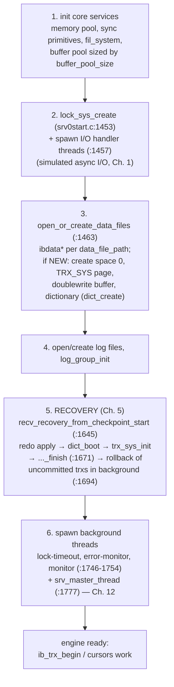

# Chapter 11 — Startup, Shutdown & the Embedded API

> What happens between `ib_init()` and a usable database — and how each `ib_*` call maps to
> the internals you now know.
> Source: `api/api0api.c`, `api/api0cfg.c`, `srv/srv0start.c`, `srv/srv0srv.c`

## 11.1 The embedded API in one test program

Every program in `tests/` follows the same skeleton (see `tests/ib_test1.c`):

```c
ib_init();                                   /* init memory, sync, OS layers   */
ib_cfg_set(...);                             /* configure before startup       */
ib_startup("barracuda");                     /* THE big one: open/create/recover */

ib_trx_t trx = ib_trx_begin(IB_TRX_REPEATABLE_READ);
ib_crsr_t crsr;
ib_cursor_open_table("db/t", trx, &crsr);
/* ... ib_cursor_insert_row / ib_cursor_read_row / ib_cursor_next ... */
ib_cursor_close(crsr);
ib_trx_commit(trx);

ib_shutdown(IB_SHUTDOWN_NORMAL);
```

## 11.2 What `ib_startup()` actually does

`ib_startup` funnels into `innobase_start_or_create()` (`srv/srv0start.c:1174`) — the
orchestration point where every subsystem from Chapters 1-10 comes online, in dependency
order:



The elegant part is step 5: **there is no "clean start" path vs "crash recovery" path** — the
same recovery code always runs; after a clean shutdown it just finds a checkpoint equal to the
log end and does nothing. Crash safety isn't a feature bolted on; it *is* the startup path.

Shutdown (`ib_shutdown` → `logs_empty_and_mark_files_at_shutdown`) is recovery's mirror:
stop background work, purge/merge what's pending, flush everything, checkpoint at the log
end — so the next startup's recovery finds nothing to do.

## 11.3 Configuration: the `srv_*` globals

`ib_cfg_set("name", value)` writes through a table in `api/api0cfg.c` (`:649-1003`) directly
into the engine's global variables — the same globals MySQL exposes with an `innodb_` prefix:

| API name | global | what it tunes (chapter) |
|----------|--------|--------------------------|
| `buffer_pool_size` | `srv_buf_pool_size` | buffer pool bytes (3) |
| `flush_log_at_trx_commit` | `srv_flush_log_at_trx_commit` | commit durability (5, 7) |
| `log_file_size`, `log_buffer_size` | `srv_log_file_size`… | redo capacity → checkpoint pressure (5) |
| `data_file_path` | `srv_data_file_names`… | system tablespace layout (1) |
| `file_per_table` | `srv_file_per_table` | one .ibd tablespace per table (1) |
| `lru_old_blocks_pct`, `lru_block_access_recency` | `buf_LRU_old_*` | midpoint LRU (3) |
| `max_dirty_pages_pct` | `srv_max_buf_pool_modified_pct` | flush pressure (12) |
| `max_purge_lag` | `srv_max_purge_lag` | purge backlog throttle (7) |
| `adaptive_hash_index` | `btr_search_enabled` | AHI (6) |
| `lock_wait_timeout` | `ses_lock_wait_timeout` | lock waits (8) |

Reading this table is a Rosetta stone: it maps two decades of MySQL tuning folklore onto the
specific mechanisms in this codebase.

## 11.4 API call → internal machinery

The `api/` layer is deliberately thin — argument marshalling plus calls into `row/`:

| API call | what happens inside |
|----------|--------------------|
| `ib_trx_begin(level)` | `trx_allocate_for_client` + `trx_start` (`api0api.c:856-866`) — id assigned, rseg chosen (Ch. 7) |
| `ib_cursor_open_table` | dictionary lookup (`dict_table_get`, Ch. 10) + build `row_prebuilt_t` with a persistent cursor (`:3089-3131`) |
| `ib_cursor_insert_row` | build/reuse an insert query graph, pump `row_ins_step` with lock-wait retry (`:3353-3420`, Ch. 9.2) |
| `ib_cursor_moveto` / `read_row` / `next` | `row_search_for_client` (`:3964-4090`, Ch. 9.3) |
| `ib_cursor_update_row` / `delete_row` | `row_upd_step` graphs (`:3568-3687`, Ch. 9.4) |
| `ib_trx_commit` | `trx_commit` (Ch. 7.4) — undo state flip + lock release + group-commit log flush |
| `ib_cursor_lock` / `ib_table_lock` | `lock_table` (Ch. 8) |

One pattern deserves attention: **lock-wait retry loops** (`ib_insert_row_with_lock_retry`,
`api0api.c:3226`). When the row layer returns `DB_LOCK_WAIT`, the API layer suspends the
thread until the lock is granted or times out, then *re-runs the operation from the stored
cursor position*. In MySQL this loop lives in the handler layer; here you can read it in
isolation — persistent cursors (Chapter 6) are what make the retry possible.

## 11.5 What to remember

1. Startup is a strict dependency ladder: OS/sync → buffer pool + I/O threads → files → **recovery
   always** → background threads. Shutdown arranges for recovery to find nothing.
2. Configuration = writing `srv_*` globals before startup; the API names map 1:1 onto
   `innodb_*` variables you already know from MySQL.
3. The API layer adds no semantics — it builds prebuilt structs + query graphs and handles
   `DB_LOCK_WAIT` retries; all real work is Chapters 6-10.

**Try it:** `ltrace -e 'ib_*' tests/.libs/ib_test1 2>&1 | head -50` shows the startup and
transaction ceremony in order; `tests/README` and `docs/api-reference.md` list the full API.

---
**Previous:** [Chapter 10 — The Data Dictionary](./10-data-dictionary.md) · **Next:** [Chapter 12 — Background Threads](./12-background-threads.md)
