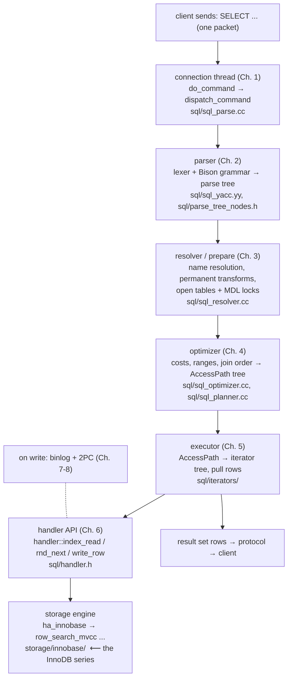

# Chapter 0 — Overview: The Journey of a SQL Statement

> **Series:** MySQL Server Architecture Deep-Dive — a step-by-step study guide to everything
> *above* the storage engine, based on the source of **Percona Server 8.0** (MySQL 8.0 LTS +
> Percona enhancements). Companion to the
> [InnoDB Architecture Deep-Dive](../innodb-architecture/README.md), which covers everything
> *below*.

## Two halves of one database

MySQL is really two programs stapled together:

- **The server layer** (`sql/`) — networking, SQL parsing, optimization, execution,
  replication, and everything a "database *server*" implies. It knows nothing about pages,
  B+trees, or buffer pools.
- **Storage engines** (`storage/`) — InnoDB, MyRocks, TempTable, MyISAM… Each knows how to
  store and retrieve *rows in tables*, and nothing about SQL.

Between them sits one C++ interface: the **handler API** (`sql/handler.h`). That boundary is
this series' destination — Chapter 6 lands exactly where the InnoDB series begins.

## The journey (memorize this picture)

Around that synchronous path run the supporting systems: metadata locking and the
binlog/engine two-phase commit (Chapters 7–8), replication (Chapter 9), the transactional
data dictionary (Chapter 10), and Percona's additions (Chapter 11). Chapter 12 replays the
whole journey as a capstone.

## Chapter roadmap

| # | Chapter | Question it answers | Main sources |
|---|---------|--------------------|--------------|
| [01](./01-connections-and-dispatch.md) | Startup, Connections & Command Dispatch | How does a TCP packet become a running SQL command in a THD? | `sql/mysqld.cc`, `sql/conn_handler/`, `sql/sql_parse.cc` |
| [02](./02-parser.md) | The Parser | How does SQL text become a parse tree and a LEX? | `sql/sql_yacc.yy`, `sql/parse_tree_nodes.h` |
| [03](./03-resolver-prepare.md) | Resolution & Prepare | How are names bound, tables opened, queries transformed? | `sql/sql_resolver.cc`, `sql/table.h` |
| [04](./04-optimizer.md) | The Optimizer | How is the cheapest plan found? | `sql/sql_optimizer.cc`, `sql/sql_planner.cc`, `sql/range_optimizer/` |
| [05](./05-executor.md) | The Iterator Executor | How does the plan actually run? | `sql/iterators/`, `sql/filesort.cc` |
| [06](./06-handler-api.md) | The Handler API | How does the server talk to InnoDB (and any engine)? | `sql/handler.h`, `storage/innobase/handler/ha_innodb.cc` |
| [07](./07-mdl-and-transactions.md) | Metadata Locks & Transaction Coordination | What serializes DDL vs DML? How do binlog and engines commit atomically? | `sql/mdl.cc`, `sql/handler.cc` |
| [08](./08-binlog.md) | The Binary Log | How are changes recorded, grouped, and made crash-safe? | `sql/binlog.cc`, `libbinlogevents/` |
| [09](./09-replication.md) | Replication | How do replicas stay in sync? | `sql/rpl_*.cc` |
| [10](./10-data-dictionary.md) | The Data Dictionary & Atomic DDL | Where does the schema live since 8.0? | `sql/dd/` |
| [11](./11-percona-additions.md) | What Percona Adds | Thread pool, MyRocks, auditing, encryption… | `plugin/`, `storage/rocksdb/` |
| [12](./12-journey-capstone.md) | Capstone: One Statement, Every Layer | Can you narrate the whole journey? | everything |

## How this connects to the InnoDB series

The [InnoDB deep-dive](../innodb-architecture/README.md) studied the 2005-era embedded engine,
where *you* were the SQL layer, calling `ib_cursor_*` directly. In this series the same engine
(20 years more evolved) sits behind `ha_innobase`, and the "user" of its cursors is the
iterator executor. Watch for the reunions:

- `row_prebuilt_t` — the prebuilt struct from the embedded API is exactly what `ha_innobase`
  keeps per open table.
- `row_search_mvcc` — the descendant of `row_search_for_client` (InnoDB series, Ch. 9).
- `TRX_PREPARED` and XA — the InnoDB commit machinery (Ch. 7 there) is one participant in the
  server's binlog two-phase commit (Ch. 7-8 here).
- The data dictionary — InnoDB's `SYS_TABLES` bootstrap (Ch. 10 there) grew into MySQL 8.0's
  entire transactional dictionary (Ch. 10 here).

## How to study with this series

1. **Keep the source open.** File references are relative to the
   [percona-server](https://github.com/percona/percona-server) tree (8.0 branch). The code is
   heavily Doxygen-commented; `sql/sql_parse.cc` and `sql/handler.h` have excellent header
   comments.
2. **Use a debug build + gdb.** Break on `dispatch_command`, `JOIN::optimize`,
   `ha_innobase::index_read` and step a simple SELECT through all layers.
3. **Use the server's own X-ray tools:** `EXPLAIN FORMAT=TREE` (the iterator tree of Ch. 5),
   `performance_schema` stage/statement tables, `SHOW ENGINE INNODB STATUS`,
   `mysqlbinlog --hexdump` (Ch. 8).
4. **Read `mysql-test/` cases** for any feature you study — they are executable specifications.

## Conventions

- File references: `sql/sql_parse.cc:1610` style, relative to the repo root; verified against
  Percona Server 8.0.46. Line numbers drift between releases — treat them as anchors, not
  gospel.
- Diagrams are Mermaid (GitHub renders them) or ASCII tables.
- "8.0 change" boxes call out what differs from the 5.x architecture, since much online
  material describes the old world.

---
**Next:** [Chapter 1 — Startup, Connections & Command Dispatch](./01-connections-and-dispatch.md)
