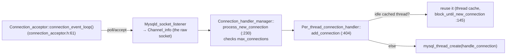

# Chapter 1 — Startup, Connections & Command Dispatch

> How a mysqld process boots, how a TCP connection becomes a session, and how a packet
> becomes a running SQL command.
> Source: `sql/mysqld.cc`, `sql/conn_handler/`, `sql/sql_class.h`, `sql/sql_parse.cc`,
> `sql/protocol_classic.cc`

## 1.1 Boot: `mysqld_main()`

`sql/mysqld.cc:7693` is the real `main`. The sequence matters because it encodes the
dependency order of the whole server (compare the InnoDB series Ch. 11 — same idea, bigger
machine):

```
init_common_variables()            (:8108)  options, charsets, sysvars
init_server_components()           (:8312)  ┐ the heavy lifter:
  ├─ plugin_register_builtin_and_init_core_se (:6849)   ← InnoDB starts HERE
  │    (InnoDB runs its own recovery — InnoDB series Ch. 5 — before the server proceeds)
  ├─ dd::init(...)                 (:6868)  data dictionary on top of InnoDB (Ch. 10)
  ├─ plugin_register_dynamic_and_init_all (:6966)  other plugins (incl. thread_pool)
  └─ ha_post_recover()             (:7300)  XA recovery finalization (Ch. 7)
network_init()                     (:8484)  listeners created
acl_init() / grant_init()          (:8552)  privileges (stored in tables → needed DD)
Events, replica threads, signal handler ...
mysqld_socket_acceptor->connection_event_loop()  (:8738)  ← blocks forever, accepting
```

Note the inversion from 5.x folklore: **the storage engine and dictionary come up before the
privilege system**, because since 8.0 the grant tables are InnoDB tables read through the DD.

A running mysqld has surprisingly few *server* threads: the accept loop, a signal-handler
thread, one thread per connection (or a thread pool — below), the event scheduler, replica
threads, and `handle_manager` for periodic maintenance. Everything else (page cleaners, purge,
I/O) belongs to InnoDB internally.

## 1.2 From `accept()` to a session thread

The connection path is a small class dance in `sql/conn_handler/`:



`handle_connection()` (`sql/conn_handler/connection_handler_per_thread.cc:247`) is a
connection's whole life:

```c
init_new_thd(channel_info);          // build the THD
thd_manager->add_thd(thd);
thd_prepare_connection(thd);         // handshake + authentication
while (thd_connection_alive(thd))
    if (do_command(thd)) break;      // ← the command loop (1.4)
end_connection(thd); close_connection(thd);
thd->release_resources(); thd_manager->remove_thd(thd);
block_until_new_connection();        // park in the thread cache for reuse
```

This is the famous **one-thread-per-connection** model — simple, low-latency, and the reason
`max_connections` × per-thread memory is a capacity-planning formula. The thread cache
(`thread_cache_size`) only saves thread *creation*, not memory or scheduler pressure.

**Percona's thread pool** (`sql/threadpool_unix.cc` — built into the server, activated as the
`thread_pool` plugin) replaces this scheduler: connections are sharded into **thread groups**,
each with an epoll listener; a bounded set of worker threads (`worker_main`,
`threadpool_unix.cc:194`) picks up ready connections and runs `threadpool_process_request()`
(`threadpool_common.cc:206`). Ten thousand mostly-idle connections then cost ~dozens of
threads instead of ten thousand. (Oracle sells this as an enterprise feature; Percona ships it
in the open build — a good example of what "Percona Server" means.)

## 1.3 THD: the session object

`class THD` (`sql/sql_class.h:1105`) is MySQL's equivalent of "everything about one session",
and you will see a `THD *thd` first parameter on nearly every function in `sql/`. What it
owns:

| member | role | chapter |
|--------|------|---------|
| `net`, `m_protocol` | the wire connection & protocol codec | 1 |
| `m_main_security_ctx` | authenticated user, privileges | — |
| `lex`, `m_query_string`, `mem_root` | current statement's parse state & memory arena | 2-3 |
| `open_tables`, `mdl_context` | opened table handles + metadata locks | 3, 7 |
| `m_transaction` (`Transaction_ctx`) | per-engine transaction registrations | 7 |
| `variables`, `status_var` | session sysvars & counters | — |
| `killed` (atomic) | cooperative KILL flag, polled at safe points | — |
| `binlog cache` (via transaction ctx) | buffered binlog events | 8 |

Two design points worth internalizing: **memory is arena-based** (`MEM_ROOT` — allocations
live until statement/connection end, freed in one shot; the same philosophy as InnoDB's
`mem_heap_t`), and **KILL is cooperative** — `thd->killed` is checked at loop boundaries, which
is why a runaway query inside a storage engine can take a while to die.

## 1.4 The command loop and the two dispatch levels

Every client interaction is a **command packet**; SQL is just the payload of `COM_QUERY`.
The loop (`sql/sql_parse.cc`):

```
do_command (:1361)                    read one packet (blocking)
  └─ dispatch_command (:1765)         switch (command)  ← protocol-level verbs
       COM_QUERY (:2104)              plain SQL text
       COM_STMT_PREPARE/EXECUTE (:2066/:2025)   prepared statements (binary)
       COM_PING, COM_INIT_DB, COM_BINLOG_DUMP_GTID (replication! Ch. 9), ...
         └─ dispatch_sql_command (:5514)      for COM_QUERY:
              parse_sql (:5549)               → Chapter 2
              mysql_execute_command (:3110)   the giant switch(lex->sql_command)
                 SQLCOM_SELECT, SQLCOM_INSERT, ... → Sql_cmd::execute → Chapters 3-6
```

So there are **two switches**: protocol commands (`COM_*`, what the wire says) and SQL
commands (`SQLCOM_*`, what the parser understood). Replication clients enter the same loop —
a replica is just a client that sends `COM_BINLOG_DUMP_GTID` and never leaves.

### The wire protocol in one paragraph

`sql/protocol_classic.cc` implements the MySQL client/server protocol: length-prefixed
packets; results as *metadata packets, then row packets* (length-encoded strings —
`net_store_data`, `:1266`), terminated by an OK/EOF packet (`net_send_ok` `:860`,
`net_send_eof` `:1052`); errors as ERR packets (`net_send_error` `:613`). Rows stream to the
client *as the executor produces them* — there is no server-side result buffering by default,
which is why a slow-reading client can hold locks (and why `SQL_BUFFER_RESULT` exists).

## 1.5 What to remember

1. Startup order encodes architecture: engines → data dictionary → privileges → network.
   InnoDB recovery has already finished before MySQL accepts a single connection.
2. A connection = a `Channel_info` → a `THD` → a thread running `do_command` in a loop.
   One-thread-per-connection is the default; Percona's thread-pool scheduler swaps in a
   bounded worker model.
3. `THD` is the session god-object: protocol, privileges, parse state, transaction context,
   MDL, kill flag. Arena allocation and cooperative kill are its two big idioms.
4. Two dispatch layers: `COM_*` (protocol) then `SQLCOM_*` (SQL). Everything you'll study in
   Chapters 2–6 happens inside one iteration of `do_command`.

**Try it:** `gdb -p $(pidof mysqld)`, `break dispatch_command`, run `SELECT 1` from a client —
then `bt` and walk the frames you just read about.

---
**Previous:** [Chapter 0 — Overview](./00-overview.md) · **Next:** [Chapter 2 — The Parser](./02-parser.md)
