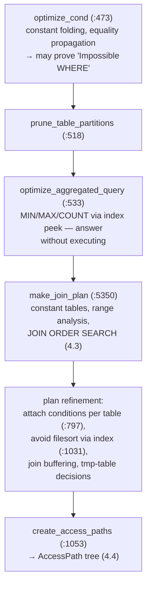

# Chapter 4 — The Query Optimizer

> Cost-based planning: statistics, range analysis, join ordering, and the AccessPath tree
> that the executor will run.
> Source: `sql/sql_optimizer.cc`, `sql/sql_planner.cc`, `sql/range_optimizer/`,
> `sql/opt_costmodel.h`, `sql/join_optimizer/`

## 4.1 The pipeline: `JOIN::optimize()`

Per query block, `JOIN::optimize()` (`sql/sql_optimizer.cc:337`) runs a fixed pipeline:

Two early-exit tricks worth knowing: `optimize_cond` can prove the WHERE false and skip
everything (`Impossible WHERE`); `optimize_aggregated_query` can answer
`SELECT MAX(k) FROM t` from one index dive with no execution at all.

## 4.2 Costs and statistics

Cost = abstract units where reading one disk block ≈ 1.0 (`opt_costconstants.cc`):
`ROW_EVALUATE_COST` = 0.1, `KEY_COMPARE_COST` = 0.05, `MEMORY_BLOCK_READ_COST` = 0.25,
`IO_BLOCK_READ_COST` = 1.0 — all overridable via the `mysql.server_cost` /
`mysql.engine_cost` tables (a rarely-used but real tuning surface). `Cost_estimate`
(`sql/handler.h:3799`) tracks io/cpu components separately.

The numbers being multiplied come from the storage engine, through three channels:

1. **`handler::info()`** (`sql/handler.h:5721`) — table row count (`stats.records`) and index
   cardinality (`rec_per_key`). For InnoDB these come from sampled index dives — *estimates,
   not counts*.
2. **`handler::records_in_range()`** (`:5681`) — "how many rows between key A and B?"
   answered by actual B+tree descents (index dives) at optimization time. Precise but costs
   I/O; `eq_range_index_dive_limit` caps how many ranges get dives before falling back to
   `rec_per_key`.
3. **Histograms** (`sql/histograms/`) — equi-height column distributions for predicates on
   non-indexed columns (`ANALYZE TABLE ... UPDATE HISTOGRAM`).

This is the layered answer to "where do optimizer estimates come from" — and the origin of
most bad-plan war stories: stale dives, capped dives, or no histogram.

## 4.3 The two searches: range analysis and join ordering

**Range analysis** (`sql/range_optimizer/`, entry `test_quick_select`,
`range_optimizer.cc:524`): the WHERE clause is compiled per index into a `SEL_TREE` of
key-interval trees (`SEL_ARG` red-black trees — one of MySQL's oldest and hairiest data
structures). Output: for each usable index, the set of ranges to scan and their estimated
row count, possibly combined as index-merge / ROR union-intersection, or skip scans.
Each candidate becomes a potential access method with a cost.

**Join ordering** (`sql/sql_planner.cc`) is the heart:

- `Optimize_table_order::choose_table_order()` (`:1959`) → **`greedy_search()`** (`:2337`)
  → `best_extension_by_limited_search()` (`:2736`): build the join prefix one table at a
  time; at each step, exhaustively evaluate extensions up to `optimizer_search_depth` tables
  deep, commit the best first table, repeat. Exhaustive within a window, greedy across —
  the classic answer to n! blowup (System R's DP, budgeted).
- For each candidate table position, **`best_access_path()`** (`:982`) picks the cheapest way
  to fetch its rows given the tables already in the prefix: `ref` lookup on an equality
  (from the KEYUSE array), a range scan from 4.2, a full index scan, or a table scan —
  costed with the prefix's row count as the multiplier.
- Semijoin strategies (from the flattened subqueries of Chapter 3) are costed alongside:
  FirstMatch, LooseScan, DuplicateWeedout, Materialization
  (`advance_sj_state`, `:4125`).

The output is `best_positions[]` — an ordered list of (table, access method, expected rows,
cost). **Left-deep plans only**: the classic optimizer never considers bushy joins.

## 4.4 The output: an AccessPath tree

Since 8.0.20+, the optimizer's product is an **`AccessPath`** tree
(`sql/join_optimizer/access_path.h:193`) — a tagged union of plan nodes:
`TABLE_SCAN`, `REF`, `EQ_REF`, `INDEX_RANGE_SCAN`, `NESTED_LOOP_JOIN`, `HASH_JOIN`,
`FILTER`, `SORT`, `AGGREGATE`, `LIMIT_OFFSET`, `MATERIALIZE`… each carrying cost and row
estimates. `create_access_paths()` (`sql_optimizer.cc:1053`) translates the chosen
`best_positions[]` into this tree. It is exactly what `EXPLAIN FORMAT=TREE` prints
(`PrintQueryPlan`, `sql/join_optimizer/explain_access_path.cc:1727`), and what the executor
consumes (Chapter 5).

### The future in the same tree: the hypergraph optimizer

`sql/join_optimizer/` also contains a complete second optimizer
(`FindBestQueryPlan`, `join_optimizer.cc:6402`; entered from `JOIN::optimize` at `:638`):
a textbook bottom-up **dynamic programming enumeration (DPhyp)** over a join hypergraph —
bushy plans, principled cost model, interesting orders. In this 8.0 tree it's
compile-gated (`WITH_HYPERGRAPH_OPTIMIZER`) and experimental; it became the default
foundation in later MySQL versions. Having both in one codebase makes this tree a great
place to compare 1990s-heuristic and modern-DP optimizer design side by side.

## 4.5 What to remember

1. Optimization = fixed pipeline: normalize conditions → prune → range-analyze each table →
   greedy join-order search with per-position `best_access_path` → AccessPath tree.
2. Estimates flow from the engine (`info`, `records_in_range` dives, histograms) into an
   abstract cost model with configurable constants. Most plan mysteries are estimate
   mysteries.
3. `optimizer_search_depth`, `optimizer_prune_level`, `eq_range_index_dive_limit`,
   `optimizer_switch` flags — the knobs map 1:1 to functions in this chapter.
4. The `AccessPath` tree is the contract between optimizer and executor — and
   `EXPLAIN FORMAT=TREE` is its honest serialization.

**Try it:** `SET optimizer_trace="enabled=on"; SELECT ...;
SELECT * FROM information_schema.optimizer_trace\G` — the trace JSON mirrors this chapter's
function names (`rows_estimation`, `considered_execution_plans`, `best_access_path`...).

---
**Previous:** [Chapter 3 — Resolution & Prepare](./03-resolver-prepare.md) · **Next:** [Chapter 5 — The Iterator Executor](./05-executor.md)
