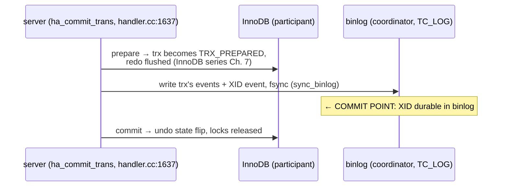

# Chapter 7 — Metadata Locks & Transaction Coordination

> The two server-level concurrency systems: MDL, which serializes DDL against DML, and the
> two-phase commit that keeps engines and binlog atomically in sync.
> Source: `sql/mdl.h/.cc`, `sql/handler.cc`, `sql/transaction_info.h`, `sql/tc_log.h`

## 7.1 Why the server needs its own locks

InnoDB locks *rows* (InnoDB series, Ch. 8). But nothing at the engine level stops
`DROP TABLE t` from destroying a table mid-`SELECT`. The server needs locks on *names and
definitions* — **metadata locks (MDL)**, held for the whole transaction (that duration is
the fix for the historical bug where a table could change between statements of one
transaction).

`MDL_key` namespaces (`sql/mdl.h:401`) cover more than tables: `GLOBAL`, `SCHEMA`, `TABLE`,
`COMMIT`, `TABLESPACE`, `FUNCTION`… (plus Percona's `BACKUP_TABLES` for
`LOCK TABLES FOR BACKUP`). Lock types run from `MDL_INTENTION_EXCLUSIVE` through the shared
family to `MDL_EXCLUSIVE` (`:197`):

```
DML:  SELECT → SHARED_READ (SR) on the table    INSERT/UPDATE/DELETE → SHARED_WRITE (SW)
      + INTENTION_EXCLUSIVE on GLOBAL, SCHEMA, COMMIT scopes
DDL:  SHARED_UPGRADABLE (SU) while preparing → upgrade to EXCLUSIVE (X) to swap the definition
FTWRL (backup): GLOBAL S — blocks all IX holders = all writes
```

SR and SW are compatible with each other (DML never blocks DML at this level) but conflict
with X — so a `DROP`/`ALTER` waits for open transactions, and everyone behind it waits on
the X request. That queue is the anatomy of the infamous **"Waiting for table metadata
lock"** pile-up: one long transaction + one ALTER = a frozen table.

Acquisition (`MDL_context::acquire_lock`, `sql/mdl.cc:3378`) waits up to
`lock_wait_timeout`, and — because transactions can wait on each other through MDL alone —
runs a full **deadlock detector**: a wait-for-graph visitor
(`Deadlock_detection_visitor`, `mdl.cc:301`; `find_deadlock`, `:4096`) that spans MDL *and*
table locks, choosing the victim by lightest weight. This is a second, independent deadlock
detector above InnoDB's (Ch. 8 there) — a deadlock can be caught by either, depending on
where the cycle forms.

## 7.2 The intention lock on COMMIT

A detail that shows the design's elegance: every commit takes
`MDL_INTENTION_EXCLUSIVE` on the **COMMIT namespace** (`ha_commit_trans`,
`sql/handler.cc:1774`). `FLUSH TABLES WITH READ LOCK` takes the conflicting global lock —
so a backup can block *commits* (not just statements) and get a true point-in-time cut,
without any special-case code in the commit path.

## 7.3 The distributed transaction inside every MySQL server

Here is the deepest fact of this chapter: with the binlog enabled, **every transaction is a
distributed transaction** between two persistence systems — the storage engine (InnoDB's
redo/undo) and the binary log (replication's source of truth, Ch. 8). If they disagree after
a crash, replicas diverge from the source. MySQL solves it with classic two-phase commit,
with the **binlog acting as the coordinator's log**:



Crash recovery (`binlog::Binlog_recovery::recover`, `sql/binlog/recovery.cc:59`) makes the
rule concrete: scan the last binlog for XID events, then `ha_recover()` — every engine lists
its prepared transactions; **in the binlog → commit it; not in the binlog → roll it back**
(`recovery.cc:111`). The InnoDB `TRX_PREPARED` state you met in the embedded engine exists
*for this handshake*. The binlog is also truncated back to the last complete transaction
(`m_valid_pos`), handling its own torn tail.

The plumbing (`sql/handler.cc:1637`, `ha_commit_trans`):

- `Transaction_ctx` (`sql/transaction_info.h:53`) tracks which engines joined the
  transaction (`Ha_trx_info` list, `rw_ha_count`), per scope — statement vs session (that
  duality is how autocommit and multi-statement transactions share one code path).
- The prepare phase is skipped when there's only one participant
  (`handler.cc:1795`: read-only, single engine + no binlog) — then it's a plain 1PC commit.
- `tc_log` is the coordinator abstraction (`sql/tc_log.h`): `MYSQL_BIN_LOG` when binlogging;
  `TC_LOG_MMAP` (an mmap'd XID file) for binlog-less multi-engine XA; `TC_LOG_DUMMY`
  otherwise (`mysqld.cc:7281-7283`).

User-level `XA PREPARE/COMMIT` is the same machinery with the client as coordinator, and
GTIDs piggyback on the commit path too (Ch. 8).

## 7.4 What to remember

1. MDL locks *definitions*, for transaction duration, with its own wait-for-graph deadlock
   detector; "Waiting for table metadata lock" = a DDL X request queued behind an open
   transaction.
2. The COMMIT-namespace intention lock is how FTWRL/backups quiesce commits cleanly.
3. Binlog + engine = 2PC with the binlog as coordinator log; recovery commits prepared
   engine transactions iff their XID reached the binlog. InnoDB's `TRX_PREPARED` exists for
   exactly this.
4. `Transaction_ctx` / `Ha_trx_info` track per-engine participation; 2PC is skipped when
   only one durable participant exists.

**Try it:** reproduce the classic pile-up — session 1: `BEGIN; SELECT * FROM t;` session 2:
`ALTER TABLE t ADD COLUMN x INT;` session 3: `SELECT * FROM t;` — then examine
`performance_schema.metadata_locks` to see SR granted, X pending, SR waiting.

---
**Previous:** [Chapter 6 — The Handler API](./06-handler-api.md) · **Next:** [Chapter 8 — The Binary Log](./08-binlog.md)
