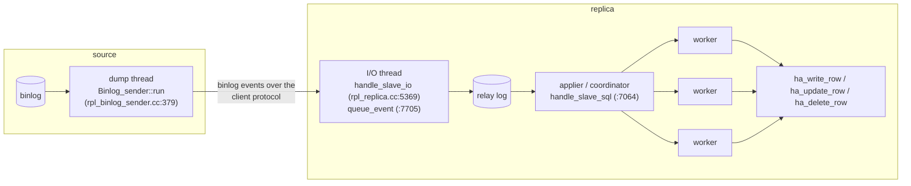

# Chapter 9 — Replication

> How replicas stay in sync: the dump thread, the I/O and applier threads, parallel apply,
> and crash-safe positioning.
> Source: `sql/rpl_binlog_sender.cc`, `sql/rpl_replica.cc`, `sql/rpl_rli_pdb.h`,
> `sql/log_event.cc`, `plugin/semisync/`

## 9.1 The pipeline: three threads and two logs

MySQL replication is asynchronous log shipping, built from pieces you already know:

- A replica is **just a client** (Ch. 1): its I/O thread connects and sends
  `COM_BINLOG_DUMP_GTID` with its `gtid_executed` set (`request_dump`,
  `rpl_replica.cc:4178`); the source's dump thread streams events it lacks, waiting on the
  binlog's update signal for new ones.
- The I/O thread only *stores* events into the **relay log** (same format as the binlog) —
  decoupling network from apply.
- The applier executes events through the very stack of Chapters 5-6:
  `Rows_log_event::do_apply_event` (`sql/log_event.cc:9820`) opens the table by id (from
  TABLE_MAP), then per row calls `ha_write_row` / `ha_update_row(record[1], record[0])` /
  `ha_delete_row` (`:12465-12614`). Row-based apply is literally handler calls replayed —
  no SQL, no parser, no optimizer.

## 9.2 Parallel apply (MTS)

A single applier thread cannot keep up with a source committing on many connections. With
`replica_parallel_workers > 0`, the applier becomes a **coordinator + workers**
(`Slave_worker`, `sql/rpl_rli_pdb.h:498`), and the question becomes: *which transactions may
run in parallel?* Two policies (`Mts_submode`, `sql/rpl_mta_submode.h:47`):

- `DATABASE` — transactions touching different schemas are independent. Coarse.
- **`LOGICAL_CLOCK`** — the source annotates each GTID event with
  (`last_committed`, `sequence_number`): transactions that were in the **same binlog
  group commit** (Ch. 8) proved they didn't conflict — they held their locks
  simultaneously — so the replica may apply them concurrently
  (`Mts_submode_logical_clock`, `rpl_mta_submode.h:129`).

That is a beautiful architectural echo: **group commit, built to save fsyncs, doubles as a
conflict oracle for parallel replication.** (Later MySQL sharpened it with writeset
tracking, deriving independence from row hashes rather than commit timing.)
`replica_preserve_commit_order` keeps workers committing in source order so the replica
never exposes a state the source never had.

## 9.3 Crash safety and semi-sync

Two refinements turned replication from fragile to dependable:

- **Crash-safe positions**: the replica's progress (`mysql.slave_relay_log_info`) is an
  InnoDB table updated *in the same transaction* as the applied changes — position and data
  commit atomically (the same trick as the `mysql.gtid_executed` table, and philosophically
  the same as InnoDB storing its dictionary in itself). A crashed replica resumes exactly
  where it stopped; with GTID auto-positioning it can even reconstruct from the data alone.
- **Semi-synchronous replication** (`plugin/semisync/`): pure async means an acknowledged
  commit can vanish if the source dies. With semi-sync, after the binlog fsync (the SYNC
  stage of Ch. 8) the committing session waits — `ReplSemiSyncMaster::commitTrx`
  (`semisync_source.cc:644`) — until at least one replica acknowledges receipt (AFTER_SYNC:
  ack before the engine commit becomes visible, so no client ever sees a state that could
  be lost), or a timeout degrades to async. This is the primitive under most MySQL HA
  setups; its consensus-flavored big sibling is Group Replication.

## 9.4 What to remember

1. Replication = binlog shipping: dump thread → I/O thread → relay log → applier. Row
   events replay as raw handler calls — replication is a client of Chapter 6, not of SQL.
2. GTID auto-positioning replaced file+offset coordination with set difference.
3. Parallel apply trusts the group-commit clock (`last_committed`/`sequence_number`):
   commit-group membership = proven non-conflict.
4. Positions live in InnoDB tables updated transactionally with the data — crash-safety by
   construction; semi-sync closes the async durability gap at the cost of one network RTT.

**Try it:** `SHOW REPLICA STATUS\G` maps 1:1 to this pipeline (I/O vs SQL thread state,
`Retrieved_Gtid_Set` vs `Executed_Gtid_Set`); `performance_schema.replication_applier_status_by_worker`
shows the workers and their `last_committed` scheduling.

---
**Previous:** [Chapter 8 — The Binary Log](./08-binlog.md) · **Next:** [Chapter 10 — The Data Dictionary](./10-data-dictionary.md)
