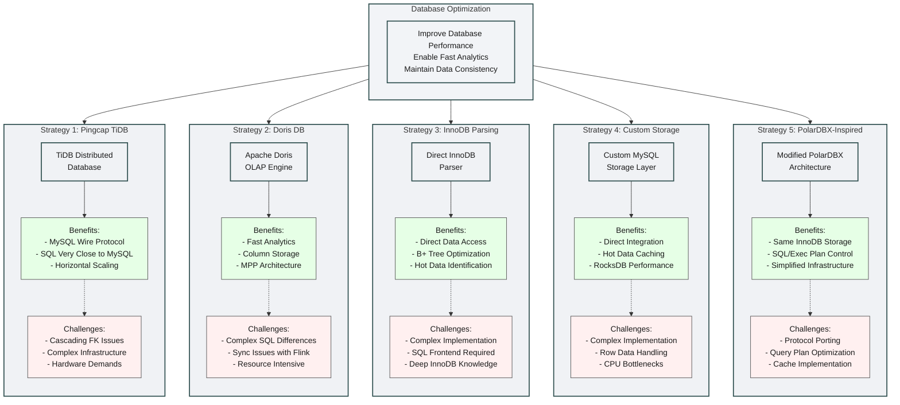

# Diagram

# Detail

Understanding the Challenge:

  * **Performance Bottlenecks**
    * Growing database size impacting query performance
    * Increasing demand for real-time analytics
    * Complex queries causing high CPU utilization
    * Need to maintain ACID compliance while improving speed
  * **Current Infrastructure**
    * Percona Server as primary database
    * InnoDB storage engine
    * Traditional master-slave replication
    * Limited by single-node performance

Attempts:

* **1 - TiDB Implementation Details**
  * **Architecture Exploration**
    * Distributed SQL database built on top of RocksDB
    * TiKV for distributed storage
    * Placement Driver (PD) for cluster management
    * Built-in partitioning and sharding
  * **Integration Attempts**
    * Data migration using TiDB Data Migration (DM)
    * Testing of parallel query execution
    * Performance benchmarking against existing system
  * **Technical Challenges**
    * Foreign key cascading operations not fully supported
    * Complex cluster topology requiring careful management
    * Need for data rebalancing and maintenance windows
    * Additional operational complexity

* **2 - Doris Integration Experience**
  * **Implementation Strategy**
    * Apache Flink CDC for data synchronization
    * Custom connectors for data transformation
    * Pipeline setup for incremental updates
  * **Technical Hurdles**
    * Complex SQL dialect requiring query rewrites
    * Checkpoint management in Flink pipelines
    * Resource consumption of Java processes
    * Initial data loading complexity

* **3 - Custom Storage Layer Investigation**
  * **Architecture Design**
    * RocksDB as persistent storage layer
    * In-memory cache for hot data (10%)
    * Custom MySQL handler implementation
  * **Implementation Details**
    * Row format conversion between MySQL and RocksDB
    * Cache eviction policies for hot data
    * Query routing logic between storage layers
  * **Performance Considerations**
    * CPU-bound operations limiting throughput
    * Memory management complexity
    * Transaction boundary handling

* **4 - InnoDB Direct Parsing Research**
  * **Technical Components**
    * B+ tree traversal implementation
    * Page compression handling
    * Transaction log processing
  * **Optimization Attempts**
    * Hot data identification algorithms
    * Memory-mapped file access
    * Parallel page reading
  * **Learning Outcomes**
    * Deep understanding of InnoDB internals
    * Page format and compression insights
    * Transaction handling complexities

* **5 - PolarDBX-Based Final Solution**
  * **Core Components**
    * Custom XProtocol implementation for Percona
    * Query splitting and routing layer
    * Connection pooling optimization
  * **Technical Improvements**
    * Maintained InnoDB storage benefits
    * Simplified infrastructure compared to distributed solutions
    * Direct control over execution plans
  * **Implementation Focus**
    * Protocol adaptation for Percona Server
    * Query optimization techniques
    * Cache strategy development
  * **Future Optimization Paths**
    * Enhanced query splitting algorithms
    * Improved cache hit ratios
    * Advanced execution plan optimization
