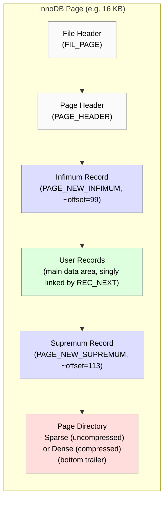

# Goal

Develop a small program (within the Percona Server 8.0 codebase) to read `.ibd` files, decrypt them if needed, decompress the pages, and then parse them offline.  

Essentially an “uncompressed/unencrypted ibd converter.”

# Innodb Page

# Strategies

[**Diagram Options**](./docs/strategy.md)

1. **`innochecksum`** Create a new utility in original mysql branch 
   - **Strategy**: Add decompression and encryption logic to MySQL’s minimal offline tool (`innochecksum`) within the MySQL `utilities` folder.
   - **Difficulty**: Integrating MySQL’s encryption and keyring references can drag in broader server dependencies; requires carefully isolating or stubbing out non-utility code.

2. **`xtraBackup`** Create a new binary using this percona xtrabackup fork
   - **Strategy**: Repurpose Percona’s backup tool (`xtrabackup`) to read and decrypt `.ibd` files, removing the unneeded backup-related features.
   - **Difficulty**: XtraBackup is patched heavily for hot-backups, so you’ll need to strip or adapt code tied to `UNIV_HOTBACKUP` and other backup hooks without breaking essential page-processing logic.

3. **`innodb-java-reader`** Extend with compression & Encryption
   - **Strategy**: Enhance the existing Java-based library (which already parses uncompressed, unencrypted `.ibd`) to handle compressed and encrypted pages.
   - **Difficulty**: Must replicate MySQL’s internal logic for page compression (various algorithms) and encryption (AES variants, key retrieval). Ensuring correctness and performance requires deeper reimplementation work.

4. **`innodb_space`** Complete and handle compressed & Encrypted Pages
   - **Strategy**: Bring more complete support to the C project (`innodb_space`), which currently parses basic InnoDB structures.
   - **Difficulty**: Similar to Java: you must integrate or replicate encryption algorithms and compression code. Potential complexities in loading keys and handling multiple row formats also apply.

# Attempts

[Page type table](./docs/page_type.md)

[Items 1 and 2 - Attempt](./docs/attempt1.md)

[Innodb-java-read Tests](./../../calcite/innodb-example/README.md)

[Innodb-space Tests](../study/docs/innodb_space.md)

# Drafts

[Decompress Only Draft](./docs/decompress_only.md)

[Encryption Draft](./docs/keyring1.md)

# Innodb Concepts for parsing

[Infimum/Supremum](./docs/infimum_supremum.doc)

[Spare Directory](./docs/sparse_directory.md)

[Compressed Dense directory](./docs/dense_directory.md)

