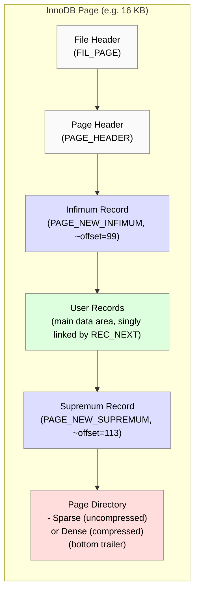

# Diagram

# Description

- **File Header (FIL_PAGE)**: The very beginning of the page, storing checksums, page number, etc.
- **Page Header (PAGE_HEADER)**: In uncompressed pages, it contains fields like `PAGE_N_RECS`, `PAGE_LEVEL`, etc. Some fields remain uncompressed even in ROW_FORMAT=COMPRESSED.
- **Infimum Record**: A minimal “boundary” record at a fixed offset (often 99). Not actual user data—just a special marker.
- **User Records**: The main data region, containing either row data (leaf page) or node pointers (internal page). Records are linked in ascending order via `REC_NEXT`.
- **Supremum Record**: A maximal boundary record, often around offset 113. Also not user data.
- **Page Directory**:  
  - In **uncompressed** pages, the **sparse** directory resides at the very bottom, containing offset slots only for “owner” records.  
  - In **compressed** pages, a **dense** directory is stored and later decoded to produce a normal sparse directory upon decompression.  

This layout allows InnoDB to manage records efficiently (via `REC_NEXT` pointers and the directory for quicker in-page lookups), while maintaining boundaries (`infimum`/`supremum`) for B+‑Tree searching.

# Page types

Defined here storage/innobase/include/fil0fil.h

| Page Type | Value | Description |
|-----------|-------|-------------|
| FIL_PAGE_INDEX | 17855 | B-tree node, the most common page type used for storing table and index data |
| FIL_PAGE_RTREE | 17854 | R-tree node, used for spatial indexes |
| FIL_PAGE_UNDO_LOG | 2 | Stores undo information for transaction rollback |
| FIL_PAGE_TYPE_FSP_HDR | 8 | File space header, contains tablespace metadata |
| FIL_PAGE_TYPE_XDES | 9 | Extent descriptor, manages space allocation |
| FIL_PAGE_TYPE_BLOB | 10 | Uncompressed BLOB data storage |
| FIL_PAGE_COMPRESSED | 14 | Compressed page format |
| FIL_PAGE_ENCRYPTED | 15 | Encrypted page format B+Tree |
| FIL_PAGE_COMPRESSED_AND_ENCRYPTED | 16 | Both compressed and encrypted |
| FIL_PAGE_ENCRYPTED_RTREE | 17 | Encrypted page format R+Tree |
| FIL_PAGE_TYPE_LOB_DATA | 23 | Data pages for uncompressed LOBs |
| FIL_PAGE_TYPE_ZLOB_DATA | 26 | Data pages for compressed LOBs |

