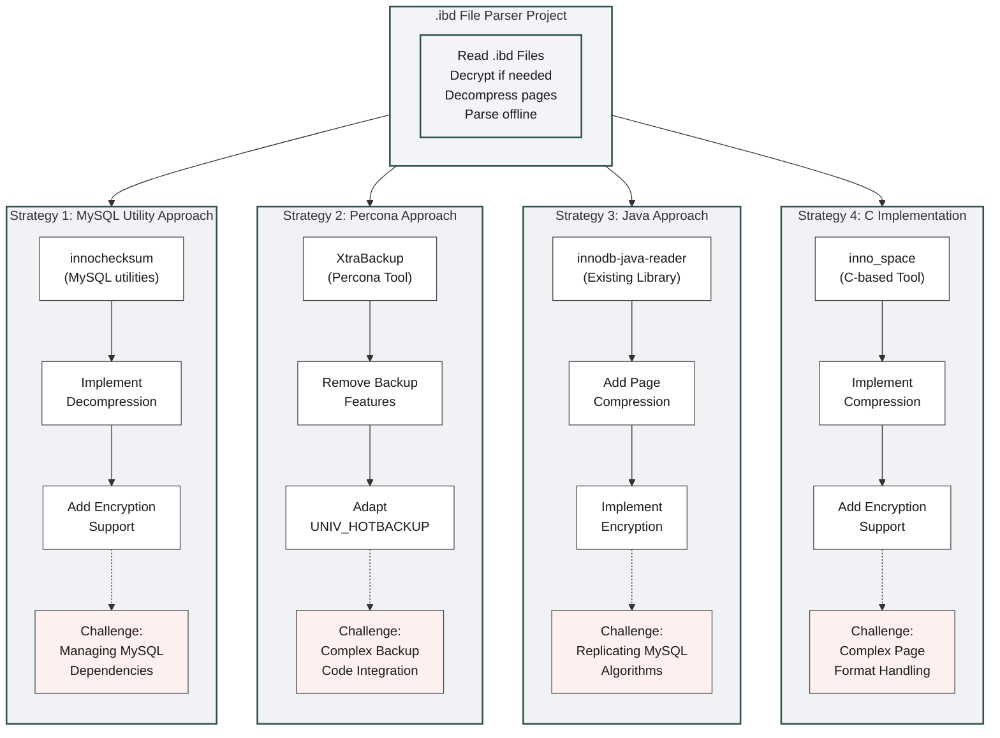

# Diagram

```mermaid
flowchart TD
    %% Style definitions
    classDef goal fill:#f2f4f7,stroke:#2f4f4f,stroke-width:2px,color:#1a1a1a
    classDef strategy fill:#f0f2f5,stroke:#2f4f4f,stroke-width:2px,color:#1a1a1a
    classDef component fill:#ffffff,stroke:#4a4a4a,stroke-width:1px,color:#1a1a1a
    classDef challenge fill:#fff0f0,stroke:#4a4a4a,stroke-width:1px,color:#1a1a1a

    %% Project Goal
    subgraph G[".ibd File Parser Project"]
        style G fill:#f2f4f7,stroke:#2f4f4f,stroke-width:2px
        goal["Read .ibd Files<br/>Decrypt if needed<br/>Decompress pages<br/>Parse offline"]
    end

    %% Strategy 1: innochecksum
    subgraph S1[Strategy 1: MySQL Utility Approach]
        style S1 fill:#f0f2f5,stroke:#2f4f4f,stroke-width:2px
        direction TB
        inno["innochecksum<br/>(MySQL utilities)"]
        inno_comp["Implement<br/>Decompression"]
        inno_enc["Add Encryption<br/>Support"]
        challenge1["Challenge:<br/>Managing MySQL<br/>Dependencies"]
    end

    %% Strategy 2: xtraBackup
    subgraph S2[Strategy 2: Percona Approach]
        style S2 fill:#f0f2f5,stroke:#2f4f4f,stroke-width:2px
        direction TB
        xtra["XtraBackup<br/>(Percona Tool)"]
        xtra_strip["Remove Backup<br/>Features"]
        xtra_adapt["Adapt<br/>UNIV_HOTBACKUP"]
        challenge2["Challenge:<br/>Complex Backup<br/>Code Integration"]
    end

    %% Strategy 3: Java Reader
    subgraph S3[Strategy 3: Java Approach]
        style S3 fill:#f0f2f5,stroke:#2f4f4f,stroke-width:2px
        direction TB
        java["innodb-java-reader<br/>(Existing Library)"]
        java_comp["Add Page<br/>Compression"]
        java_enc["Implement<br/>Encryption"]
        challenge3["Challenge:<br/>Replicating MySQL<br/>Algorithms"]
    end

    %% Strategy 4: C Tool
    subgraph S4[Strategy 4: C Implementation]
        style S4 fill:#f0f2f5,stroke:#2f4f4f,stroke-width:2px
        direction TB
        c_tool["inno_space<br/>(C-based Tool)"]
        c_comp["Implement<br/>Compression"]
        c_enc["Add Encryption<br/>Support"]
        challenge4["Challenge:<br/>Complex Page<br/>Format Handling"]
    end

    %% Main connections
    G --> S1
    G --> S2
    G --> S3
    G --> S4

    %% Strategy 1 connections
    inno --> inno_comp --> inno_enc -.-> challenge1

    %% Strategy 2 connections
    xtra --> xtra_strip --> xtra_adapt -.-> challenge2

    %% Strategy 3 connections
    java --> java_comp --> java_enc -.-> challenge3

    %% Strategy 4 connections
    c_tool --> c_comp --> c_enc -.-> challenge4

    %% Apply styles
    class goal goal
    class inno,inno_comp,inno_enc,xtra,xtra_strip,xtra_adapt,java,java_comp,java_enc,c_tool,c_comp,c_enc component
    class challenge1,challenge2,challenge3,challenge4 challenge
```