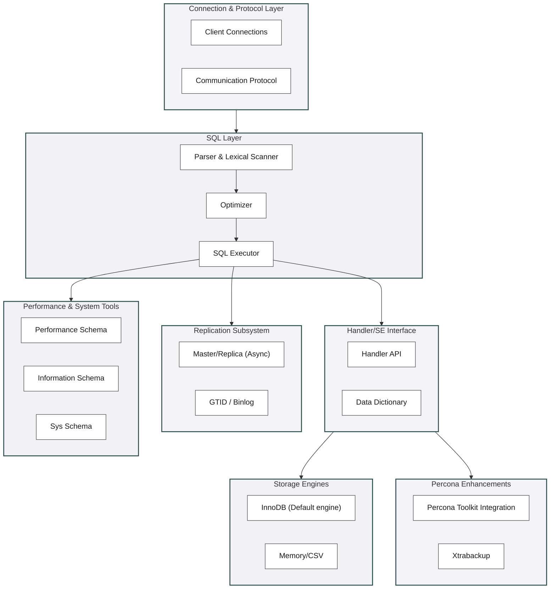

# Percona MySQL study area

# Source code

- [Source code study](./source)

# InnoDB

- [Embedded Innodb 1.0.6](./../innodbtest/README.md)
- [InnoDB File Formats Evolution](./docs/inndb_format.md)
- [InnoDB space (parse .ibd without mysql)](./docs/innodb_space.md)
- [Joining tables and Storage Engine](./docs/join_storage.md)