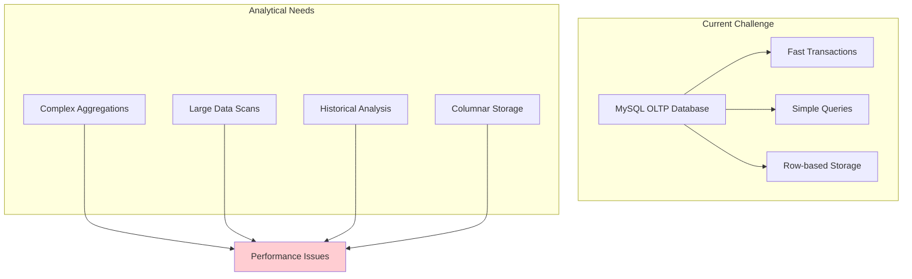
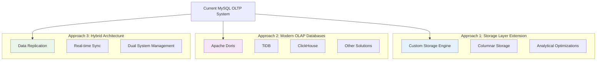
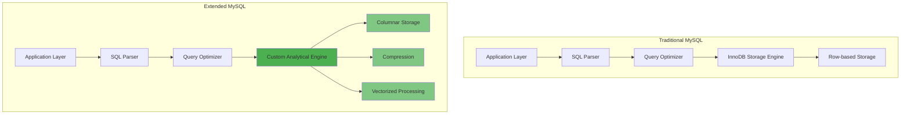
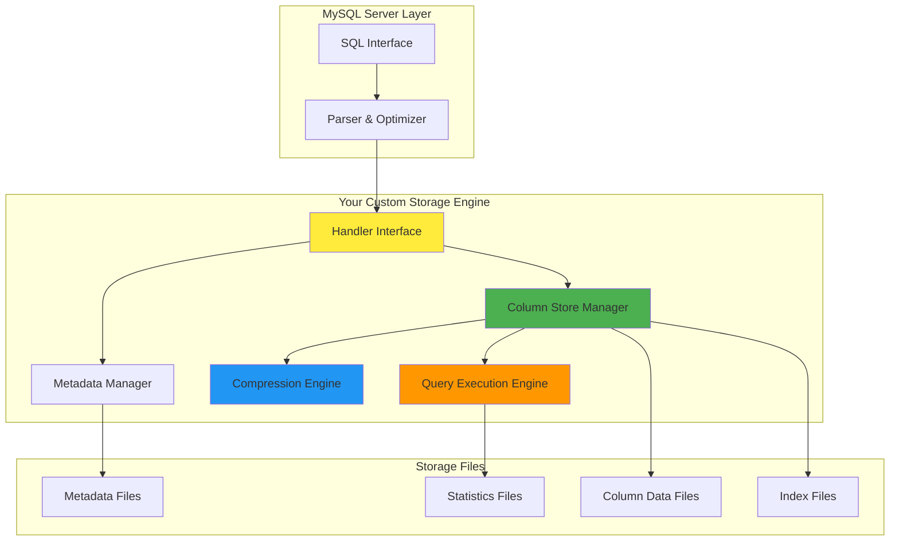
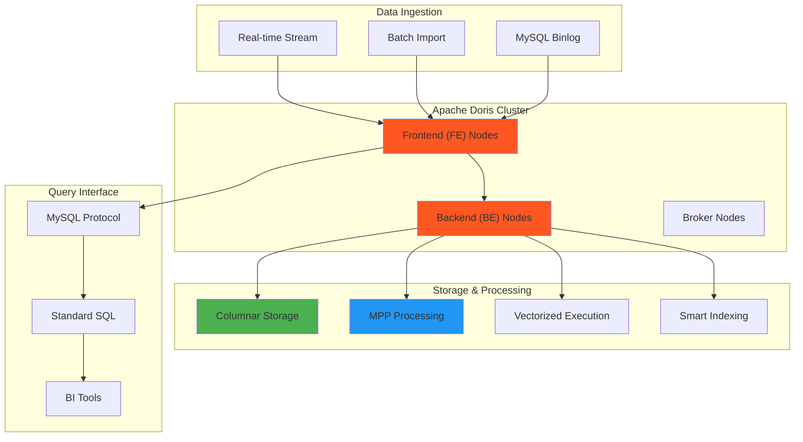
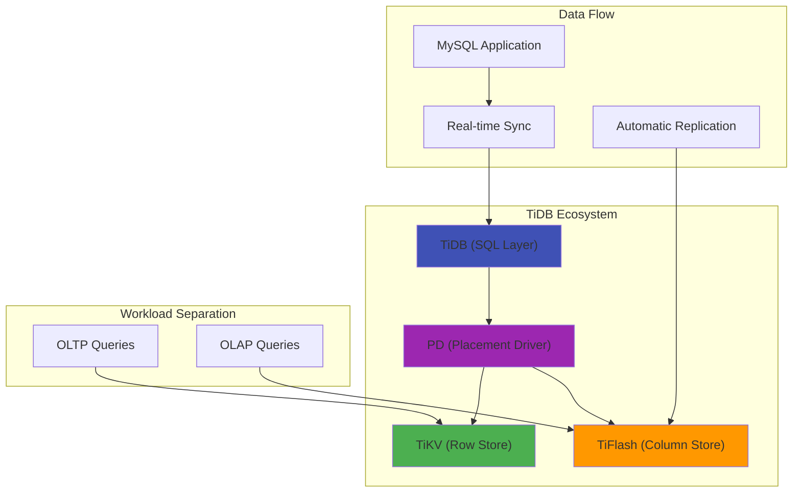
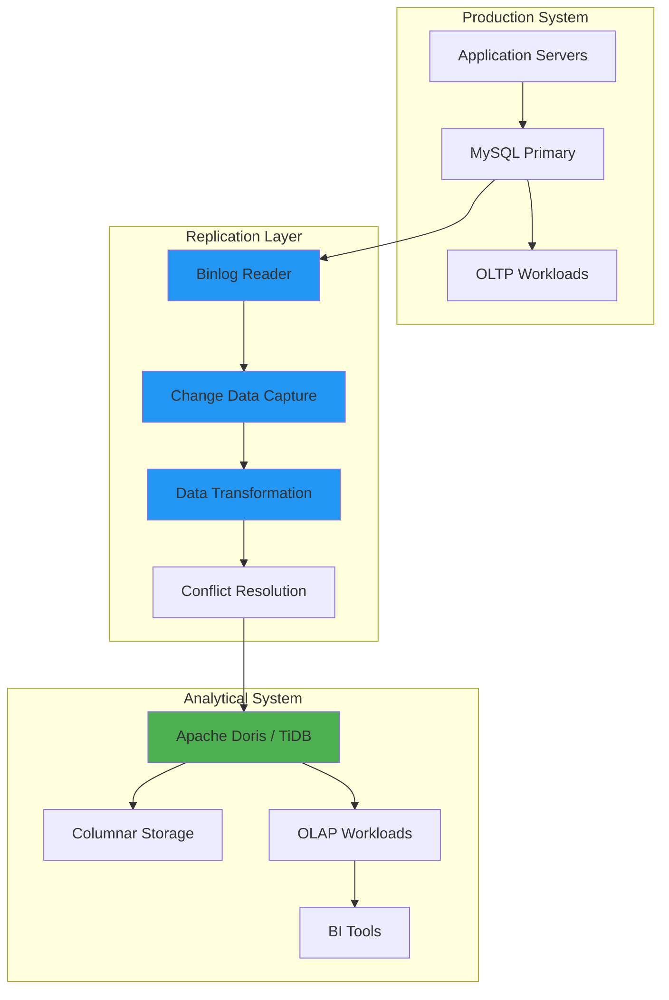
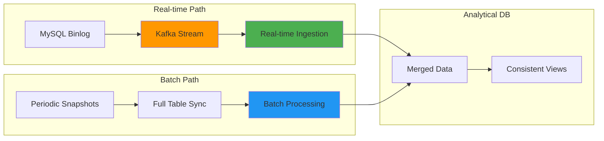
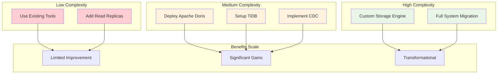
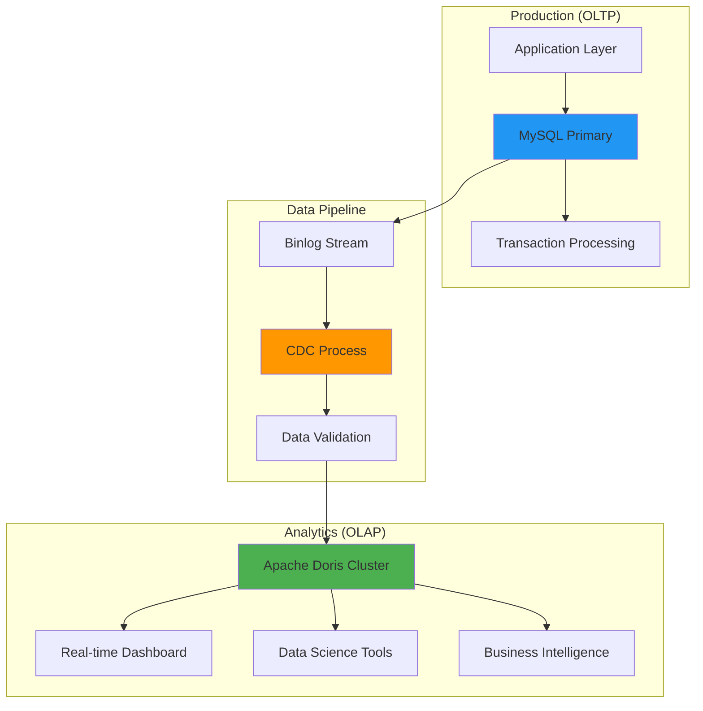

# Analytical Data Architecture: Storage Layer & Modern Database Solutions

## The Challenge: OLTP vs OLAP

Traditional MySQL is optimized for **OLTP (Online Transaction Processing)** - fast inserts, updates, and simple queries. But analytical workloads require **OLAP (Online Analytical Processing)** - complex queries, aggregations, and data analysis.



## Solution Approaches Overview



---

## Approach 1: MySQL Storage Layer Extension

### Concept: Custom Storage Engine

Instead of using InnoDB or MyISAM, create a custom storage engine optimized for analytical workloads.



### Custom Storage Engine Features

**Columnar Storage Benefits:**
- **Compression**: Similar data types compress better
- **Vectorized Queries**: Process entire columns at once
- **Skip Unused Columns**: Only read needed data
- **Aggregation Optimization**: Built-in statistical functions

**Implementation Architecture:**



### Pros and Cons

**Advantages:**
- ✅ Keep existing MySQL infrastructure
- ✅ Familiar SQL interface
- ✅ No data migration needed
- ✅ Can coexist with OLTP workloads

**Challenges:**
- ❌ Complex development effort
- ❌ MySQL storage engine limitations
- ❌ Maintenance overhead
- ❌ Limited by MySQL's query planner

---

## Approach 2: Modern OLAP Database Solutions

### Apache Doris Architecture



**Apache Doris Features:**
- **MySQL Compatibility**: Same protocol and SQL syntax
- **Real-time Analytics**: Sub-second query response
- **Horizontal Scaling**: Add nodes for more capacity
- **Automatic Optimization**: Smart indexing and partitioning

### TiDB Analytical Solution



**TiDB Benefits:**
- **Hybrid HTAP**: Handle both OLTP and OLAP
- **MySQL Compatible**: Drop-in replacement
- **Automatic Scaling**: Horizontal scaling built-in
- **Real-time Analytics**: No ETL delays

### Other Modern Solutions

| Database | Strengths | Best For |
|----------|-----------|----------|
| **ClickHouse** | Extremely fast analytics | Time-series, logging, metrics |
| **StarRocks** | Real-time analytics | Streaming data, dashboards |
| **Databend** | Cloud-native | Modern cloud architectures |
| **DuckDB** | Embedded analytics | Local analysis, prototyping |

---

## Approach 3: Data Replication Architecture

### Real-time Sync Topology



### Replication Strategies

**1. Binlog-based Replication**
```sql
-- MySQL binlog events automatically captured
INSERT INTO users (id, name, email) VALUES (1, 'John', 'john@example.com');
-- Automatically replicated to analytical system
```

**2. Change Data Capture (CDC)**
- **Debezium**: Kafka-based CDC
- **Maxwell**: Lightweight MySQL CDC
- **Canal**: Alibaba's MySQL CDC solution

**3. Hybrid Approach**


---

## Implementation Comparison

### Complexity vs Benefits Matrix



### Recommended Architecture

**For Most Organizations:**



## Migration Strategy

### Phase 1: Proof of Concept
1. **Setup Small Doris Cluster**
2. **Replicate Sample Tables**
3. **Test Query Performance**
4. **Validate Data Consistency**

### Phase 2: Pilot Implementation
1. **Deploy Production Cluster**
2. **Implement CDC Pipeline**
3. **Migrate Critical Reports**
4. **Train Users**

### Phase 3: Full Migration
1. **Scale Analytical Workloads**
2. **Optimize Performance**
3. **Monitor and Maintain**
4. **Expand Use Cases**

---

## Key Takeaways

### Why Modern OLAP Databases Win

**Technical Advantages:**
- **Purpose-built** for analytical workloads
- **Proven solutions** with active communities
- **Enterprise support** and documentation
- **Ecosystem integration** with BI tools

**Business Benefits:**
- **Faster time to value**
- **Lower maintenance overhead**
- **Better scalability**
- **Future-proof architecture**

### The Bottom Line

While extending MySQL's storage layer is technically interesting, **modern OLAP databases like Apache Doris and TiDB offer superior solutions** with:

- ✅ **Proven performance** at scale
- ✅ **MySQL compatibility** for easy migration
- ✅ **Active development** and support
- ✅ **Lower total cost of ownership**

The combination of **MySQL for OLTP** + **Apache Doris/TiDB for OLAP** provides the best of both worlds while maintaining familiar interfaces and reducing complexity.

---

*The future of data architecture is hybrid: specialized systems for specialized workloads, connected by real-time data pipelines.*