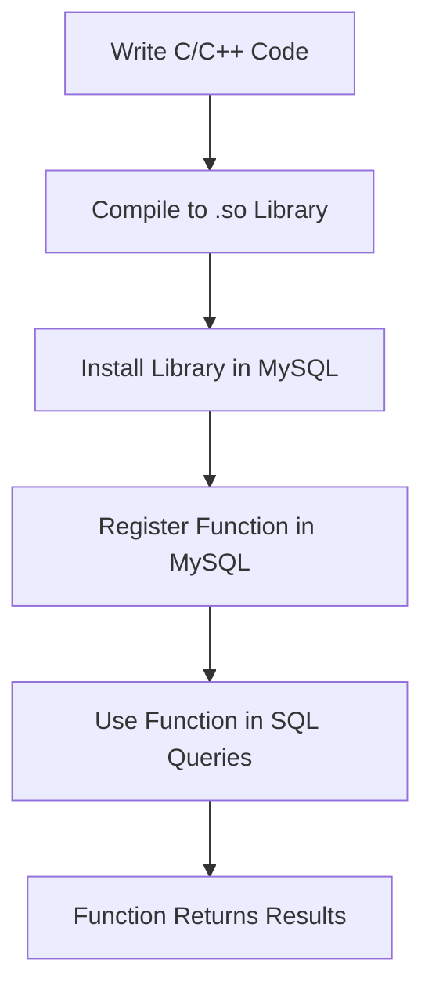
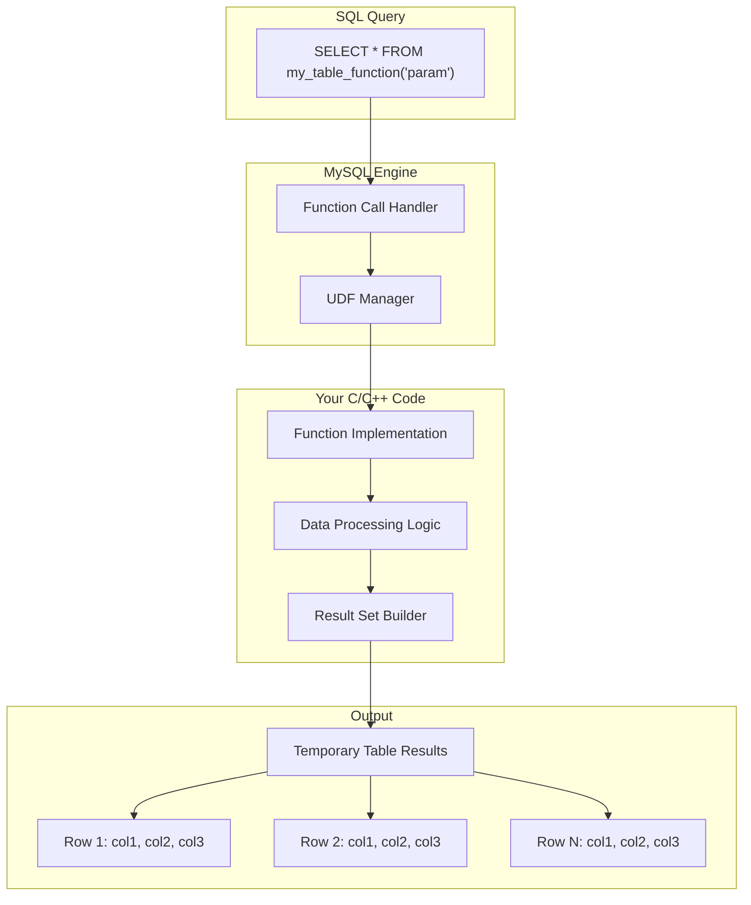
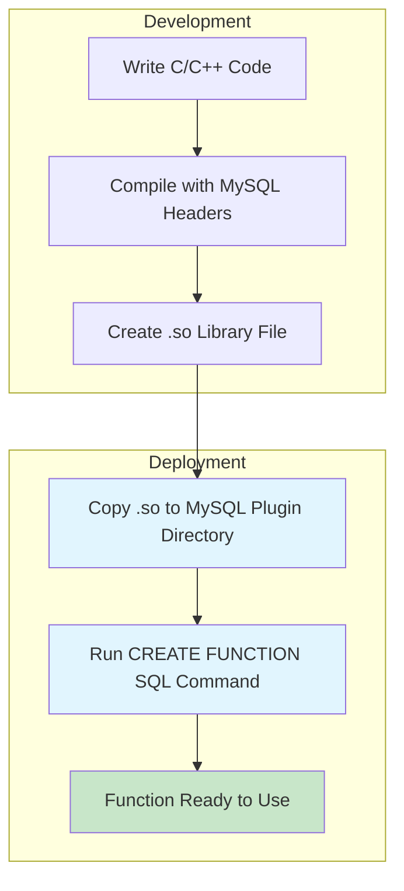
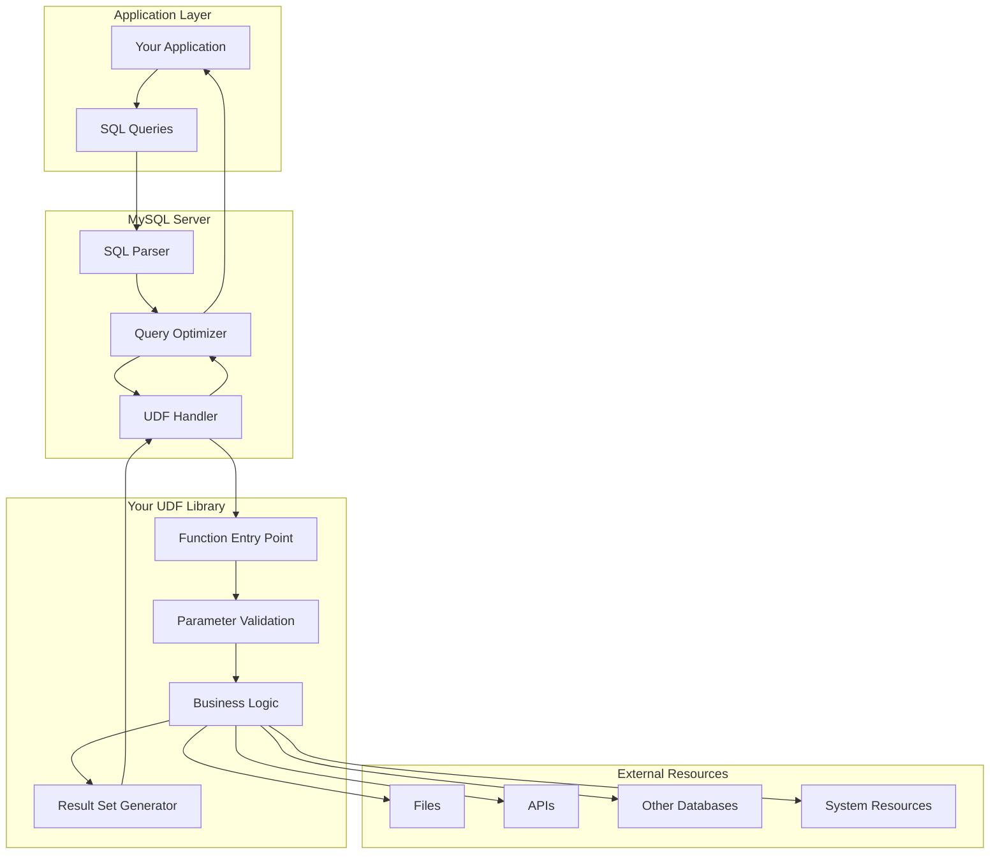

# MySQL UDF (User Defined Functions) Overview

## What are UDFs?

User Defined Functions (UDFs) in MySQL allow you to extend the database's capabilities by writing custom functions in C/C++ that can be called directly from SQL queries. Think of it as adding new "superpowers" to your database.

## Basic Concept Flow



## Types of UDFs

### 1. Scalar Functions
Returns a single value (like a number or string)

```sql
SELECT my_custom_function(column1, column2) FROM table;
```

### 2. Table Functions (The Focus)
Returns multiple rows that can be used as a temporary table

```sql
SELECT * FROM my_table_function(parameters);
```

## Table Function Architecture



## How Table Functions Work

### Step-by-Step Process

1. **Function Call**: MySQL receives a query with your table function
2. **Parameter Parsing**: Your C/C++ code receives the input parameters
3. **Data Processing**: Your code processes the data (could read files, call APIs, perform calculations)
4. **Result Building**: Your code builds rows of data dynamically
5. **Table Creation**: MySQL treats the output as a temporary table
6. **Query Execution**: The rest of the SQL query processes this "virtual table"

### Example Use Cases

```sql
-- Read CSV file and return as table
SELECT * FROM read_csv_file('/path/to/data.csv');

-- Process JSON and return structured data
SELECT * FROM parse_json_data('{"users": [{"name": "John", "age": 30}]}');

-- Call external API and return results
SELECT * FROM fetch_api_data('https://api.example.com/users');

-- Complex mathematical calculations
SELECT * FROM calculate_statistics(dataset_id);
```

## Installation Process

### The Simple 3-Step Installation



### Installation Commands

```bash
# 1. Copy your compiled library
sudo cp my_function.so /usr/lib/mysql/plugin/

# 2. Register in MySQL
mysql> CREATE FUNCTION my_table_function RETURNS STRING SONAME 'my_function.so';

# 3. Start using it!
mysql> SELECT * FROM my_table_function('parameter');
```

## Key Benefits

### 🚀 **Performance**
- C/C++ code runs much faster than SQL for complex operations
- Direct memory management and optimization

### 🔧 **Flexibility**
- Access to entire C/C++ ecosystem
- Can integrate with external libraries and APIs
- Process any data format (JSON, XML, CSV, binary)

### 🔄 **Seamless Integration**
- Functions appear as native MySQL functions
- No need to export/import data
- Works with all SQL features (JOIN, WHERE, ORDER BY, etc.)

### 📊 **Dynamic Tables**
- Create tables on-the-fly based on runtime parameters
- Process external data sources as if they were database tables
- Transform data in real-time

## Real-World Example

```sql
-- Instead of this complex process:
-- 1. Export data from MySQL
-- 2. Process in external application  
-- 3. Import results back

-- You can do this:
SELECT 
    orders.order_id,
    orders.customer_id,
    analysis.risk_score,
    analysis.recommendation
FROM orders
JOIN fraud_analysis(orders.transaction_data) AS analysis
ON orders.order_id = analysis.order_id
WHERE analysis.risk_score > 0.8;
```

## Technical Architecture



## Why This Approach is Powerful

### Traditional Approach Problems:
- **Data Movement**: Constant export/import cycles
- **Performance**: Multiple round trips between database and application
- **Complexity**: Managing data synchronization
- **Maintenance**: Multiple systems to maintain

### UDF Table Function Solution:
- **Single Query**: Everything happens in one SQL statement
- **Real-time**: No data export/import needed
- **Performance**: C/C++ speed with SQL convenience
- **Simplicity**: Just another SQL function call

## Summary

MySQL UDFs, especially table functions, bridge the gap between database efficiency and application flexibility. They allow you to:

1. **Extend MySQL** with custom functionality written in C/C++
2. **Process external data** as if it were a database table
3. **Integrate seamlessly** with existing SQL queries
4. **Deploy easily** with simple .so library installation

This approach transforms your database from a simple data store into a powerful data processing engine that can handle complex, real-time operations while maintaining the simplicity and power of SQL.

---

*The beauty of UDFs is that they make complex operations look simple to the end user, while giving developers the full power of C/C++ under the hood.*