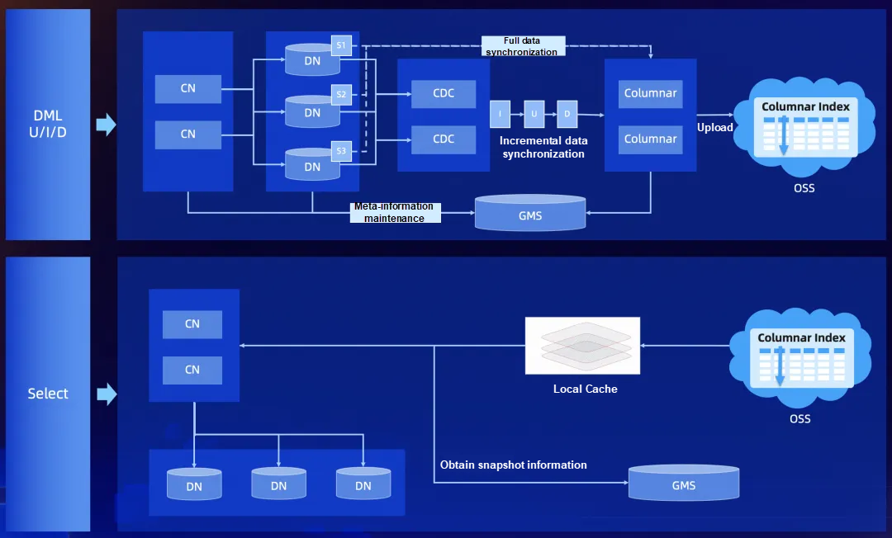

# Articles

In April 2024, PolarDB-X officially released version 2.4.0, focusing on Columnar

Clustered Columnar Index  
https://www.alibabacloud.com/blog/official-open-source-of-polardb-x-v2-4-columnar-engine_601302


# Data Flow



# Files

Jars file (found in Docker image)

```java
columnar-cdc-5.4.19-SNAPSHOT.jar
columnar-common-5.4.19-SNAPSHOT.jar
columnar-common-5.4.19-SNAPSHOT-tests.jar
columnar-core-5.4.19-SNAPSHOT.jar
columnar-filesystem-5.4.19-SNAPSHOT.jar
columnar-meta-5.4.19-SNAPSHOT.jar
columnar-rpc-5.4.19-SNAPSHOT.jar
columnar-runtime-5.4.19-SNAPSHOT.jar
columnar-server-5.4.19-SNAPSHOT.jar
```