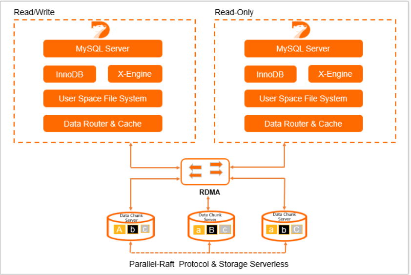
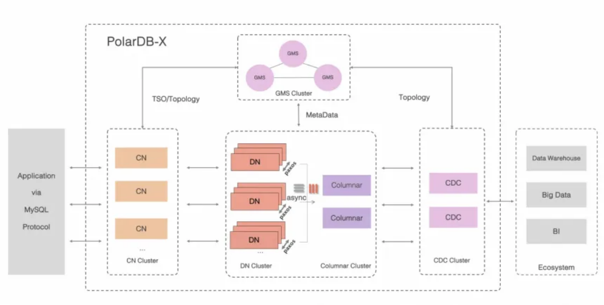
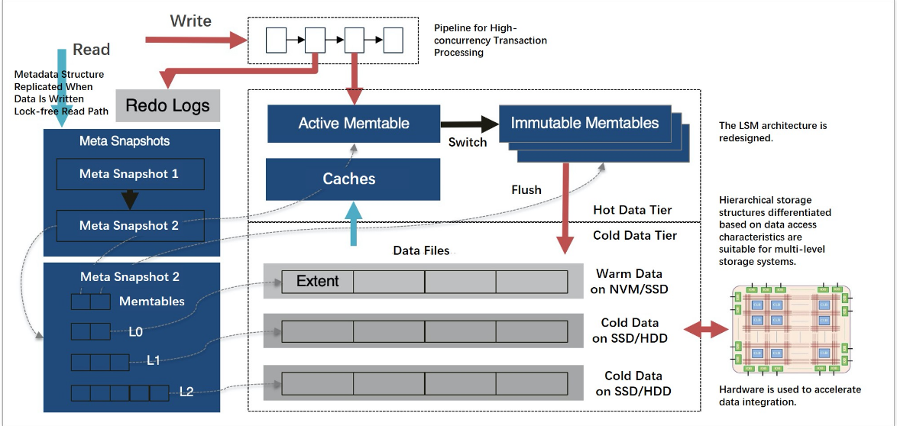

# PolarDB vs PolarDBX Architecture Overview

## Storage Architecture
### PolarDB
- Uses shared distributed storage architecture with RDMA
- All compute nodes access the same shared storage layer
- Supports multiple storage engines:
  1. PolarStore (primary storage engine)
  2. Modified InnoDB optimized for shared storage
  3. X-Engine 

### PolarDBX (Open Source)
- Uses distributed storage architecture
- Each node maintains its own data copy
- Built on top of MySQL nodes
- Uses modified InnoDB called Lizard
- Currently does not support X-Engine as storage layer

## X-Engine Details
### Architecture
- LSM (Log-Structured Merge-tree) based storage engine
- Optimized for cloud scenarios
- Focuses on write-intensive workloads
- Provides better compression than InnoDB

### Key Features
- Multi-version concurrency control (MVCC)
- Optimized for cloud storage
- Better write amplification handling compared to InnoDB
- Enhanced compression capabilities
- Tiered storage support

### Use Cases
- Write-intensive scenarios
- Cases requiring high compression ratios
- Applications with cold data storage requirements
- Currently only available in PolarDB, not in PolarDBX

## Lizard Storage Engine Details
### Purpose
- Handles distributed transactions
- Implements MVCC across nodes
- Maintains consistency in distributed operations

### Architecture
- Works alongside InnoDB's B+tree (not replacing it)
- Adds transaction-related information to support distributed operations
- Maintains compatibility with InnoDB's core storage

### Physical Storage Files
1. `.liz` files
   - Store Lizard transaction logs
   - Critical for distributed transaction management

2. `.ldx` files
   - Contain Lizard index metadata
   - Help manage distributed index structures

3. `.lda` files
   - Store actual Lizard data
   - Complement InnoDB's data storage

4. Standard InnoDB files remain:
   - `.ibd` (tablespace files)
   - `.frm` (table definition files)

All Lizard-related files are stored in MySQL's data directory alongside traditional InnoDB files

## Key Differences Summary
1. Storage Architecture:
   - PolarDB: Shared storage for efficiency and consistency
   - PolarDBX: Distributed storage for scalability

2. Storage Engine Support:
   - PolarDB: Multiple options (PolarStore, modified InnoDB, X-Engine)
   - PolarDBX: Lizard-modified InnoDB only

3. Transaction Handling:
   - PolarDB: Centralized through shared storage
   - PolarDBX: Distributed through Lizard B+tree enhancement

4. X-Engine Availability:
   - Available in PolarDB
   - Not currently supported in PolarDBX