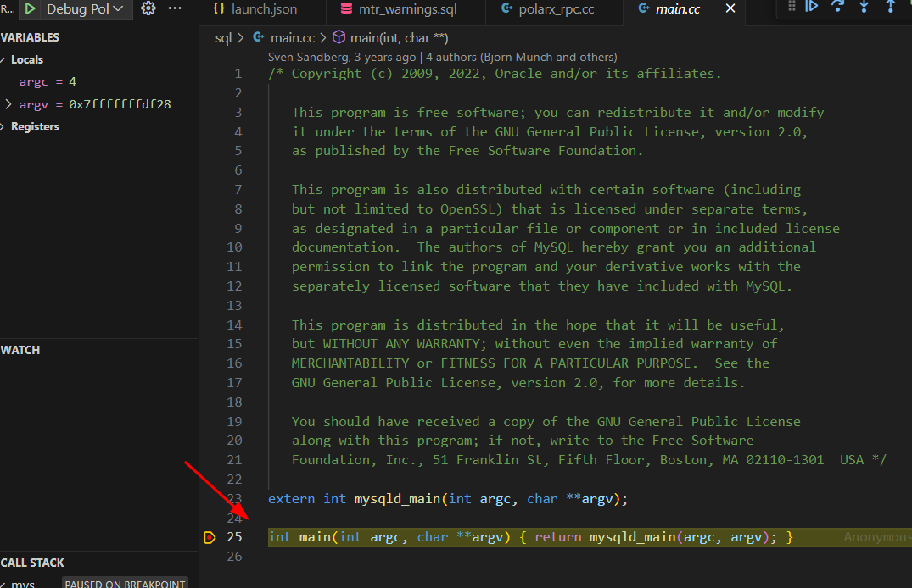

# Introduction

Debug on Linux PolarDBX Engine (mysql fork)  
Remote debug using Visual Code  

Inside .vscode

Linux create gdb file

```bash
mkdir -p ~/.config/gdb
echo "add-auto-load-safe-path /home/cslog/polardbx-engine/.gdbinit" >> ~/.config/gdb/gdbinit
```

Create launch.json in VSCode

```json
{
    "version": "0.2.0",
    "configurations": [
        {
            "name": "Debug PolarDBX Storage",
            "type": "cppdbg",
            "request": "launch",
            "program": "${workspaceFolder}/runtime_output_directory/mysqld",
            "args": [
                "--defaults-file=/data/my3306/conf/my.cnf",
                "--log-error=/data/my3306/mysql_error.log",
                "--debug=d:t:i:o,/data/my3306/mysqld.trace"
            ],
            "stopAtEntry": false,
            "cwd": "${workspaceFolder}",
            "environment": [],
            "externalConsole": false,
            "MIMode": "gdb",
            "miDebuggerPath": "/usr/bin/gdb",
            "setupCommands": [
                {
                    "description": "Enable pretty-printing for gdb",
                    "text": "-enable-pretty-printing",
                    "ignoreFailures": true
                },
                {
                    "description": "Load .gdbinit",
                    "text": "source ${workspaceFolder}/.gdbinit",
                    "ignoreFailures": true
                }
            ],
            "sourceFileMap": {
                "/home/cslog/polardbx-engine": "${workspaceFolder}"
            },
            "logging": {
                "engineLogging": true,
                "trace": true,
                "traceResponse": true,
                "moduleLoad": true
            },
            "symbolLoadInfo": {
                "loadAll": true,
                "exceptionBreakpoint": "thrown"
            }
        }
    ]
}
```

Create c_cpp_properties.json

```json
{
    "configurations": [
        {
            "name": "Linux",
            "includePath": [
                "${workspaceFolder}/**",
                "${workspaceFolder}/include",
                "${workspaceFolder}/sql",
                "${workspaceFolder}/plugin/**",
                "${workspaceFolder}/storage/**"
            ],
            "defines": [],
            "compilerPath": "/usr/bin/gcc",
            "cStandard": "c11",
            "cppStandard": "c++17",
            "intelliSenseMode": "linux-gcc-x64"
        }
    ],
    "version": 4
}
```

Create settings.json

```json
{
    "files.associations": {
        "*.inc": "cpp",
        "*.ic": "cpp",
        "*.tcc": "cpp",
        "ratio": "cpp",
        "regex": "cpp"
    }
}
```

Now you can use breakpoints in UI.
Test here:


