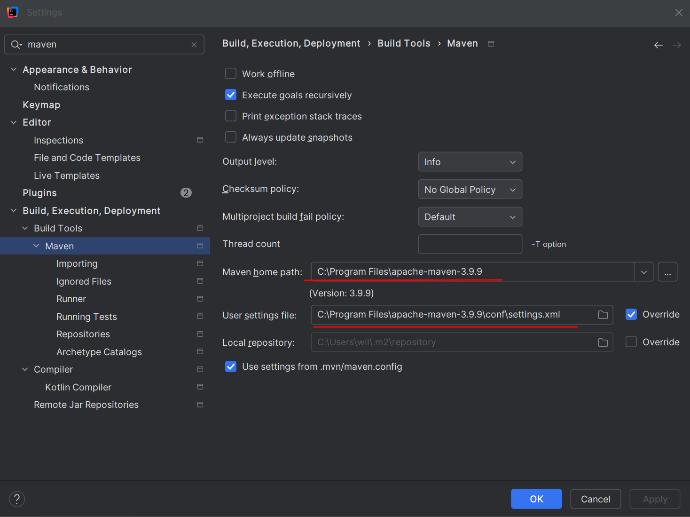
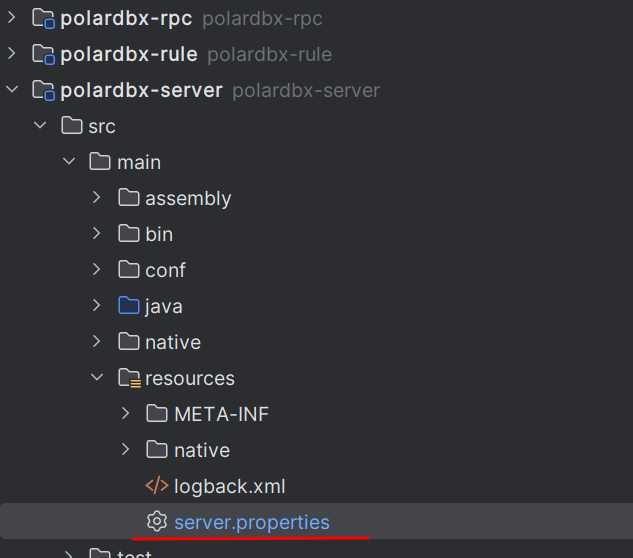
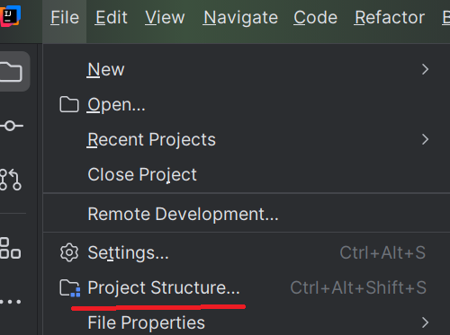
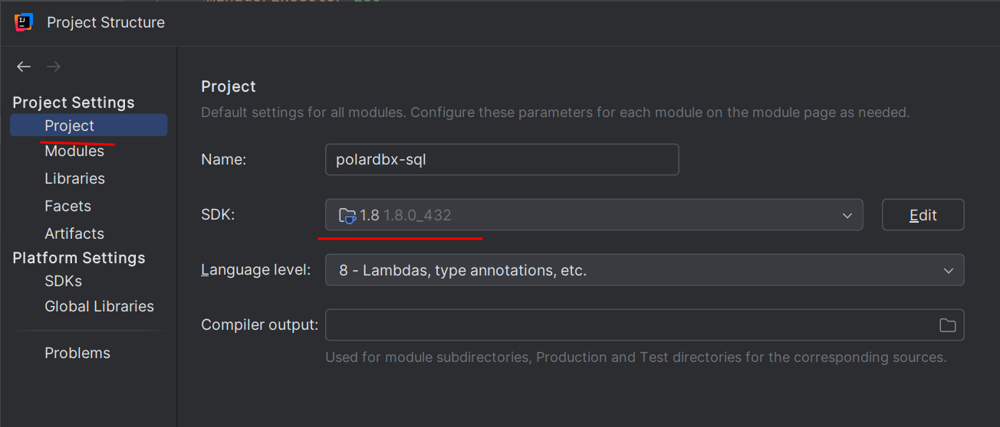
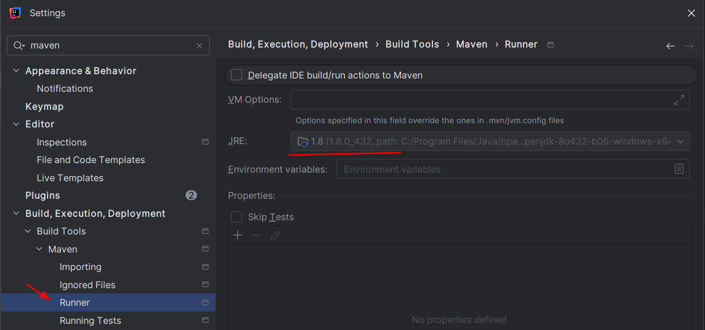
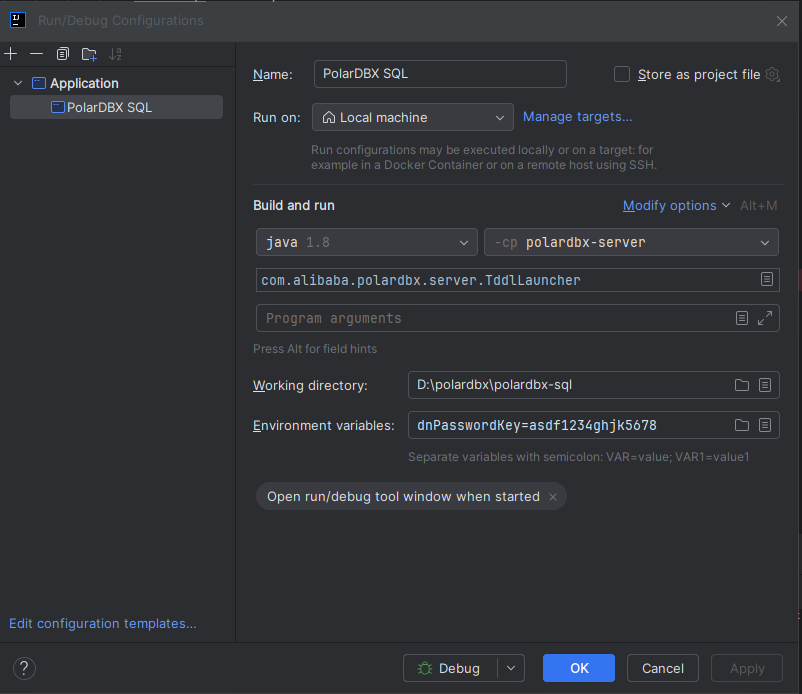

# Guide:

https://github.com/polardb/polardbx/blob/main/compile_and_run_polardbx_on_windows.md  

# Configuration

Download repository

```shell
git clone https://github.com/polardb/polardbx-sql  
git submodule update --init  
```

Maven config where you copied maven.  

https://maven.apache.org/download.cgi  




Also change adjust the memory limit of IDEA compilation to 8000 (guide item 6)


Configure server.properties 



Pay attention to:

```ini
serverPort=3306 # your front mysql client sql
rpcPort=9090 # rpc communication
metaDbAddr=10.1.1.148:4886 # ip polardbx engine (mysql)
metaDbXprotoPort=32886 # port polardbx metadb
metaDbUser=my_polarx # user polardbx metadb
metaDbName=polardbx_meta_db_polardbx # user polardbs
galaxyXProtocol=2 # protocol version
metaDbPasswd=2nhGcH1ckXt5XWQ9vRvJMGS7TB1RbOV6alTrlYTQQdk= # metadb password
```

Prompt

```bash
mysql -hlocalhost -P8527 -upolardbx_root
```

Project menu, configure to JDK 1.8






Also in Setting Maven select JDK 1.8



Run/Debug Config


