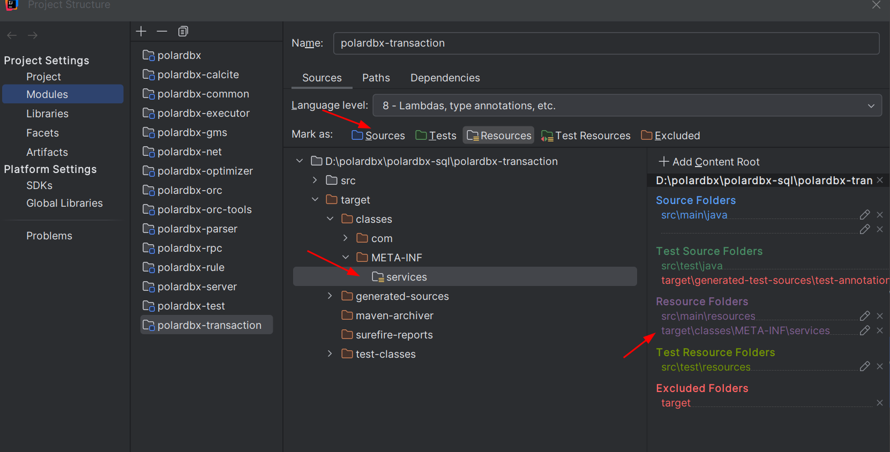

# Problem: PolarDB-X SPI Loading Issue Resolution

When running PolarDB-X in IntelliJ IDEA, the following error occurred during SQL execution:

```sql
mysql> SELECT * FROM lineorder limit 1;
ERROR 4700 (HY000): [18ed4a52d8000000][10.1.1.139:8527][ssb]ERR-CODE: [PXC-4700][ERR_SERVER] 
server error by com.alibaba.polardbx.executor.TopologyExecutor cannot be cast to 
com.alibaba.polardbx.transaction.TransactionExecutor
```

# Resolution

## Root Cause

The issue was related to Java's Service Provider Interface (SPI) loading mechanism. Despite having the correct SPI configuration files in the source directory:

```
polardbx-transaction/src/main/resources/META-INF/services/com.alibaba.polardbx.executor.spi.ITopologyExecutor
```

The SPI files were not being properly loaded at runtime because they weren't present in the compiled classes directory.

## Technical Details

1. **SPI Configuration Files:**
   - Location: `src/main/resources/META-INF/services/`
   - Required files:
     - `com.alibaba.polardbx.executor.spi.ITopologyExecutor`
     - `com.alibaba.polardbx.executor.spi.ITransactionManager`
   - Content example:
     ```
     com.alibaba.polardbx.transaction.TransactionExecutor
     ```

2. **Project Structure:**
   ```
   polardbx-sql/
   ├── polardbx-transaction/
   │   ├── src/main/resources/
   │   │   └── META-INF/services/
   │   │       └── com.alibaba.polardbx.executor.spi.ITopologyExecutor
               └── com.alibaba.polardbx.executor.spi.TransactionExecutor
   │   └── target/classes/
   │       └── META-INF/services/
   │           └── com.alibaba.polardbx.executor.spi.ITopologyExecutor
               └── com.alibaba.polardbx.executor.spi.TransactionExecutor                  
   ```

## Resolution

The issue was resolved by ensuring the SPI configuration files were present in the compiled classes directory:

1. Verify the files are in place:
   ```bash
   ls target/classes/META-INF/services/
   # Should show:
   # com.alibaba.polardbx.executor.spi.ITopologyExecutor
   # com.alibaba.polardbx.executor.spi.ITransactionManager
   ```

2. Add resources in Intellij for polardbx.transaction for target/classes/META-INF/services.
The source src/main/resources is already there.



## Verification

After applying the fix, you can verify the solution by:

1. Running the SQL query again:
   ```sql
   SELECT * FROM lineorder LIMIT 1;
   ```

2. Checking SPI loading through debug code:
   ```java
   ServiceLoader<ITopologyExecutor> loader = ServiceLoader.load(ITopologyExecutor.class);
   for (ITopologyExecutor executor : loader) {
       System.out.println("Found executor: " + executor.getClass().getName());
   }
   ```

## Related Documentation

- [Java SPI Documentation](https://docs.oracle.com/javase/tutorial/sound/SPI-intro.html)
- [Maven Resource Plugin](https://maven.apache.org/plugins/maven-resources-plugin/)

## Additional Notes

- This issue typically occurs in development environments where the build process might not correctly handle resource files
- Similar issues might occur with other SPI configurations in the project
