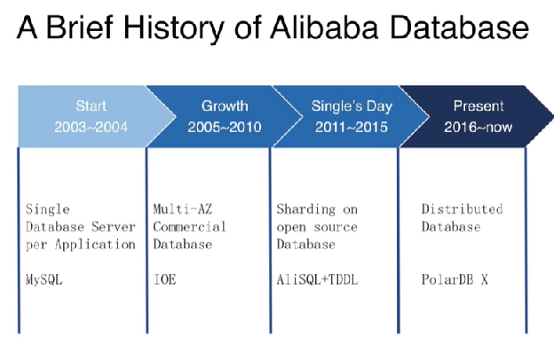

# The Evolution of Alibaba's Database Architecture

## Early Stages: Simple Architecture  
In the early days of Alibaba, the database architecture was straightforward:  
- Each application was served by a single MySQL database instance  
- As traffic grew, single instances became insufficient to handle the load  
- The company faced the famous "IOE" (IBM, Oracle, EMC) architecture challenges in 2009

## Transition to Distributed Architecture  
When faced with performance and cost challenges, Alibaba made several adaptations:  
1. Switched to open-source databases like MySQL  
2. Split databases and tables into smaller units  
3. Developed middleware called "TDDL" (Taobao Distribute Data Layer) to:  
   - Route queries to different MySQL instances  
   - Handle data distribution  
   - This solution worked well but had high maintenance costs

## Introduction of Polardb-X  
POLARDB-X emerged as Alibaba's native distributed database solution, featuring:  
- Shared-nothing architecture for high scalability  
- Cross-region disaster recovery capabilities  
- Support for multi-region deployment

### Key Architectural Components:  
1. Compute Layer:  
   - SQL engine compatible with MySQL  
   - Distributed query processing

2. Storage Layer:  
   - X-Engine storage cluster  
   - High-availability replication groups  
   - Metadata management

### Advanced Features:

#### Elasticity  
- Decoupled computation from storage  
- Independent scaling of compute and storage resources  
- Ability to handle traffic spikes during events like promotion days  
- On-demand resource allocation

#### High Availability  
- Strong consistency within replication groups  
- Optimized Paxos protocol  
- High throughput even in geo-distributed deployments

#### Distributed Transactions  
- Hybrid timestamp-based approach  
- Optimized for single-server transactions  
- Special optimizations for one-phase commit transactions

#### X-Engine: Multi-tiered Storage  
- Based on observation of online business workload patterns  
- Multiple storage tiers for data with different "temperatures"  
- Pipeline implementation for parallel write processing  
- Optimized compaction through data reuse  
- Hardware acceleration capabilities

## Technical Innovation  
The X-Engine storage system has been recognized by the academic community:  
- Accepted at SIGMOD conference industry track  
- Paper published detailing the technical implementation  
- Focuses on efficient data management and storage optimization

This evolution represents Alibaba's journey from simple single-instance databases to a sophisticated distributed database system capable of handling massive scale and complex requirements.

## TIDB x PolarDBX

What is the difference between the two?

The overall architecture is similar, the biggest difference is: PolarDB-X is a self-developed distributed feature based on the MySQL kernel, and TiDB is a distributed database compatible with MySQL, the difference is native and compatible. MySQL has many enterprise features, such as PolarDB-X supports MySQL stored procedures, UDF, binlog, etc.

# Architecture

# What is shared-nothing ?

Shared-nothing architecture is a distributed computing architecture where each node is independent and self-sufficient. Let me break this down:

Key characteristics of shared-nothing architecture:

1. Independence:  
   * Each node has its own CPU, memory, and storage  
   * No resources are shared between nodes  
   * Each node processes its own data independently  
2. Communication:  
   * Nodes communicate only through network messages  
   * No disk sharing, memory sharing, or direct hardware dependencies  
   * All coordination happens through software protocols  
3. Advantages:  
   * High Scalability: Easy to add more nodes without complex coordination  
   * Better Reliability: No single point of failure  
   * Improved Performance: No resource contention between nodes  
   * Cost-Effective: Can use commodity hardware  
4. In Alibaba's POLARDB-X context:  
   * Each database node manages its own portion of data  
   * Nodes can be added or removed without affecting others  
   * Enables independent scaling of compute and storage resources  
   * Facilitates better handling of geographic distribution  
5. Challenges:  
   * More complex data distribution and coordination  
   * Needs sophisticated distributed transaction handling  
   * Requires careful planning for data partitioning

This architecture is particularly valuable for cloud databases like POLARDB-X because it allows for:

* Elastic scaling (adding/removing nodes as needed)  
* Geographic distribution of data  
* Better fault isolation  
* More efficient resource utilization

