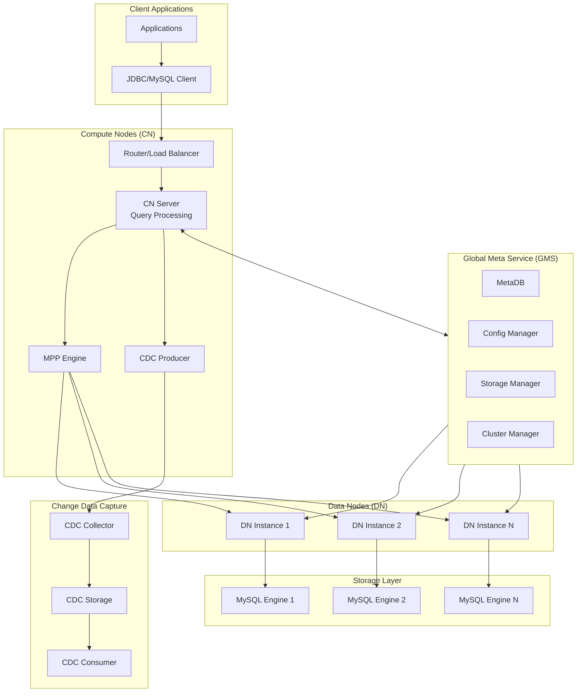

# Diagram

# Description

1. Client Layer:
   - Applications connecting through JDBC/MySQL protocol
   - Router/Load balancer for CN access
2. Compute Nodes (CN):
   - Query processing engine
   - MPP (Massively Parallel Processing) engine
   - CDC Producer for change data capture
3. Global Meta Service (GMS):
   - Configuration management
   - Storage management
   - Cluster management
   - Metadata storage
4. Data Nodes (DN):
   - Multiple DN instances
   - Data storage and processing
   - Direct connection to storage engines
5. Storage Layer:
   - MySQL engines as underlying storage
   - Multiple instances for scalability
6. Change Data Capture (CDC):
   - CDC Producer in CN
   - CDC Collector
   - CDC Storage
   - CDC Consumer for downstream systems

Key interactions shown:

- Client to CN communication
- CN to DN data flow
- GMS management of all components
- CDC data flow through the system
- Storage engine connections