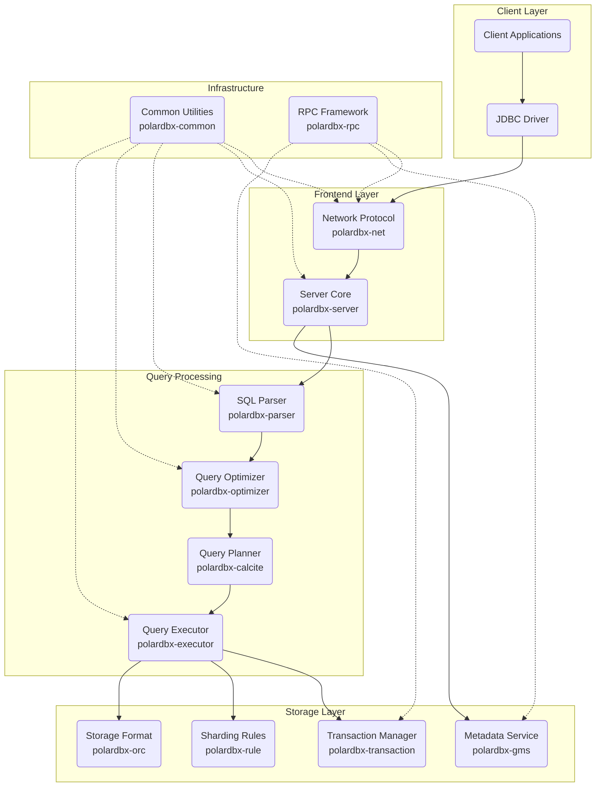

# Architecture

# Description

Frontend Layer:

- polardbx-net: Handles network protocols and client connections
- polardbx-server: Core server implementation

Query Processing Chain:

- polardbx-parser: SQL parsing
- polardbx-optimizer: Query optimization
- polardbx-calcite: Query planning using Apache Calcite
- polardbx-executor: Query execution

Storage & Data Management:

- polardbx-transaction: Transaction management
- polardbx-rule: Sharding rules and logic
- polardbx-gms: Global metadata service

Common Services:

- polardbx-common: Shared utilities and common code
- polardbx-rpc: RPC framework for distributed communication

Storage Format Support:

- polardbx-orc: ORC format implementation
- polardbx-orc-tools: Tools for working with ORC format