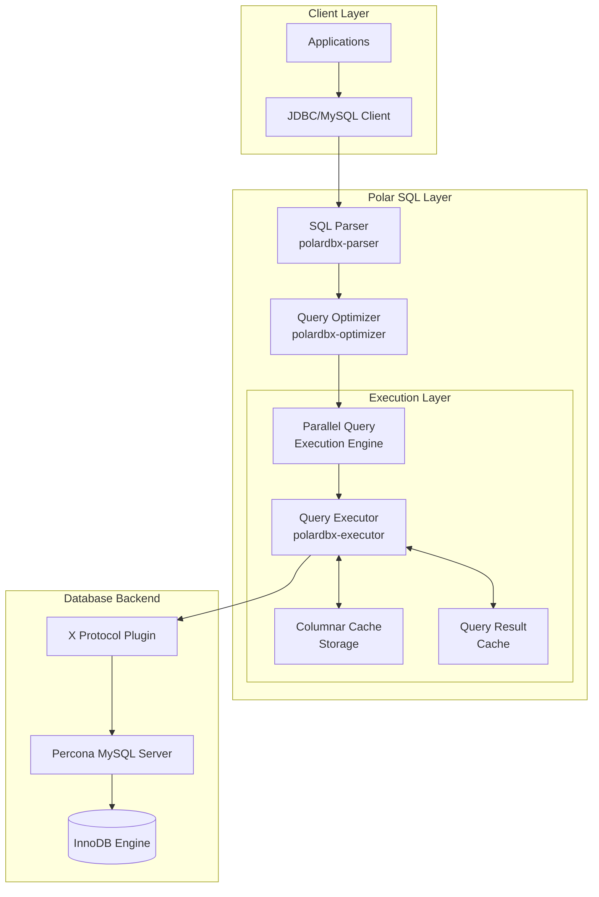

# Diagram

# Description

Client Layer:

- Applications: Any MySQL-compatible client applications
- JDBC/MySQL Client: Standard MySQL protocol connections and connection pooling

Polar SQL Layer:

1. Parser (polardbx-parser)
   - SQL parsing to AST
   - MySQL dialect support
   - Syntax validation
2. Optimizer (polardbx-optimizer)
   - Cost-based query optimization
   - Join ordering and transformations
   - Execution plan generation
3. Execution Components:
   - Parallel Execution: Multi-threaded query processing and result aggregation
   - Query Executor: Plan execution and data flow management
   - Columnar Cache: Column-oriented caching for analytical queries
   - Result Cache: Frequently accessed query results caching

Backend:

- X Protocol: Efficient MySQL client-server protocol
- Percona MySQL: Enhanced MySQL server with performance improvements
- InnoDB: ACID-compliant storage engine with row-level locking

Data Flow:

1. Client → Parser → Optimizer → Parallel Execution → Executor
2. Executor interacts with caches and storage as needed
3. Storage operations handled by InnoDB through X Protocol