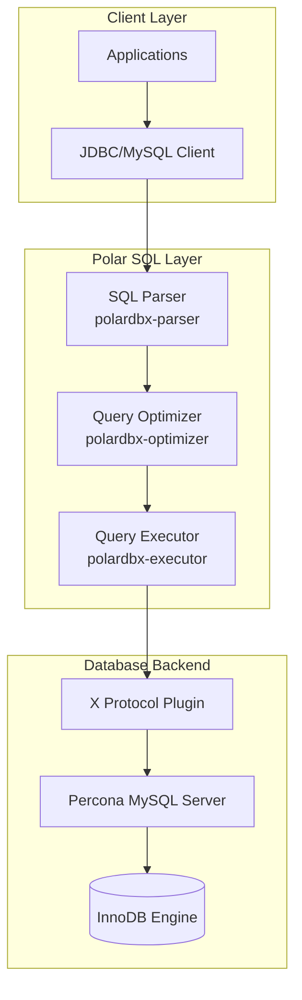

# Diagram

# Description

Client Layer:

- Standard client applications
- JDBC/MySQL protocol support

Polar SQL Layer (Core Modules):

- SQL Parser: Handles SQL parsing
- Query Optimizer: Optimizes queries
- Query Executor: Executes queries directly

Backend:

- X Protocol Plugin: MySQL's protocol for efficient client-server communication
- Percona MySQL Server: Enhanced MySQL server
- Storage Engine: Direct storage layer