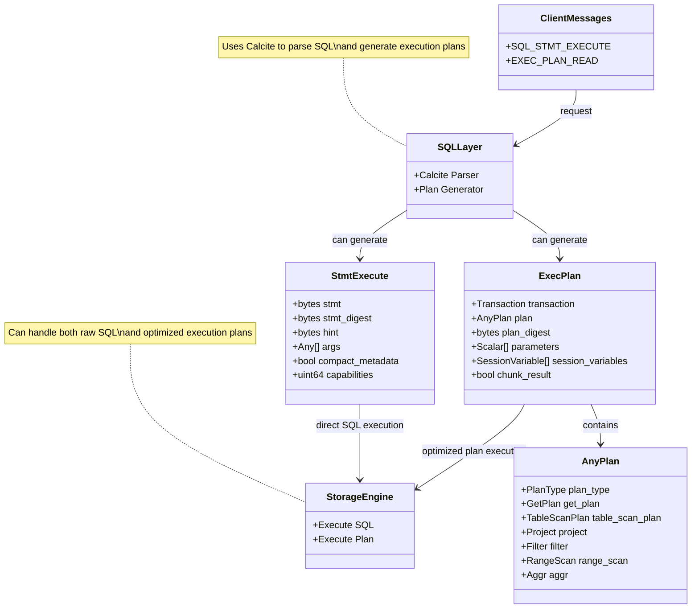
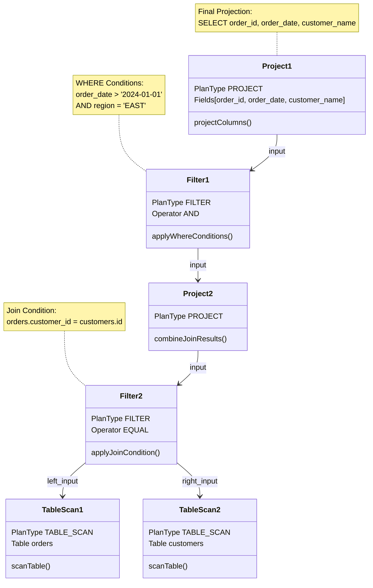

# Introduction

XProtocol uses protobuf for communication between CN (Compute Nodes) and DN (Data Nodes)

# Diagram



# Description

PolarDB-X SQL Layer:

- Uses Calcite for SQL parsing and planning
- Can send either:
  - Direct SQL statements via `StmtExecute`
  - Optimized execution plans via `ExecPlan`

Communication Paths:

- ClientMessages

Shows the two main types of requests:

  - `SQL_STMT_EXECUTE` (type 12)
  - `EXEC_PLAN_READ` (type 100)

Storage Engine:

- Can handle both types of requests:
  - Execute raw SQL from `StmtExecute`
  - Execute optimized plans from `ExecPlan`

Important Distinction:

- These are parallel paths, not a conversion flow
- The SQL layer decides which path to take based on its optimization strategy
- Using Calcite, it can generate optimized execution plans directly rather than always sending SQL

# Execution plan

```sql
SELECT o.order_id, o.order_date, c.customer_name 
FROM orders o 
JOIN customers c ON o.customer_id = c.id 
WHERE o.order_date > '2024-01-01' 
  AND c.region = 'EAST'
```


