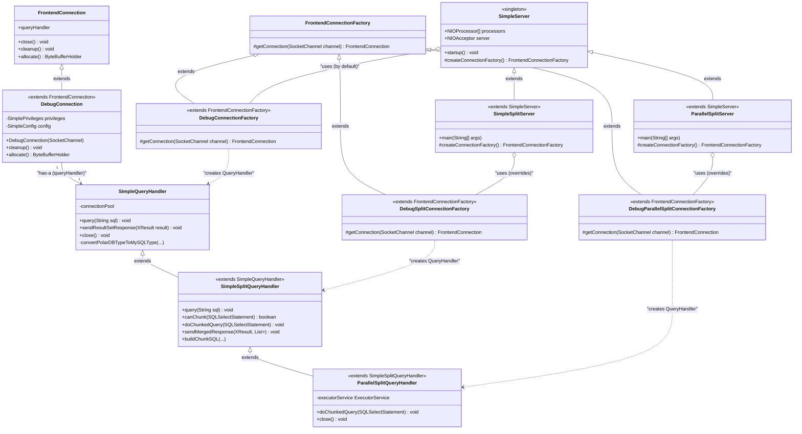

# Diagram

```mermaid
classDiagram
    %% =====================
    %% Classes and hierarchy
    %% =====================

    class SimpleServer {
        +NIOProcessor[] processors
        +NIOAcceptor server
        +startup() void
        #createConnectionFactory() FrontendConnectionFactory
        <<singleton>>
    }

    class SimpleSplitServer {
        +main(String[] args)
        #createConnectionFactory() FrontendConnectionFactory
        <<extends SimpleServer>>
    }

    class ParallelSplitServer {
        +main(String[] args)
        #createConnectionFactory() FrontendConnectionFactory
        <<extends SimpleServer>>
    }

    class FrontendConnectionFactory {
        #getConnection(SocketChannel channel) FrontendConnection
    }

    class DebugConnectionFactory {
        #getConnection(SocketChannel channel) FrontendConnection
        <<extends FrontendConnectionFactory>>
    }

    class DebugSplitConnectionFactory {
        #getConnection(SocketChannel channel) FrontendConnection
        <<extends FrontendConnectionFactory>>
    }

    class DebugParallelSplitConnectionFactory {
        #getConnection(SocketChannel channel) FrontendConnection
        <<extends FrontendConnectionFactory>>
    }

    class FrontendConnection {
        +close() void
        +cleanup() void
        +allocate() ByteBufferHolder
        +queryHandler
    }

    class DebugConnection {
        +DebugConnection(SocketChannel)
        +cleanup() void
        +allocate() ByteBufferHolder
        -SimplePrivileges privileges
        -SimpleConfig config
        <<extends FrontendConnection>>
    }

    class SimpleQueryHandler {
        +query(String sql) void
        +sendResultSetResponse(XResult result) void
        +close() void
        -connectionPool
        -convertPolarDBTypeToMySQLType(...)
    }

    class SimpleSplitQueryHandler {
        +query(String sql) void
        +canChunk(SQLSelectStatement) boolean
        +doChunkedQuery(SQLSelectStatement) void
        +sendMergedResponse(XResult, List<List<Object>>) void
        +buildChunkSQL(...)
        <<extends SimpleQueryHandler>>
    }

    class ParallelSplitQueryHandler {
        +doChunkedQuery(SQLSelectStatement) void
        +close() void
        -executorService ExecutorService
        <<extends SimpleSplitQueryHandler>>
    }

    %% =====================
    %% Inheritance arrows
    %% =====================

    SimpleServer <|-- SimpleSplitServer : extends
    SimpleServer <|-- ParallelSplitServer : extends

    FrontendConnectionFactory <|-- DebugConnectionFactory : extends
    FrontendConnectionFactory <|-- DebugSplitConnectionFactory : extends
    FrontendConnectionFactory <|-- DebugParallelSplitConnectionFactory : extends

    SimpleQueryHandler <|-- SimpleSplitQueryHandler : extends
    SimpleSplitQueryHandler <|-- ParallelSplitQueryHandler : extends

    FrontendConnection <|-- DebugConnection : extends

    %% =====================
    %% Usage / composition
    %% =====================

    SimpleServer o-- DebugConnectionFactory : "uses (by default)"
    SimpleSplitServer o-- DebugSplitConnectionFactory : "uses (overrides)"
    ParallelSplitServer o-- DebugParallelSplitConnectionFactory : "uses (overrides)"

    DebugConnection "1" --> "1" SimpleQueryHandler : "has-a (queryHandler)"

    %% =====================
    %% Factories create specific QueryHandler
    %% =====================
    DebugConnectionFactory ..> SimpleQueryHandler : "creates QueryHandler"
    DebugSplitConnectionFactory ..> SimpleSplitQueryHandler : "creates QueryHandler"
    DebugParallelSplitConnectionFactory ..> ParallelSplitQueryHandler : "creates QueryHandler"
```