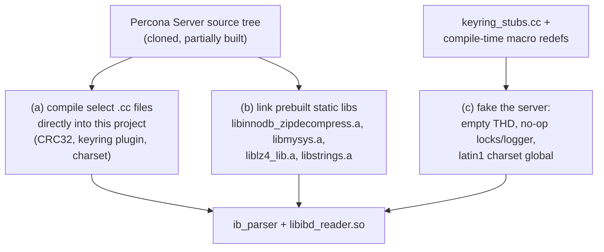

# Article 2 — The Build Challenge: Linking MySQL's Own Code

> The heart of the project, and the author's own "this was the hard part": getting real
> Percona Server C++ to compile and run **outside** the server.

## The temptation and the trap

Decrypting and decompressing InnoDB pages means implementing AES key unwrapping and the
page-zip algorithm *exactly* as InnoDB does — get one detail wrong and you produce
garbage that looks plausible. The obvious shortcut: **don't reimplement, reuse InnoDB's
own code.** The trap: that code assumes it lives inside a running MySQL server — global
locks, the performance schema, thread-local `THD` session objects, a logger, charset
singletons. Pull one function and you drag in the world.

The whole build is a disciplined fight to take *just the code you need* and convince it
the server exists when it doesn't.

## Three mechanisms

### (a) Compile chosen Percona source files directly

Rather than link the whole server, the build lists specific `.cc` files from the Percona
tree and compiles them into this project: InnoDB's CRC32, a charset table, and — the
tricky part — **eleven keyring-plugin source files** (buffered file I/O, key container,
digest, checkers, serializers). These implement reading a Percona keyring file and
fetching a master key; there is no smaller unit to borrow.

### (b) Link a few prebuilt static libraries

The decompressor is the prize: Oracle deliberately made **`libinnodb_zipdecompress.a`**
an externalizable library, so a *partial* build of Percona Server
(`make mysys strings innodb_zipdecompress lz4_lib perconaserverclient` — minutes, not the
whole server) yields exactly the archives needed. The project links those instead of
vendoring the code — a documented A-vs-B decision (link the lib vs. copy the source), and
linking won.

### (c) Fake the server around it

This is where the real ingenuity is. Three tactics make server code run headless:

- **Compile definitions that switch off subsystems** (`UNIV_LIBRARY`, `UNIV_NO_ERR_MSGS`,
  `DISABLE_PSI_MEMORY/FILE/RWLOCK/MUTEX/THREAD`, `DBUG_OFF`, …). This is the same
  ifdef strategy MySQL itself uses for its hot-backup build — define the right macros and
  server code compiles as a thin library with the instrumentation gone.
- **Macro-stubbing the logger.** The keyring code calls `LogPluginErr(...)` everywhere;
  per-source compile flags redefine those macros to `do {} while (0)` so the calls
  vanish at compile time — no logging subsystem needed.
- **A stub file for server globals** (`keyring_stubs.cc`, ~70 lines). It provides
  minimal, do-nothing definitions of everything the keyring code references but the
  server would normally own: an empty `THD` class and a thread-local `current_thd`,
  no-op `push_warning` and security-context accessors, a fake `mysql_rwlock_t` with
  no-op lock/unlock and the global `LOCK_keyring`, and `system_charset_info` pointed at
  latin1. It compiles because these symbols *exist*; it runs because the keyring code's
  use of them is incidental to reading a key file.

## The scars that prove it was hard

Two details capture the flavor of this kind of work:

- **A deliberate memory leak to avoid a crash.** The keyring `fetch_key()` appears to
  transfer or corrupt ownership of the temporary key object; freeing it caused
  double-frees. The fix is an intentional, documented small leak — the pragmatic choice
  in a short-lived CLI process, and exactly the kind of trade-off that only surfaces when
  you run someone else's code out of its native habitat.
- **Hardcoded header offsets** (encryption-info at fixed byte positions for compressed vs
  uncompressed tablespaces). Reusing InnoDB's algorithms still leaves you responsible for
  finding the right bytes to feed them — the library decompresses a page, but *you* must
  locate the page.

## The lesson

The build system *is* the project. Anyone can call `AES_decrypt`; the value here is
proving that InnoDB's *actual* keyring + decompression code can be lifted out of a
500k-line server and run against a file on disk. It's a masterclass in dependency
archaeology — and the reason the next step (rewriting it all in Rust, where there is no
server to fake) started to look appealing.

---
**Previous:** [Reading InnoDB Without a Server](./01-overview.md) · **Next:** [Decrypt → Decompress → Parse](./03-pipeline.md)
