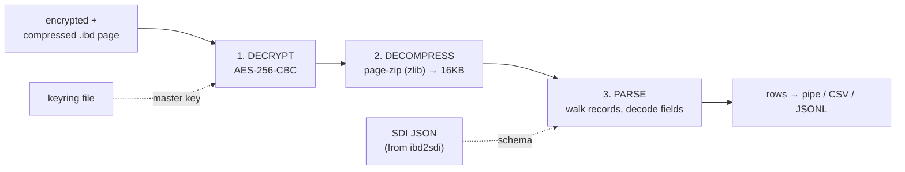

# Article 3 — Decrypt → Decompress → Parse

> The three stages, in the order a reader must apply them (the exact reverse of how MySQL
> wrote them).

## Write order vs read order

MySQL writes a protected page **compress, then encrypt**. So reading is the mirror:
**decrypt first, then decompress, then parse.** Get the order wrong and you're trying to
inflate ciphertext.

## Stage 1 — Decrypt

InnoDB's encryption at rest is a two-level key scheme, and the tool reproduces it end to
end:

1. **Load the master key from the keyring file** using Percona's own
   `Keys_container` + `Buffered_file_io` (the plugin code borrowed in Article 2), looking
   up the key named `INNODBKey-<uuid>-<id>`.
2. **De-obfuscate** the stored key — the keyring lightly XOR-obfuscates entries with a
   fixed, publicly-documented constant (not a security boundary; the file itself is the
   secret).
3. **Unwrap the tablespace key.** The `.ibd`'s encryption-info header carries a 3-byte
   magic (`lCA`/`lCB`/`lCC` = format V1/V2/V3) and a 64-byte blob = (tablespace key ‖ IV)
   wrapped with the master key via **AES-256-ECB, no padding**, guarded by a CRC32C. Verify
   the checksum, split into a 32-byte key + 32-byte IV.
4. **Decrypt each page** with **AES-256-CBC, no padding** — including InnoDB's quirk for
   non-block-aligned tails (decrypt the final two blocks first). Only pages whose type
   marks them encrypted are touched, and the original page type is restored afterward.

The payoff: an encrypted `.ibd` that any hex dump shows as noise becomes a normal (still
possibly compressed) InnoDB file.

## Stage 2 — Decompress

For `ROW_FORMAT=COMPRESSED` tables, index pages are page-zip blobs. Rather than
reimplement that fiddly format, the tool hands each `FIL_PAGE_INDEX` page to InnoDB's own
`page_zip_decompress_low()` (from the linked `libinnodb_zipdecompress.a`, zlib
underneath), expanding e.g. 8KB physical → 16KB logical. Compression is detected by
physical size being smaller than logical, or by page type.

Two honest details: metadata pages are copied at their physical size, so the output is
*intentionally mixed-size* (which is why re-import is experimental); and **transparent
page compression** — the whole-page zlib/lz4 punch-hole scheme, distinct from page-zip —
is detected but passed through raw, a documented boundary rather than a silent failure.

## Stage 3 — Parse

With a plain 16KB page in hand, parsing is the record walk from the
[InnoDB course, chapter 2](../innodb-architecture/02-page-format.md):

- **Schema from SDI.** Column definitions, types, and collation IDs come from the SDI
  JSON (produced once by `ibd2sdi`), parsed with RapidJSON. This is why the tool reads
  data without a server but still needs the schema extracted from one.
- **Record walking.** It follows the leaf-page linked list from infimum to supremum,
  handling both **COMPACT and REDUNDANT** record formats with its own offset management
  (deliberately avoiding MySQL's `rec_get_nth_field`, which would drag in more server
  state) — lineage from the well-known undrop-for-innodb recovery tool.
- **Field decoding.** Integers (signed/unsigned), floats, DECIMAL, the temporal types,
  charset-aware CHAR/VARCHAR via the SDI collation, external LOB/ZLOB pages followed off
  the record, and MySQL's binary JSON decoded to text.
- **Output.** Pipe (default), CSV, or JSONL; optional `--with-meta` adds page number,
  byte offset, and the delete-mark flag — the last being useful for forensics (a
  delete-marked row is still physically present until purge, exactly as the
  [course's MVCC chapter](../innodb-architecture/07-transactions-mvcc.md) describes).

## The whole thing in one command

Mode `4` runs decrypt+decompress in a single pass; mode `3` then parses the result. In
practice: extract the schema once (`ibd2sdi`), then `ib_parser` turns a locked-down,
encrypted, compressed production tablespace into a stream of readable rows — no MySQL
process anywhere in sight.

---
**Previous:** [The Build Challenge](./02-build-challenge.md) · **Next:** [A C ABI for Everything Else](./04-c-api-and-verification.md)
