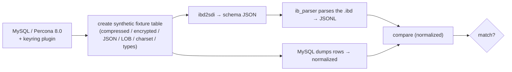

# Article 4 — A C ABI for Everything Else

> A CLI is useful; a library is reusable. The C ABI is what turned this tool into the
> FFI backbone other projects built on — and how its correctness is proven.

## From tool to library

The parsing logic is also compiled into a shared library, `libibd_reader.so`, behind a
clean C header (`ibd_reader_api.h`) with hidden default visibility and an explicit export
macro — a deliberate, stable **C ABI** designed for FFI from Go, Python, Rust, "and other
languages."

The surface has two generations:

- **Page/file operations** — `ibd_decompress_file/page`, `ibd_decrypt_file/page`,
  `ibd_decrypt_and_decompress_file`, `ibd_get_page_info`, `ibd_is_page_compressed`,
  `ibd_get_page_type_name`, plus lifecycle (`ibd_init/cleanup`,
  `ibd_reader_create/destroy`, `ibd_get_error`, `ibd_set_debug`).
- **Row iteration** — the higher-level API most consumers want:

```c
ibd_open_table(reader, ibd_path, sdi_json_path, &table);
ibd_get_table_info(table, ...);          // columns, row count
while (ibd_read_row(table, &row) == IBD_OK) {   // IBD_END_OF_STREAM ends it
    ibd_row_get_column(row, i, &value);  // typed union: int/uint/double/string/...
    ...
    ibd_free_row(row);
}
ibd_close_table(table);
```

Typed result codes (`IBD_OK`, `IBD_END_OF_STREAM`, negative errors including a distinct
`IBD_ERROR_KEYRING`) make it usable from languages that can't read C++ exceptions.

## The FFI backbone of the journey

This C ABI is the **integration seam** that connected the low-level C work to the
higher-level systems in the [query optimization journey](../../query-optimization/index.md):

- The repo ships a **cgo binding** (Go) as the reference consumer.
- The same header is what a Rust/Go wrapper links against to **ingest InnoDB data without
  a running MySQL** — the snapshot-load path the analytical replicas needed
  ([cslog-db / cslog-query](../../query-optimization/05-cslog-query.md) read initial table
  state from files rather than replaying a full change stream).

So a project that began as "decompress a page" became the thing that lets *any* language
read production InnoDB files — which is a much bigger deliverable than the CLI it started
as.

## Proving correctness

Reading a file "successfully" is meaningless if the rows are subtly wrong. Verification
is done against the only authority — a real MySQL server:



The fixture corpus is a set of synthetic tables — one per hard feature: compressed pages,
encrypted pages, binary JSON, external LOB, compressed LOB (ZLOB), every data type, a
secondary index. For each, the harness creates the table in a live MySQL (with the
keyring plugin, so encryption is real), extracts the schema with `ibd2sdi`, parses the
`.ibd` with `ib_parser`, and diffs the normalized JSONL against MySQL's own row output.

A separate set of scripts attempts the round trip the other way — `IMPORT TABLESPACE` of
a rebuilt file — and, tellingly, one of them **demonstrates the expected failure** (a
rebuilt-but-still-COMPRESSED file mismatches metadata → MySQL error 1808). Documenting the
limitation as a passing test, rather than hiding it, is the same honesty that runs through
the whole [state-of-parity](../innodb-rust/05-state-of-parity.md) mindset of these
projects.

## What this project contributed to the story

- **Proof that InnoDB's real code can be lifted out** and run headless — the confidence
  that made a from-scratch [Rust reimplementation](../innodb-rust/README.md) worth
  attempting.
- **A reusable reader** (the C ABI) that unblocked file-based ingestion for the
  analytical systems.
- **Deep, tested familiarity** with the two features naive readers ignore — encryption
  and compression — which are exactly the features that separate a toy `.ibd` reader from
  one you can point at production.

---
**Previous:** [Decrypt → Decompress → Parse](./03-pipeline.md) · **Back to:** [Series Overview](./README.md)
