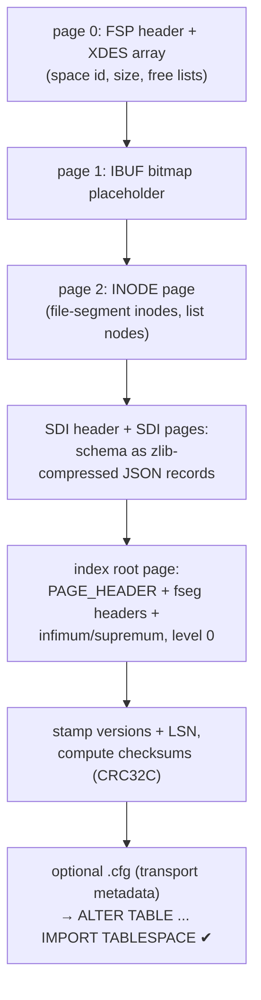

# Article 3 — Reading & Writing the On-Disk Format

> Reading `.ibd` files is table stakes (several tools do it). **Writing** them — building
> tablespaces MySQL will import — is the differentiator, and where every format detail
> stops being optional.

## The read path

Reading follows the anatomy from the
[InnoDB course, chapters 1-2](../innodb-architecture/02-page-format.md), with all
constants upstream-exact:

1. **FIL header** — offsets 0-38 exactly as upstream (`FIL_PAGE_OFFSET`=4,
   `FIL_PAGE_LSN`=16, `FIL_PAGE_TYPE`=24…); the full 8.0 page-type catalog
   (`FIL_PAGE_INDEX`=17855, SDI=17854, LOB/ZLOB, compressed/encrypted variants).
2. **Index page header** — `PAGE_N_DIR_SLOTS`, `PAGE_HEAP_TOP`, `PAGE_N_HEAP` (bit 15 =
   compact), `PAGE_LEVEL`, the two `PAGE_BTR_SEG_*` segment headers; infimum/supremum at
   their compact offsets; directory slots owning 4-8 records.
3. **Compact records** — the 5 extra header bytes parsed at negative offsets (info bits,
   n_owned, heap_no, status, next pointer), then the null bitmap and variable-length
   array walked *backwards* from the origin; **instant ADD/DROP COLUMN row versioning**
   handled (a modern-format subtlety the 2009 engine never had); 20-byte external
   references followed into LOB pages, including MySQL's binary JSON.
4. **SDI** — since 8.0 each tablespace embeds its own dictionary as zlib-compressed JSON
   in SDI pages; the reader decompresses and decodes it to know the schema with no
   server and no `.frm`. Compressed (page0zip) and encrypted (AES) tablespaces are
   handled on the way in.

One honest limitation: only COMPACT/DYNAMIC user records decode today — pre-5.7
REDUNDANT tables aren't readable (yet).

## The write path

Creating an importable tablespace means reproducing everything `CREATE TABLE` does to a
file — there is no "minimal viable subset," because `IMPORT TABLESPACE` checks all of it:

Then **offline B+tree insertion** (`ibd_insert`) does real tree surgery on the closed
file: build the index entry from typed values, descend to the leaf, and run the full
page-insert machinery — free-list reuse or heap allocation, record write, linked-list
splice, `n_owned`/directory-slot maintenance, `PAGE_LAST_INSERT`/direction statistics —
and when a page fills, an actual **page split with node-pointer insertion into the
parent** (root raise included). Every touched page is re-checksummed. It is chapter 6 of
the course, executed against a file on disk with no server in sight.

### The checksum gauntlet

Nothing teaches format discipline like MySQL's import validation. The writer implements
the full checksum family — CRC32C over the two segments (bytes 4-26 and 38 to trailer),
the legacy InnoDB new/old formulas, the compressed-page variant, and the
`BUF_NO_CHECKSUM_MAGIC` sentinel — because the *reader on the other side* (real MySQL)
will try them according to its own configuration. Same for LSN stamping: header and
trailer LSN fragments must agree, or the page is "torn."

### What offline writing means — and doesn't

These tools write pages directly: **no redo log is generated, no doublewrite protects
the writes**. That's correct for their use case (building/modifying a tablespace that is
not attached to any server — crash mid-write just means rerunning the tool), and it's
honest about what this is: a *format writer*, not yet a crash-safe engine. The
mtr/redo/doublewrite scaffolding exists in the engine crates but isn't wired into a
durable commit path — that boundary, and why it's the hardest one, is
[Article 5](./05-state-of-parity.md)'s subject.

## What writing taught that reading never would

- **Every field is load-bearing.** A reader can skip `PAGE_DIRECTION` or fudge
  `n_owned`; a writer cannot — import validation and later scans expose every shortcut.
- **The dictionary is half the format.** Getting records right was days; getting SDI
  JSON to parity with `ibd2sdi` (types, charsets, hidden columns, se_private_data) was
  weeks. Data without correct metadata is unimportable.
- **Freedom from the buffer pool is a feature.** Abstracting page access (the
  `BtrPageProvider` trait) turned the B+tree into a library usable by offline tools —
  something upstream InnoDB, welded to its buffer pool, structurally cannot offer.

---
**Previous:** [Architecture](./02-architecture.md) · **Next:** [Proving It: Parity Testing](./04-parity-testing.md)
