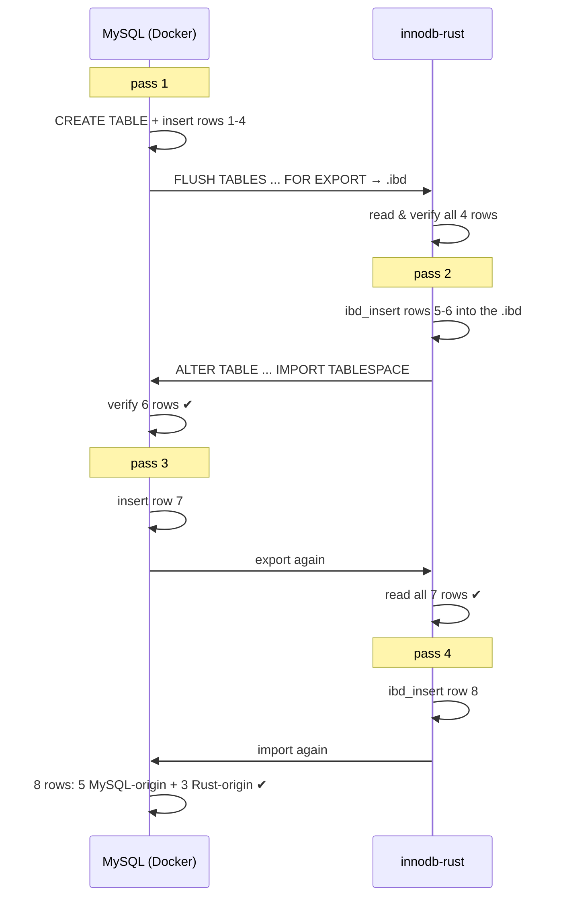

# Article 4 — Proving It: Parity Testing Against Real MySQL

> A format reimplementation is worthless unless the original implementation agrees with
> it. This article covers the verification machinery — the most transferable part of the
> whole project.

## The core question

"Can Rust read and write InnoDB files?" is not testable by unit tests alone — the only
authority on the InnoDB format is **InnoDB itself**. So the verification strategy puts a
real MySQL server (in Docker) in the loop and makes the two implementations exchange
files in both directions.

## The flagship: the bidirectional round-trip

One script tells the whole story — four passes over the *same tablespace*:

Data survives **multiple MySQL↔Rust round-trips without corruption**. That final import
is the strong claim: MySQL's own `IMPORT TABLESPACE` — with its checksum verification,
page validation, and SDI checks — accepts pages that Rust wrote and modified.

## The comparison engine

Round-trips need a referee. A parity checker runs the Rust scanner (`ibd_scan
--normalize`) over a tablespace, dumps the same table from MySQL as JSON, normalizes
both sides (binary columns HEX-encoded to survive charset differences), and diffs
per row, per field — reporting exactly which field of which row diverged.

Beyond row data, **schema serialization** gets the same treatment: the Rust `ibd2sdi`
equivalent is diffed against MySQL's own `ibd2sdi` tool over a corpus of schemas —
normalized JSON against normalized JSON. The dictionary metadata Rust writes is the
metadata MySQL would have written.

The corpus of scenario scripts (~25) then covers the long tail: every data type,
COMPRESSED row format (real zlib/LZ4 round-trip through MySQL compressed tables),
updates, deletes, purge, secondary-index maintenance, crash cases.

## The second layer: internal correctness

Interoperability proves the *format*; a separate harness attacks *behavior*:

- **End-to-end scenarios** against a demo server speaking the MySQL protocol —
  organized as smoke / planner / crash / concurrency / soak groups: crash-recovery
  matrices, deadlock cycles, lock-wait timeouts, isolation-contract checks.
- **A randomized SIGKILL soak** — kill the engine at random points under load, restart,
  verify invariants; wired into nightly CI (24 cycles) with failure-bundle artifacts.
- **Fuzzing** (cargo-fuzz) on the attack surfaces a file-format parser exposes: page
  checksums, record metadata, B-tree validation.
- **~600 unit/integration tests** across the crates, with an 80% coverage gate, plus a
  regression harness that renders Markdown/HTML/JUnit reports.

## Lessons worth stealing

1. **Test against the reference implementation, not your understanding of it.** Every
   format assumption eventually meets `IMPORT TABLESPACE`, which does not negotiate.
2. **Normalize, then diff.** Charset/encoding noise will otherwise bury real mismatches.
3. **Make the authority tool your oracle** (`ibd2sdi` vs `ibd2sdi-rust`) — when the
   vendor ships a serializer, parity means byte-equivalent-after-normalization output.
4. **Separate format parity from behavioral correctness** — different harnesses, different
   failure modes, different CI budgets (fast gate on PR, soak at night).

---
**Previous:** [Reading & Writing the Format](./03-reading-writing-ibd.md) · **Next:** [The State of Parity](./05-state-of-parity.md)
