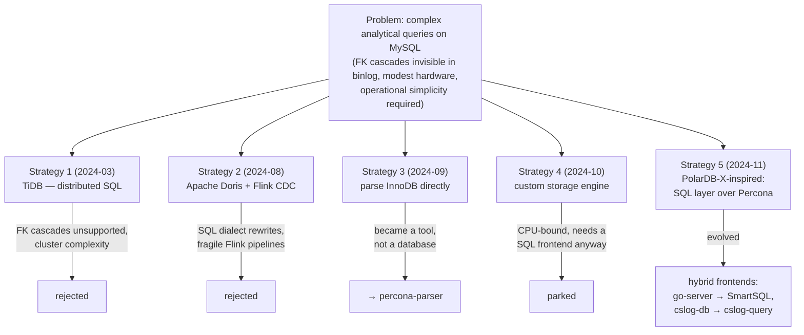

# Labs & Attempts

> Five strategies, many experiments, several instructive dead ends. Each one eliminated
> an alternative or contributed a building block to the final systems.

## The five strategies

### Strategy 1 — TiDB (rejected)

Distributed MySQL-compatible SQL over TiKV. Tested data migration, replication and
parallel query. Killed by the two recurring villains: **foreign-key cascades don't
replicate** (TiDB didn't support them), and a distributed cluster is exactly the
operational burden customer sites can't carry.

### Strategy 2 — Apache Doris + Flink CDC (rejected)

Real columnar speed, but the SQL dialect differences meant rewriting every report, and
the Flink CDC pipeline (checkpoints, resources) was fragile in practice. Lesson kept:
*the analytical engine must hide behind MySQL's dialect and protocol, and the sync path
must be boring.*

### Strategy 3 — Parse InnoDB directly (became a tool)

If replication is the problem, read the data files themselves.
[`db/mysql/parse/`](https://github.com/wilhasse/courses/tree/main/db/mysql/parse)
(→ [percona-parser](https://github.com/wilhasse/percona-parser)) learned to **decrypt,
decompress and parse `.ibd` pages offline** — trying four approaches (extending
innochecksum, gutting XtraBackup, extending innodb-java-reader, inno_space). The
spectacular proof-of-concept lives in
[`db/calcite/innodb-example`](https://github.com/wilhasse/courses/tree/main/db/calcite):
**Apache Calcite running Star Schema Benchmark queries directly against InnoDB files,
no MySQL server at all**. Deep InnoDB-format knowledge from this thread fed everything
later (and the [InnoDB course](../mysql/innodb-architecture/README.md)).

### Strategy 4 — Custom storage engine (parked)

"CSLOG Storage": memory + RocksDB hybrid engine, hot 10% cached. Prototyped against the
Memory engine and `.ibd` ingestion. Parked when it became clear the hard part isn't
storage — it's that you still need a **SQL frontend** (parser/optimizer/executor) worth
using on top.

### Strategy 5 — PolarDB-X-inspired SQL layer (the direction that stuck)

[`db/polardbx/`](https://github.com/wilhasse/courses/tree/main/db/polardbx): study
Alibaba's PolarDB-X and extract its **SQL layer** (parser, optimizer, parallel executor,
columnar/result caches) to run over a *single* Percona node via X Protocol — distributed
smarts without distribution. Deep dives into its optimizer, private protocol, and
columnar indexes. The full extraction proved heavy, but the architecture — *smart SQL
frontend, MySQL underneath, caches in between* — is exactly what shipped later.

## Supporting labs (the building blocks)

| lab | location | contribution |
|-----|----------|--------------|
| Query splitting | [`db/druid/`](https://github.com/wilhasse/courses/tree/main/db/druid) | Alibaba Druid SQL parser: split a complex query's AST, route subqueries to different engines, recombine — the router/rewriter concept |
| SSB benchmark | [`db/ssb/`](https://github.com/wilhasse/courses/tree/main/db/ssb) | shared benchmark harness with table variants per engine (InnoDB, RocksDB, Heap, custom) |
| chDB integration saga | [`db/mysql/tests/mysql-to-chdb-example`](https://github.com/wilhasse/courses/tree/main/db/mysql/tests) | how to embed ClickHouse next to MySQL: UDF **crashed** (722MB library inside mysqld), external process blocked — final answer: a **persistent API server** loading chDB once (50-100× faster). This exact pattern ships in SmartSQL |
| LMDB vs B+Tree | [`db/lmdb/`](https://github.com/wilhasse/courses/tree/main/db/lmdb) | benchmarks (Go/Rust/Zig): LMDB dominates reads; picked for the OLTP side of go-server |
| ClickHouse ingestion | [`db/clickhouse/`](https://github.com/wilhasse/courses/tree/main/db/clickhouse) | Go native-protocol batch loading |
| Canal CDC | [`db/mysql/canal/`](https://github.com/wilhasse/courses/tree/main/db/mysql/canal) | Alibaba binlog CDC study — the sync building block |
| Huawei parallel query | [`db/mysql/opt/`](https://github.com/wilhasse/courses/tree/main/db/mysql/opt) | ported Huawei's Kunpeng parallel-query patch onto Percona 8.0.39 — intra-query parallelism as a within-MySQL alternative (ARM-only upstream) |
| go-server | [`db/mysql/go-server/`](https://github.com/wilhasse/courses/tree/main/db/mysql/go-server) | the **direct prototype of SmartSQL**: go-mysql-server frontend routing OLTP→LMDB, OLAP→chDB, plus virtual remote databases |
| cslog-db + doris-rust | private repos | the **direct predecessors of cslog-query**: a Doris-parity Rust engine that taught (by failing) the value of immutable rowsets, few files, one long-lived query session |

## What the dead ends taught

1. **Replication compatibility beats raw speed** — TiDB and Doris were fast; both died on
   sync fidelity and operations.
2. **Embedding is treacherous** — the chDB-in-MySQL crash pushed the design to *processes
   beside MySQL*, not code inside it.
3. **The frontend is the product** — every path converged on "speak MySQL's protocol,
   route intelligently"; engines are interchangeable behind it.
4. **Generality is the enemy** — cslog-db aimed at Doris parity and drowned; its restart
   ([cslog-query](./05-cslog-query.md)) scoped down to "make these reports fast" and
   works.

---
**Previous:** [What I Studied](./02-studies.md) · **Next:** [SmartSQL](./04-smart-sql.md)
