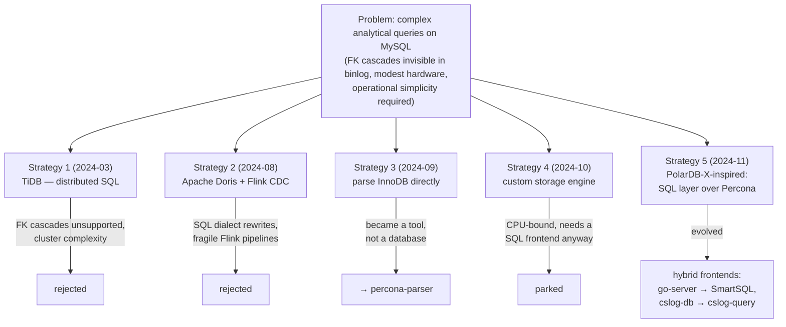

# Labs & Attempts

> Five strategies, many experiments, several instructive dead ends. Each one eliminated
> an alternative or contributed a building block to the final systems.

## The five strategies

### Strategy 1 — TiDB (rejected)

Distributed MySQL-compatible SQL over TiKV. Tested data migration, replication and
parallel query. Killed by the two recurring villains: **foreign-key cascades don't
replicate** (TiDB didn't support them), and a distributed cluster is exactly the
operational burden customer sites can't carry.

### Strategy 2 — Apache Doris + Flink CDC (rejected)

Real columnar speed, but the SQL dialect differences meant rewriting every report, and
the Flink CDC pipeline (checkpoints, resources) was fragile in practice. Lesson kept:
*the analytical engine must hide behind MySQL's dialect and protocol, and the sync path
must be boring.*

### Strategy 3 — Parse InnoDB directly (became a tool)

If replication is the problem, read the data files themselves.
[`db/mysql/parse/`](https://github.com/wilhasse/courses/tree/main/db/mysql/parse)
(→ [percona-parser](https://github.com/wilhasse/percona-parser)) learned to **decrypt,
decompress and parse `.ibd` pages offline** — trying four approaches (extending
innochecksum, gutting XtraBackup, extending innodb-java-reader, inno_space). The
spectacular proof-of-concept lives in
[`db/calcite/innodb-example`](https://github.com/wilhasse/courses/tree/main/db/calcite):
**Apache Calcite running Star Schema Benchmark queries directly against InnoDB files,
no MySQL server at all**. Deep InnoDB-format knowledge from this thread fed everything
later (and the [InnoDB course](../mysql/innodb-architecture/README.md)).

### Strategy 4 — Custom storage engine (parked)

"CSLOG Storage": memory + RocksDB hybrid engine, hot 10% cached. Prototyped against the
Memory engine and `.ibd` ingestion. Parked when it became clear the hard part isn't
storage — it's that you still need a **SQL frontend** (parser/optimizer/executor) worth
using on top.

### Strategy 5 — PolarDB-X-inspired SQL layer (the direction that stuck)

[`db/polardbx/`](https://github.com/wilhasse/courses/tree/main/db/polardbx): study
Alibaba's PolarDB-X and extract its **SQL layer** (parser, optimizer, parallel executor,
columnar/result caches) to run over a *single* Percona node via X Protocol — distributed
smarts without distribution. Deep dives into its optimizer, private protocol, and
columnar indexes. The full extraction proved heavy, but the architecture — *smart SQL
frontend, MySQL underneath, caches in between* — is exactly what shipped later.

## Supporting labs (the building blocks)

| lab | location | contribution |
|-----|----------|--------------|
| Query splitting | [`db/druid/`](https://github.com/wilhasse/courses/tree/main/db/druid) | Alibaba Druid SQL parser: split a complex query's AST, route subqueries to different engines, recombine — the router/rewriter concept |
| SSB benchmark | [`db/ssb/`](https://github.com/wilhasse/courses/tree/main/db/ssb) | shared benchmark harness with table variants per engine (InnoDB, RocksDB, Heap, custom) |
| chDB integration saga | [`db/mysql/tests/mysql-to-chdb-example`](https://github.com/wilhasse/courses/tree/main/db/mysql/tests) | how to embed ClickHouse next to MySQL: UDF **crashed** (722MB library inside mysqld), external process blocked — final answer: a **persistent API server** loading chDB once (50-100× faster). This exact pattern ships in SmartSQL |
| LMDB vs B+Tree | [`db/lmdb/`](https://github.com/wilhasse/courses/tree/main/db/lmdb) | benchmarks (Go/Rust/Zig): LMDB dominates reads; picked for the OLTP side of go-server |
| ClickHouse ingestion | [`db/clickhouse/`](https://github.com/wilhasse/courses/tree/main/db/clickhouse) | Go native-protocol batch loading |
| Canal CDC | [`db/mysql/canal/`](https://github.com/wilhasse/courses/tree/main/db/mysql/canal) | Alibaba binlog CDC study — the sync building block |
| Huawei parallel query | [`db/mysql/opt/`](https://github.com/wilhasse/courses/tree/main/db/mysql/opt) | ported Huawei's Kunpeng parallel-query patch onto Percona 8.0.39 — intra-query parallelism as a within-MySQL alternative (ARM-only upstream) |
| go-server | [`db/mysql/go-server/`](https://github.com/wilhasse/courses/tree/main/db/mysql/go-server) | the **direct prototype of SmartSQL**: go-mysql-server frontend routing OLTP→LMDB, OLAP→chDB, plus virtual remote databases |
| doris-rust | private repo | Apache-Doris-parity storage engine in Rust (rowsets, delete vectors, PK index, compaction) — consumed by cslog-db as one of its backends |

## The big one: cslog-db, a full analytical replica (failed, instructive)

The most ambitious attempt deserves its own post-mortem. **cslog-db** (~5 intense weeks,
~69k lines of Rust, 396 commits) tried to build a complete **read-only, MySQL-wire-compatible
analytical replica**: continuously mirror a *full* production MySQL database into a local
columnar store (Apache DataFusion on top), serve `SELECT`s locally, proxy anything
unsupported to the real MySQL upstream.

### The write path killed it

Reads were never the problem — **full-fidelity replication of row-level updates into
columnar storage was**:

- On the largest history table, sustained CDC apply throughput collapsed to
  **~1 row/second — versus ~200 writes/second native MySQL replication** in the same
  environment. The cause: immutable columnar storage turns every CDC microbatch into new
  files and commits; partitioning multiplied commits per flush; the table accumulated
  **93,000+ tiny Parquet files** that planning, scanning, merging and compaction all
  drowned in.
- Merge-based upserts were measured **~200× slower than appends** (1-2s vs 5ms per
  million-row batch) — fine for INSERT-heavy tables, fatal for the UPDATE-heavy full
  replica.
- Partition-aware buffering made CPU and memory scale **O(active partitions)**; the
  "fix" was retreating from partitioning altogether.

### Six storage backends couldn't fix a scope problem

The response to each wall was trying another engine — the table-source enum grew to eight
entries in five weeks: **Delta Lake** (original; small-file explosion), **Lance** (faster
merges, but DataFusion version conflicts and unproven concurrency), **Apache Iceberg**
(append-only — updates awkward), the **doris-rust engine** (most ambitious; effectively
re-implementing an OLAP engine), **chDB** (one-session-per-process serialization), and
finally **DuckDB** — which bulk-loaded 258M rows at ~380k rows/s, then applied CDC at
**~9 rows/s** (per-row delete+insert), with replication lag growing without bound; its
MySQL extension also ignored memory limits and got OOM-killed. Meanwhile whole subsystems
grew for idempotency, replay, schema drift, and source-vs-replica validation — effort
spent proving the replica matched the source, because it often didn't. The server's
`main.rs` reached 17,000 lines: "became too complex," made concrete.

### The correct conclusion

The failure wasn't any particular engine — it was the **mismatch between "replicate
everything, row by row" and immutable columnar storage**, plus unbounded scope. The
restart, [cslog-query](./05-cslog-query.md), inverted exactly these decisions: replicate
*only the tables the slow reports need*, batch CDC into few large immutable rowsets with
delete vectors, keep one long-lived query session, verify parity as a first-class
feature — and explicitly refuse to become "an Apache Doris clone."

## What the dead ends taught

1. **Replication compatibility beats raw speed** — TiDB and Doris were fast; both died on
   sync fidelity and operations.
2. **Embedding is treacherous** — the chDB-in-MySQL crash pushed the design to *processes
   beside MySQL*, not code inside it.
3. **The frontend is the product** — every path converged on "speak MySQL's protocol,
   route intelligently"; engines are interchangeable behind it.
4. **Generality is the enemy** — cslog-db aimed at a full replica with Doris-parity
   storage and drowned in its own write path; its restart
   ([cslog-query](./05-cslog-query.md)) scoped down to "make these reports fast" and
   works.
5. **Columnar stores hate row-by-row updates** — batch the changes, embrace immutability
   with delete vectors, or don't replicate that table at all.

---
**Previous:** [What I Studied](./02-studies.md) · **Next:** [SmartSQL](./04-smart-sql.md)
