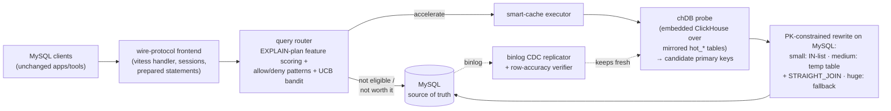

# SmartSQL — The Production System

> The first finished product of this journey: a MySQL-protocol proxy that transparently
> accelerates complex analytical queries. **In production**, currently scoped to a curated
> set of queries.

## The idea in one paragraph

MySQL's optimizer struggles with big analytical joins (10+ tables): it picks poor join
orders, and fixing that with indexes would require an impractical explosion of composite
indexes. SmartSQL's answer: **don't make MySQL plan the hard part.** A columnar engine —
**chDB (embedded ClickHouse)** — keeps a mirror of the hot tables and runs the selective
part of the query blazingly fast, producing only the **primary keys** of matching rows.
Then a simplified, PK-constrained query goes to MySQL — the source of truth — to fetch the
final rows. MySQL stays authoritative; ClickHouse does the thinking. Measured speedups:
**10–50× on complex multi-table queries**.

## Architecture

Written in **Go** (~58k lines). Clients connect unchanged — SmartSQL speaks the MySQL wire
protocol (via the `dolthub/vitess` handler library):

The moving parts:

- **Frontend** — MySQL protocol server; sessions, prepared statements, admin commands.
  Being a proxy (not a plugin) means zero changes to MySQL or to applications.
- **Query router** — decides *per query* whether acceleration is worth the ~25ms probe
  overhead: extracts features from `EXPLAIN FORMAT=JSON`, applies hard cutoffs and
  allow/deny pattern lists, and uses a two-arm UCB bandit to keep learning from real
  latencies. Decisions are cached per query fingerprint.
- **chDB probe layer** — plans and rewrites the selective portion of the query against
  columnar `hot_*` mirror tables; supports join and COUNT pushdown into ClickHouse.
- **PK-constrained execution** — strategy picked by candidate-set size: `IN`-list (up to
  ~5k keys), temp table + `STRAIGHT_JOIN` (up to ~1M keys, auto-switching MEMORY→InnoDB
  to avoid OOM), or give up and run the original query.
- **Binlog CDC replicator** — streams MySQL changes into the chDB mirror, with a
  row-accuracy verifier and interval repair so the mirror can be *trusted*.
- **Safety net everywhere** — any unsupported shape, probe failure, or oversized result
  falls back to plain MySQL passthrough. Acceleration is an optimization, never a
  correctness risk.

## Why it's limited to a few queries (deliberately)

Production scope is controlled by explicit configuration, not by chance:

1. Only tables registered in the **hot directory** (with their PKs, pushdown columns and
   join relationships) are mirrored and eligible.
2. **Allow/deny/route pattern lists** gate which query shapes can be accelerated —
   an allowlist-first posture for a system sitting in front of production data.
3. Everything else silently passes through to MySQL.

This is the "start narrow, earn trust, widen slowly" operating model: each newly onboarded
query gets modeled, verified (CDC verifier), measured (Prometheus/Grafana + query log),
and only then added to the allowlist.

## Lessons learned

- The **hybrid probe→fetch pattern works**: columnar engines are spectacular at finding
  *which* rows matter; MySQL is fine at fetching them by PK.
- The cost is **operational machinery**: CDC replication, verification, warmup, per-table
  configuration. Most of SmartSQL's code is keeping the mirror trustworthy, not executing
  queries.
- A **router that can learn** beats static rules — but it needs good features and
  guardrails (hard cutoffs + allowlists) more than clever exploration.
- Protocol-level transparency (a proxy speaking MySQL) is the killer deployment property:
  no app changes, instant rollback (point clients back at MySQL).

[cslog-query](./05-cslog-query.md) attacks the same problem from the opposite side: instead
of accelerating queries *against* MySQL, move the analytical workload *off* MySQL entirely —
onto a purpose-built local analytical replica.

---
**Previous:** [Labs & Attempts](./03-labs.md) · **Next:** [cslog-query — The Next Generation](./05-cslog-query.md)
