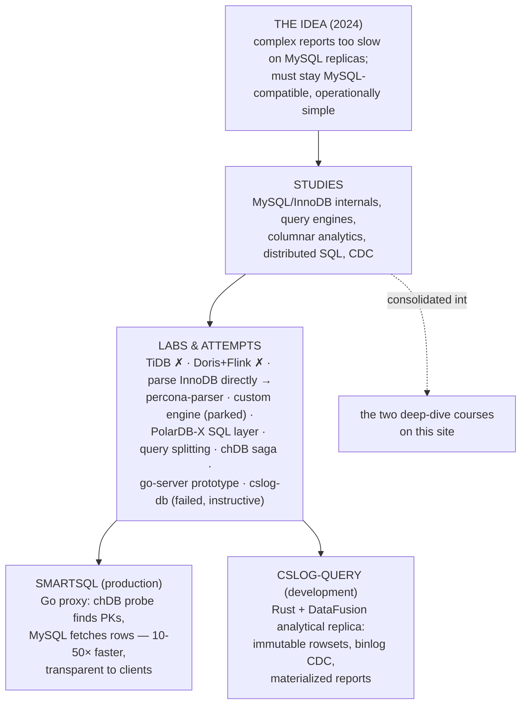

# The Query Optimization Journey

> One idea pursued for years: **make complex analytical queries fast on MySQL** — without
> abandoning MySQL. This collection gathers the idea, everything studied, every attempt,
> and the two systems that came out of it, so the whole path can be recalled at any time.

## The story in one diagram

## Read the journey

| # | Page | What it covers |
|---|------|----------------|
| 1 | [The Idea](./01-the-idea.md) | The problem, the constraints (the FK-cascade trap!), and the thesis that emerged |
| 2 | [What I Studied](./02-studies.md) | The knowledge base: internals, query engines, columnar analytics, CDC — with pointers to the raw notes |
| 3 | [Labs & Attempts](./03-labs.md) | The five strategies (TiDB, Doris, InnoDB parsing, custom engine, PolarDB-X) and the supporting experiments |
| 4 | [SmartSQL](./04-smart-sql.md) | The production system: hybrid chDB-probe + MySQL-fetch proxy |
| 5 | [cslog-query](./05-cslog-query.md) | The next generation: a local analytical replica in Rust, built simple-first |

## Timeline

| when | milestone |
|------|-----------|
| 2024-03 | Strategy 1: TiDB evaluation — rejected (FK cascades, cluster ops) |
| 2024-05 | Down the rabbit hole: MySQL 8 / InnoDB internals study begins |
| 2024-08 | Columnar survey (DuckDB, MonetDB, CMU course); Strategy 2: Doris + Flink — rejected |
| 2024-09→11 | Strategies 3-4: parse InnoDB directly (→ Calcite-over-.ibd proof, later [innodb-parser](../mysql/innodb-parser/README.md)); custom storage engine — parked |
| 2024-11→2025-01 | Strategy 5: PolarDB-X SQL-layer extraction over Percona |
| 2025 | chDB integration saga (UDF crash → API server); go-server hybrid prototype (LMDB + chDB); LMDB benchmarks |
| 2025→ | **SmartSQL** built and put into production (curated queries) |
| early 2026 | **cslog-db**: 5-week attempt at a full analytical replica — 6 storage backends, updates too slow (see [post-mortem](./03-labs.md#the-big-one-cslog-db-a-full-analytical-replica-failed-instructive)) |
| 2026 | Restarted as **cslog-query** with narrowed scope; first real report offload in progress |
| 2026 | **innodb-rust**: reimplementing InnoDB in Rust — read/write format parity round-tripped through real MySQL ([article series](../mysql/innodb-rust/README.md)) |
| 2026 | Studies consolidated into the [InnoDB](../mysql/innodb-architecture/README.md) and [MySQL Server](../mysql/server-architecture/README.md) deep-dive courses |

## The principles this journey earned

1. **Stay behind the MySQL wire protocol** — transparency is the deployment superpower.
2. **MySQL remains the source of truth**; analytical engines are disposable accelerators.
3. **Respect the binlog's blind spots** (FK cascades) — verify, repair, or avoid.
4. **Processes beside MySQL, never code inside it.**
5. **Start narrow, verify everything, widen slowly** — allowlists and parity checks before
   generality.
