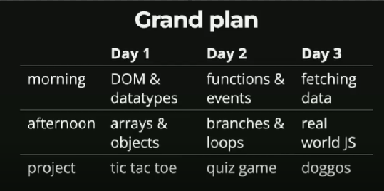

# Course

First Steps to Professional

A FrontendMasters course by Anjana Vakil

https://anjana.dev/javascript-first-steps/

## Introduction



## DOM

Exercise: Tic Tac Toe  
Type commands in the console to retrieve:

1. all the p elements
2. the text "X"
3. the number of squares in the board
4. the text "A game you know"

```javascript
document.getElementsByTagName("p"); //1
document.querySelector("#p1-symbol").textContent; //2
document.querySelectorAll(".square").length; //3
document.querySelector("h2").textContent; //4
```

Exercise: Changing the Board

1. Change the player names to you & neighbor
2. Swap the player symbols
3. Change subtitle to "A game you know and love"

```javascript
document.querySelector("#p1-name").textContent = "Willian";
document.querySelector("#p2-name").textContent = "Arthur";
document.querySelector("#p1-symbol").textContent = "O";
document.querySelector("#p2-symbol").textContent = "X";
document.querySelector("header h2").append(" and love");
```

## Value & Data Types

JS has only two kinds of data  
Primitive types (ex: strings, numbers)  
Objects (document)

```javascript
typeof "42";
//'string'
typeof 42;
//'number'
typeof Infinity;
//'number'
typeof true;
//'boolean'
typeof null;
//'object'
"some string".length;
//11
```

undefined and null abscence of the value  
undefined - accidental nothing  
null - deliberate nothing

## String

string are made of characters  
starts at 0 (index)

```javascript
"ALOHA"[0];
//'A'
"ALOHA".indexOf("L");
//1
"ALOHA".indexOf("Q");
//-1
"ALOHA".includes("HA");
//true
"ALOHA".startsWith("AL");
//true
```

### Comparison

```javascript
1 === "1";
//false
1 == "1";
//true
```

strict operator ===  
loosey goolsey ==

## Variables

**var** declares a variable globally or locally to an entire function regardless of block scope.  
**let** introduces block scope to JavaScript. Variables declared with let are limited in scope to the block, statement, or expression in which they are used.  
**const** declares and assignes a variable that can't be changed

```javascript
if (true) {
  var varVariable = "I am var";
  let letVariable = "I am let";
}

console.log(varVariable); // Outputs: "I am var" because var is function-scoped or globally scoped.
console.log(letVariable); // ReferenceError: letVariable is not defined because let is block-scoped.
```

## Arrays

Usage

```javascript
let test = ["ok", "ok2", "ok3"];
//undefined;
test[0];
//("ok");
test.length;
//3;
let test = ["ok", "ok2", "ok3"];
//undefined
test.includes("ok2");
//true
test.includes("ok5");
//false
let last = test.pop();
//undefined
last;
//'ok3'
test;
//(2) ['ok', 'ok2']
test.push("ok3");
//3
test;
//(3) ['ok', 'ok2', 'ok3']
```

Comparing strict X loosey goolsey

```javascript
"lonely" == ["lonely"];
//true
"lonely" === ["lonely"];
//false
```

Sorting, follows string convention not numbers!!

```javascript
[100, 2, 20].sort();
//(3) [100, 2, 20]
[100, 2, 50].sort();
//(3) [100, 2, 50]
```

Other methods

```javascript
["ok", "ok2", "ok3"].join(" - ");
// 'ok - ok2 - ok3'
["ok", "ok2", "ok3"].concat("ok4", "ok5");
// (5) ['ok', 'ok2', 'ok3', 'ok4', 'ok5']
```

Arrays accept other array as an element

```javascript
let a = [1, 2, 3];
//undefined
a.push([5, 6, 7]);
//4
a;
//(4) [1, 2, 3, Array(3)]
```

Mutabillity  
Strings and other primitives type are immutable and Arrays are mutable

```javascript
let abcArray = ["a", "b", "c"];
//undefined
abcArray[1] = "d";
//'d'
abcArray;
//(3) ['a', 'd', 'c']
let abcString = "abc";
//undefined
abcString[1] = "d";
//'d'
abcString;
//'abc'
```

Push (change) and Concat (don't change the original array)

```javascript
let a = [1, 2, 3];
//undefined;
a.concat(4);
//(4)[(1, 2, 3, 4)];
a;
//(3)[(1, 2, 3)];
a.push(4);
//4;
a;
//(4)[(1, 2, 3, 4)];
```

**const\* or **let\* for array? It is better to use const unless you have a good reason to use let.

## Objects

```javascript
const JS = { first: "J", last: "S" };
//undefined
js.first;
//'J'
js.last;
//'S'
js.full = "JS";
//'JS'
js;
//{first: 'J', last: 'S', full: 'JS'}
```
