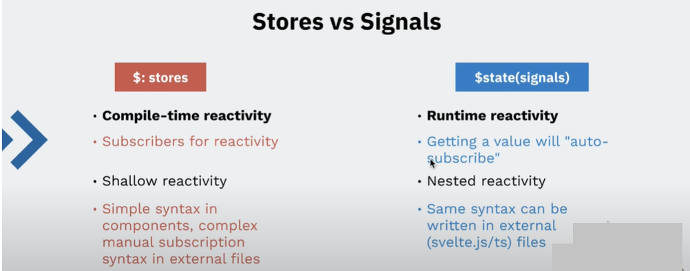
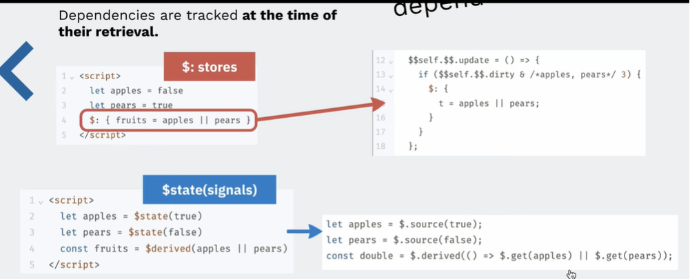
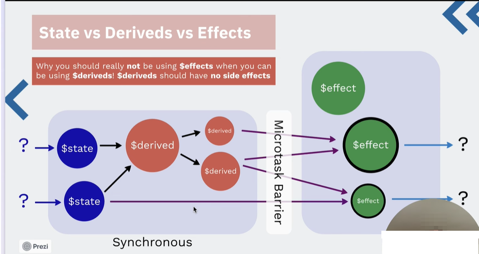

## Video 1 - Signals

https://www.youtube.com/watch?v=PC4Jx6ZBfTg  
Svelte 5 Rune Reactivity Explained: Understanding Runtime Reactivity vs Compile-time Reactivity  

Install bun (Windows)

```bat
powershell -c "irm bun.sh/install.ps1 | iex"
```

Reactivity example:

- reacctivity.js

Article:  
https://nolanlawson.com/2023/12/02/lets-learn-how-modern-javascript-frameworks-work-by-building-one

From video explanation.  
Source code:
- svelte4.js
- signal.js
- svelte5.js

Run:
```bat
bun run svelte4.js
bun run signal.js
bun run svelte5.js
```


## Video 2 - Basic

https://www.youtube.com/watch?v=-SM77ksjpJI  
Svelte 5 Runes Demystified (1/4) - Signal Reactivity Basics

https://svelte.dev/blog/runes  
Introduction to Runes



Stelve 4

```html
<script>
let name = 'world'
let caractersInName;
$: {
    caractersInName = name.length
}
</script>

<input type="text" bind:value={name} />
<h1>Hello {name}!</h1>
{caractersInName}
```

Stelve 4 - function 
name is still binded 
caracter count doesn't work

```html
<script>
let name = 'world'
let caractersInName;
function countLetters() {
    caractersInName = name.length
}
$: {
    countLetters()
}
</script>

<input type="text" bind:value={name} />
<h1>Hello {name}!</h1>
{caractersInName}
```

Stelve 5

It's working now

```html
<script>
let name = $state('world')
let caractersInName = $state(0);
function countLetters() {
    caractersInName = name.length
}

$effect((): {
    caractersInName = name.length
})
</script>

<input type="text" bind:value={name} />
<h1>Hello {name}!</h1>
{caractersInName}
```



## Video 3 - Runes

https://www.youtube.com/watch?v=HFTxHu614OU  
Svelte 5 Runes Demystified (3/4) - Why You Should Never Use $effects When You Can Use $deriveds!



```javascript
<script>
	let count = $state(0);

	/* DONT'T DO THIS */
	let double = $state(0)
	$effect(() => {
		double = count + 2
	});
	
	function increment() {
		count = count + 2
		console.log({count, double})
	}
</script>

<button onclick={increment}>
	clicks: {count}
</button>
```

double doesn't increment

```bash
{ count: 2 ,double: 2 }
{ count: 4 ,double: 4 }
{ count: 6 ,double: 6 }
```

```javascript
<script>
	let count = $state(0);

	/* DO THIS */
	let double = $derived(count + 2);
	
	function increment() {
		count = count + 2
		console.log({count, double})
	}
</script>

<button onclick={increment}>
	clicks: {count}
</button>
```

now it's working

```bash
{ count: 2 ,double: 4 }
{ count: 4 ,double: 6 }
{ count: 6 ,double: 8 }
```
