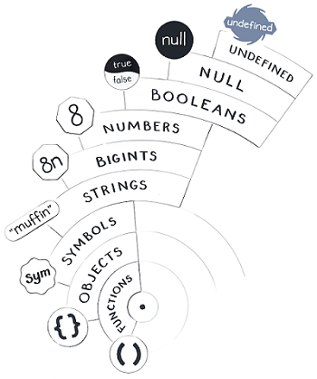

# Course

Link: https://justjavascript.com  

Explore the JavaScript Universe  
Dan Abramov (co-author of Redux and Create React App)  
Maggie Appleton (Illustrator)  

# Modules

## Mental Models

This code below has an accidental bug which changes the value of the original tittle.  
Why?

```javascript
function duplicateSpreadsheet(original) {
  if (original.hasPendingChanges) {
    throw new Error('You need to save the file before you can duplicate it.');
  }
  let copy = {
    created: Date.now(),
    author: original.author,
    cells: original.cells,
    metadata: original.metadata,
  };
  copy.metadata.title = 'Copy of ' + original.metadata.title;
  return copy;
}
```

## The JavaScript Universe

A value is a fundamental concept in JavaScript—so we can’t define it through other terms.  
Instead, we’ll define it through examples. Numbers and strings are values. Objects and functions are values, too.  
In our JavaScript universe, values float in space. Why ?  It is still not possible to answer that question.    

There are two types of values:
* Primitive values: numbers, booleans, strings, etc
* Objects and Functions

typeof

```javascript
console.log(typeof(2)); // "number"
console.log(typeof("hello")); // "string"
console.log(typeof(undefined)); // "undefined"
```

## Values and Variables

Primitive Values Are Immutable

```javascript
let reaction = 'yikes';
reaction[0] = 'l';
console.log(reaction);
//yikes
```

Arrays are not primitives so I can change it

```javascript
let arr = ['y','i','k','e','s'];
//undefined
arr[0] = 'l';
//'l'
arr
//['l', 'i', 'k', 'e', 's']
```

But variables are wire, I can change it despite not values

```javascript
let pet = 'Narwhal';
pet = 'The Kraken';
console.log(pet);
// The Kraken
```
Summarizing:  
Variables are not values.  
Variables point to values.  

## Studying from the Inside

The foundation of our mental model is values.  
Each value belongs to a type.  
Primitive values are immutable.  
We can point to values using “wires” we call variables.

## Meeting the Primitive Values



```javascript
console.log(typeof(undefined)); 
// "undefined"
```

Strings Aren’t Objects

```javascript
console.log(typeof('Hello'));
//string
```

Numbers

```javascript
let scale = 0;
let a = 1 / scale;
// Infinity
let b = 0 / scale;
// NaN
let c = -a;
// -Infinity
let d = 1 / c;
// -0

console.log(typeof(NaN)); 
// "number"
```

## Meeting Objects and Functions

Do Objects Disapper? No.

```javascript
let shrek = {};
let donkey = {};
//undefined
shrek = null;
//null
shrek
//null
```

How many different values does this code pass to console.log? 7

```javascript
for (let i = 0; i < 7; i++) {
  console.log(function() {});
}
//7 f() {}
```

## Equality of Values

## Properties

## Mutation

## Prototypes