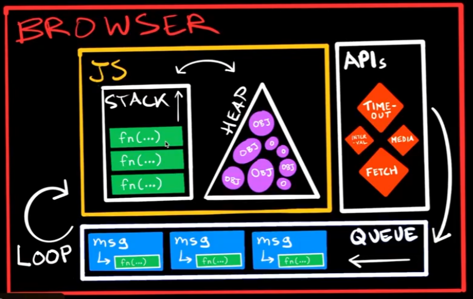

## Course

Vanilla Javascript Projects

A FrontendMasters course by Anjana Vakil

https://anjana.dev/vanilla-js-projects/

# Review

## Exercises

Project **dark-mode** - html/javascript with dark mode switcher

Project **random-clock** - html/javascript clock on the screen changing randomly

## Notes



Browser APIs , look at [MDN Web Docs](https://developer.mozilla.org/pt-BR/)

Time

```javascript
console.time("lap");
runAround();
console.timeLog("lap");
//lap: 2000ms
runAround();
console.timeEnd("lap");
//lap: 3000ms
```

Timeout function

```javascript
console.log("prints");
setTimeout(() => console.log("prints >1 second later", 1000));
console.log("prints immediately ??");
```

Intervals are not exact is could happen anytime after the minimum

```javascript
const travelling = setInterval(() => {}, 1000);
console.log("prints");
```

# Object Oriented Programming

## Scope

global - outer scope
function - inside this function there is another scope but can access global scope
global - can't access variables inside function

## Closure

A closure is a function that closes over values in its defining scope, remembering them forever.

Example:

```javascript
const add = (function () {
  let counter = 0;
  return function () {
    counter += 1;
    return counter;
  };
})();

add();
add();
add();

// the counter is now 3
```

The variable add is assigned to the return value of a self-invoking function.  
The self-invoking function only runs once. It sets the counter to zero (0), and returns a function expression.  
This way add becomes a function. The "wonderful" part is that it can access the counter in the parent scope.  
This is called a JavaScript closure. It makes it possible for a function to have "private" variables.  
The counter is protected by the scope of the anonymous function, and can only be changed using the add function.

## Programming paradigms

| Paradigm | Meta-Paradigm | Focus                  |
| -------- | ------------- | ---------------------- |
| FP       | Declarative   | "what you want to get" |
| OOP      | Imperative    | "how to do things"     |

## IIFEs

```javascript
const greeting = "Hello world";
(function () {
  console.log(greeting);
})();
```

Define and call a function right away

## Object prototype

Everything is a object: array, string, function \
Objects have prototypes\
Prototype is a object that all of it properties and methods are accessible through this "sub object" with that prototype

```javascript
Object.getPrototypeOf(example);
// Array []

Object.getPrototypeOf(document.children);
// HTMLCollection

person1.hasOwnProperty("toString");
// false
```

Prototype Chain. The object itself, and prototypes

```javascript
person1.hasOwnProperty("toString");
false;
person1.__proto__.hasOwnProperty("toString");
false;
person1.__proto__.__proto__.hasOwnProperty("toString");
true;
```

# Iteration

## Iterator

```javascript
let myIterable = {
  from: 1,
  to: 5,

  [Symbol.iterator]() {
    // This method must return an iterator object
    return {
      current: this.from,
      last: this.to,

      next() {
        // The next method should return the next value as an object {done:.., value :...}
        if (this.current <= this.last) {
          return { done: false, value: this.current++ };
        } else {
          return { done: true };
        }
      },
    };
  },
};

for (let value of myIterable) {
  console.log(value); // Outputs 1, 2, 3, 4, 5
}
```

## Generator

```javascript
function* generateSequence(start, end) {
  for (let i = start; i <= end; i++) {
    yield i; // Each call to next() will return the next number in the range
  }
}

// Using the generator
let generator = generateSequence(1, 5);

for (let value of generator) {
  console.log(value); // Outputs 1, 2, 3, 4, 5
}
```

# Classes & Browser APIs

## Classes using prototypes

```javascript
function Person(name) {
  this.name = name;
}

Person.prototype.sayHello = function () {
  console.log("Hello, my name is " + this.name + "!");
};

var person1 = new Person("Alice");
person1.sayHello(); // Outputs: Hello, my name is Alice!
```

## Classes using ES6

```javascript
class Person {
  constructor(name) {
    this.name = name;
  }

  sayHello() {
    console.log(`Hello, my name is ${this.name}!`);
  }
}

const person1 = new Person("Alice");
person1.sayHello(); // Outputs: Hello, my name is Alice!
```

## Private Methods using prototypes

```javascript
function Person(name) {
  var privateName = name; // Private variable

  this.sayHello = function () {
    console.log("Hello, my name is " + privateName + "!");
  };
}

var person1 = new Person("Alice");
person1.sayHello(); // Outputs: Hello, my name is Alice!
// person1.privateName is undefined
```

## Private Methods using ES6

```javascript
class Person {
  #privateName; // Private field

  constructor(name) {
    this.#privateName = name;
  }

  sayHello() {
    console.log(`Hello, my name is ${this.#privateName}!`);
  }
}

const person1 = new Person("Alice");
person1.sayHello(); // Outputs: Hello, my name is Alice!
// person1.#privateName is not accessible from outside the class.
```

## Inheritance using prototypes

```javascript
function Person(name) {
  this.name = name;
}

Person.prototype.sayHello = function () {
  console.log("Hello, my name is " + this.name + "!");
};

function Employee(name, jobTitle) {
  Person.call(this, name); // Call the parent constructor
  this.jobTitle = jobTitle;
}

// Inherit from Person
Employee.prototype = Object.create(Person.prototype);
Employee.prototype.constructor = Employee;

// Add method to Employee
Employee.prototype.sayHello = function () {
  console.log(
    "Hello, my name is " + this.name + " and I am a " + this.jobTitle + "."
  );
};

var employee1 = new Employee("Alice", "Engineer");
employee1.sayHello(); // Outputs: Hello, my name is Alice and I am a Engineer.
```

## Inheritance using ES6

```javascript
class Person {
  constructor(name) {
    this.name = name;
  }

  sayHello() {
    console.log(`Hello, my name is ${this.name}!`);
  }
}

class Employee extends Person {
  constructor(name, jobTitle) {
    super(name); // Call the parent class constructor
    this.jobTitle = jobTitle;
  }

  sayHello() {
    console.log(`Hello, my name is ${this.name} and I am a ${this.jobTitle}.`);
  }
}

const employee1 = new Employee("Alice", "Engineer");
employee1.sayHello(); // Outputs: Hello, my name is Alice and I am a Engineer.
```

## Exercises

Project **dark-modal** - turning dark mode to dark modal switcher

# Javascript Outside the Browser

## Exercises

Project **where-am-i** - node.js project

# Modern JavaScript Development

## Importing Modules

CommonJS modules

```javascript
const cowsay = require('cowsay');

modules.export = {
  moove: () => cowsay.say({text: "Get going"})
};
```

ECMAScript modules

```javascript
import { say } from 'cowsay'

export const moove = () => cowsay.say({text: "Get going"})
```

In the browser

```javascript
<script type="module">
  // import away
</script>
```

## Vite Project

```bash
npm create vite@latest
```

## Exercises

Project **selfie-cam** - vite project
